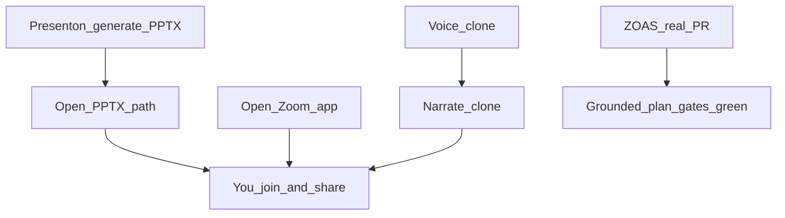

# Ask, Docs, Branch, Presence, Integrations, Present Deck, Presenton, ZOAS real PR

## Quality bar (locked)

- All bugs in this plan **fixed and verified green** (no false “Opened Zoom” / fake success).
- Delivery scorecard language stays **grounded plan + gates green** — **never** claim “100% / 0 error.”
- Zoom: **you** join the meeting and **share** PowerPoint; Mentrix opens Zoom / optional join link and narrates with clone. **No Zoom Meeting SDK**, no auto-join, no auto screen-share.

## Locked decisions

- **Ask blueprint:** Clear + Reload from Lattice.
- **Demo projects:** Purge known names; seed only if `ZECT_SEED_DEMO_PROJECTS=true`.
- **Branch:** Real `checkoutRepoBranch` from header.
- **Wifi:** Presence WebSocket — fix + “Presence” label.
- **GitHub + Jira:** Integrations readiness (not MinionBot).
- **Voice / PPTX path:** API error surfacing; quote-strip + OneDrive allowlist.
- **Zoom:** Launch desktop Zoom (+ optional saved join URL). **SDK auto-join/share = out of scope** — you already use Zoom and will share when presenting.
- **Presenton:** **In scope** — self-host Presenton (or mentrix-slides wrapper) for prompt → on-brand PPTX; Mentrix hands path to Present Deck + clone narrate. Zinnia/team templates via upload.
- **ZOAS PR:** **In scope** — real Mentrix `bugfix` on `develop` → Confirm plan → Approve → **Create PR** to `zinnia/zoas` (not dry-run-only). Fix ZECT blockers found along the way. Prefer a small, clear bug or docs/test fix so the PR is reviewable.

---

## 1–6. Unchanged core UX

1. Ask Clear / Reload blueprint  
2. Doc Generator prefill + docs  
3. Purge demo projects  
4. Header git checkout  
5. Presence Wifi fix  
6. GitHub + Jira Integrations cards  

(Details as previous plan sections 1–6.)

---

## 7. Present Deck — Voice / PPTX / Zoom launch (no SDK)

### 7a. Voice — `Failed to fetch`

Actionable API/network errors; Electron API base + auth; real `detail` from clone endpoint.

### 7b. PPTX path

Strip quotes; OneDrive Desktop/Documents/Downloads allowlist; precise error codes + UI copy.

### 7c. Zoom — launch only (you join + share)

- Reliable `Zoom.exe` path resolution; optional `ZOOM_DEFAULT_JOIN_URL` / Integrations field to open join link.
- Honest status; copy: “Join your meeting, share PowerPoint, then Narrate.”
- **Do not** build Zoom Meeting SDK, schedule API, or auto screen-share.

---

## 8. Presenton slide generator (in scope)

- Self-host [Presenton](https://github.com/presenton/presenton) (Docker) using ZECT’s existing LLM keys / Ollama — no Presenton Cloud key required.
- Mentrix Companion / Present Deck: **Generate deck** (prompt + optional template id) → call Presenton `POST /api/v1/ppt/generate/presentation` → save PPTX under Documents/Desktop → fill Present Deck path.
- Template upload path: Zinnia master (and later team masters) via Presenton “bring your design” / stored template id.
- Docs: how to run Presenton locally and point Mentrix at `PRESENTON_BASE_URL`.

---

## 9. Real ZOAS production PR (in scope)

1. Header: ZOAS Eval / `zinnia/zoas` / checkout **develop**.  
2. Mentrix Delivery `bugfix` + workspace + `zinnia-zoas`.  
3. Engage → **Confirm plan** → gates → Approve → **Create PR** with dry_run **off** (real GitHub PR).  
4. Ultra Review / Semgrep panel as available.  
5. Fix any ZECT blockers discovered.  
6. Scorecard wording in UI/docs remains **grounded plan + gates green** (no “100% / 0 error”).

---

## 10. Verification

| Area | Pass |
|------|------|
| Voice / PPTX / Zoom launch | Bugs fixed; no false success |
| Presenton | Generate PPTX from prompt → open in Present Deck |
| ZOAS | Real PR URL on `zinnia/zoas` |
| Scorecard copy | No “100% / 0 error” claims in new/updated strings |
| Ask / Doc / demos / branch / presence / GH-Jira | Sections 1–6 |

## Out of scope

- MinionBot / MSTF  
- **Zoom Meeting SDK auto-join / auto screen-share** (you join and share manually)  
- Claiming Delivery **“100% / 0 error”** scorecard language  
