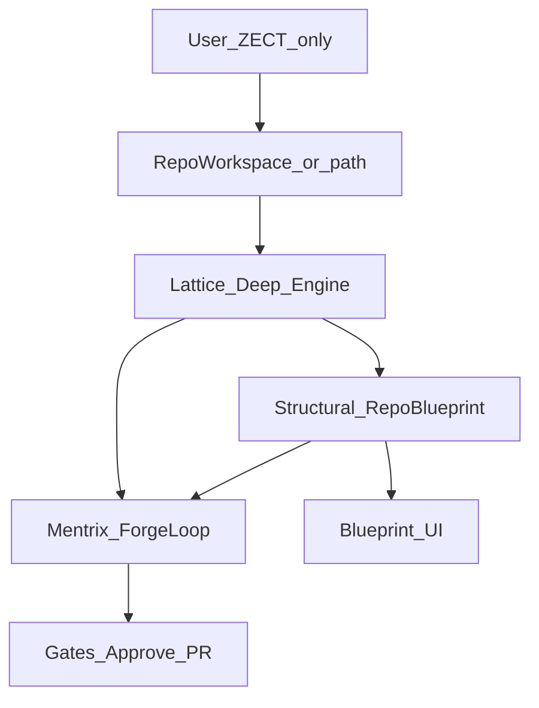

# Lattice Deep Mentrix Knowledge Engine

## Locked product decisions

- **Users never install Graphify or Neo4j.** Everything ships inside ZECT.
- **Brand:** Lattice (graph) + Mentrix (agent) + ForgeLoop (runtime). No third-party agent or graph product names in UI, APIs, or user docs.
- **Capability bar:** [Graphify-Labs/graphify](https://github.com/Graphify-Labs/graphify) as an open-source design reference for code-graph depth (parse, path, explain)—implemented **inside Lattice**, not as a user install.
- **Structural blueprint:** Mentrix-native deep inventory (APIs, symbols, deps, tech stack, business summaries)—shaped by industry best practice for AI coding platforms; research notes may cite local reference trees under `C:\runner` without naming or cloning other products.
- **Storage v1:** JSON Lattice cache + Postgres/SQLite tables for structured blueprint (not Neo4j). Neo4j deferred until query scale demands it.
- **Engine v1:** Deepen Lattice with **tree-sitter** (`tree-sitter` + language grammars) where practical; keep AST/regex fallbacks. Do **not** vendor the Graphify CLI as a user-facing dependency.



---

## Phase A — Fix developer workspace (unblock all users)

**Problem:** [`RepoWorkspace.tsx`](frontend/src/pages/RepoWorkspace.tsx) uses raw `fetch` without Bearer for add-repo / project detail (same 401 pattern as Labs).

**Fix:**

- Route all Repo Workspace project/repo calls through exported [`apiFetch` / `request`](frontend/src/lib/api.ts).
- Audit [`ProjectRepoSelector.tsx`](frontend/src/components/ProjectRepoSelector.tsx) for the same gap.
- After successful clone: auto-trigger Lattice ingest with `project_key` default `{owner}-{repo}` and set Mentrix-friendly workspace path.

**Acceptance:** Logged-in user can list projects, clone `hectorg2211/jarvis` (or any repo), browse tree, and see Lattice graph for that key without console 401s.

---

## Phase B — Mentrix Structural RepoBlueprint (ZECT-native)

Add structured blueprint model stored in ZECT DB (new table or JSON blob per `project_key`):

| Field group | Purpose |
|-------------|---------|
| `file_tree`, `stats`, `tech_stack` | Overview |
| `functions`, `classes` | Symbol inventory |
| `api_endpoints`, `outbound_calls` | API surface |
| `dependency_graph` | Module imports (from Lattice) |
| `database_connections`, `config_entries` | Heuristic detect |
| `business_context` | Optional LLM summaries for Mentrix understand |
| `indexed_commit_sha`, `status` | Drift / lifecycle |

**Builder service:** `backend/app/services/lattice/structural_blueprint.py`

- Input: local path + `project_key` (from Lattice ingest or clone).
- Output: persist blueprint + refresh Lattice graph in one pipeline.
- Reuse/extend [`indexer.py`](backend/app/services/lattice/indexer.py) for calls/imports/endpoints; add tree-sitter pass for Python/TS/JS first.

**APIs:**

- `POST /api/lattice/ingest` — already exists; extend response with `blueprint` summary.
- `GET /api/lattice/blueprint?project_key=` — full structural blueprint JSON.
- `POST /api/lattice/blueprint/prompt` — Mentrix-ready deep prompt (replaces shallow GitHub-only vibe prompt when local index exists).

---

## Phase C — Blueprint UI + Mentrix consume the same truth

Today UI Blueprint ([`repo_analysis.py`](backend/app/routers/repo_analysis.py)) is GitHub tree + README only—too shallow for a best-in-class developer tool.

**Changes:**

1. [`BlueprintGenerator.tsx`](frontend/src/pages/BlueprintGenerator.tsx): add mode **From Lattice** — project key / local path → deep prompt from structural blueprint (APIs, symbols, deps, business_context).
2. Keep GitHub Standard mode for remote-only; when local Lattice exists, prefer deep prompt.
3. Mentrix [`blueprint_phase.py`](backend/app/services/phases/blueprint_phase.py) + ForgeLoop scout: inject structural blueprint sections (endpoints, dependency_graph, top symbols, explain notes)—not just substring hits.
4. Lattice Graph UI: show blueprint stats panel (endpoints, tech_stack, functions count).

**Mentrix advantage:** one agent, one graph (Lattice), Approve→PR quality gates, plus deep blueprint that lists full structural detail for every user.

---

## Phase D — Graphify-class capabilities (embedded checklist)

Implement inside Lattice (no Graphify install for users)—capability bar from Graphify:

| Capability | Lattice target |
|------------|----------------|
| Deterministic code parse | tree-sitter + existing AST |
| Cross-file imports/calls | resolve + `calls` / `imports_file` (extend) |
| Path / neighbors / explain | already started; harden + tests |
| God nodes / communities | simple degree ranking + connected components (no Leiden/Neo4j required v1) |
| Docs in same graph | link RAG chunk paths as `doc` nodes lightly |
| Mentrix query | Scout uses path/neighbors + blueprint endpoints |

Document in [`docs/MENTRIX_ARCHITECTURE.md`](docs/MENTRIX_ARCHITECTURE.md) and assessment HOW_IT_WORKS: “Graphify-class, shipped as Lattice.” Never brand competing products in user-facing copy.

---

## Phase E — Mentrix-first developer tool polish

- Auto-fill Mentrix workspace + project_key from active Repo Workspace selection.
- Empty Mentrix state: “Clone or Lattice-ingest once → engage.”
- Desktop headphones: keep STT wake + hotkey (desktop clap automation out of scope).
- Playwright: clone/list smoke (auth), Lattice blueprint GET, Mentrix engage with `project_key` from fixture repo (e.g. jarvis or PBL).

---

## Explicitly out of scope

- Cloning external agent microservices or Neo4j into ZECT
- User-facing Graphify CLI / `/graphify` skill install
- Renaming Lattice to Graphify
- Desktop clap detection
- Naming or branding any third-party agent product in UI, APIs, commits, or user docs

---

## Validation

```bash
cd backend && py -3.12 -m pytest -q tests/test_lattice_intelligence.py tests/test_mentrix_quality_gates.py
# new: tests/test_structural_blueprint.py
cd frontend && npx playwright test e2e/labs-auth.spec.ts e2e/mentrix-smoke.spec.ts
```

Manual: login → Repo Workspace clone → Lattice shows endpoints/symbols → Blueprint From Lattice → Mentrix deliver/understand with same `project_key`.

## Success criteria

- Users only install/run ZECT; deep graph + blueprint appear after ingest/clone.
- Structural blueprint lists enterprise-class fields (APIs, deps, symbols, tech stack).
- Mentrix plans from that blueprint; UI Blueprint no longer “README-only” for local repos.
- Repo Workspace loads projects/repos without 401.
- Docs state clearly: Mentrix + Lattice as the delivery platform; graph depth Graphify-class under Lattice; no third-party agent product names in user-facing materials.
