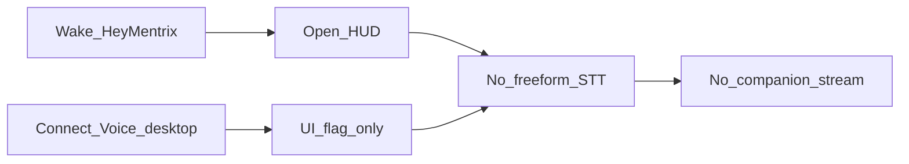
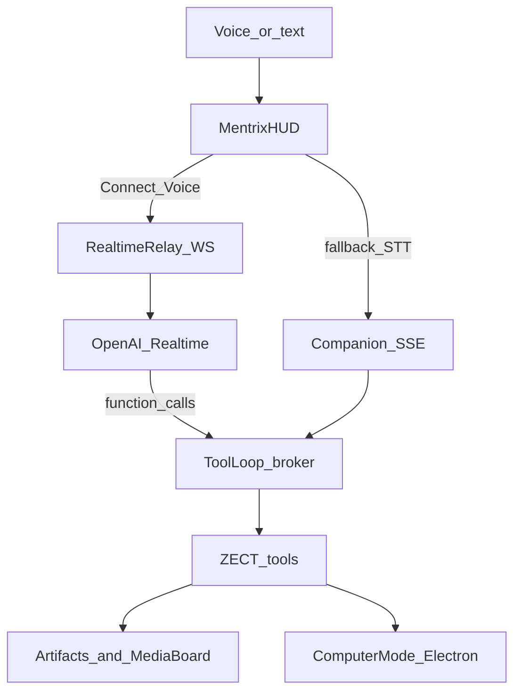

# Mentrix Agent Gap Close (ZECT + Realtime + Media + Computer)

## Locked decisions

- **Brand:** Mentrix / Lattice / ForgeLoop / ZECT only. No Exa. No third-party companion product names in UI/APIs/docs.
- **Voice primary:** OpenAI Realtime speech-to-speech for **Connect Voice** (requires `OPENAI_API_KEY` in `backend/.env` only — never chat/git).
- **Voice fallback:** If Realtime unavailable → Windows/macOS free-form STT → existing companion SSE → `speechSynthesis` TTS (so HUD never dead-ends like today).
- **Scope:** ZECT agent workflows + Mentrix-branded Image/Thumbnail board + deeper computer-use on **Windows and macOS**.
- **Security unchanged:** permission broker, always-ask Allow overlay, Computer Mode off by default, secrets-path deny, full audit.

**Security note:** If an API key was pasted into chat earlier, rotate it in the OpenAI dashboard and keep only the new key in local `.env`.

## Current gaps (why voice “only listens”)

Wake grammar is phrase-only ([`electron/win-wake.js`](electron/win-wake.js)); Connect Voice on Electron skips Web Speech and never emits `mentrix-stt-goal` ([`MentrixCompanion.tsx`](frontend/src/pages/MentrixCompanion.tsx)). Realtime + post-wake dictation fix that loop.

## Target architecture

## Phase 1 — OpenAI Realtime as primary Connect Voice

**Backend**

- New service [`backend/app/services/mentrix/realtime.py`](backend/app/services/mentrix/realtime.py): session config (Mentrix system prompt, ZECT tool schemas mirroring companion registry), audio format, turn detection.
- New routes in [`backend/app/routers/mentrix.py`](backend/app/routers/mentrix.py):
  - `POST /api/mentrix/companion/realtime/session` — mint short-lived client secret / relay token (server holds `OPENAI_API_KEY`; never send raw key to renderer).
  - `WS /api/mentrix/companion/realtime` — authenticated proxy between Electron/renderer and OpenAI Realtime; on `function_call` → run same `_exec_tool` + permission broker path used by SSE; emit Mentrix events back (`tool_start`, `pending_confirm`, `artifact`, `navigate`).
- Env: document `OPENAI_API_KEY` (existing) + `MENTRIX_REALTIME=1` default-on when key present for Connect Voice; keep SSE turn for Playwright.

**Frontend** ([`MentrixCompanion.tsx`](frontend/src/pages/MentrixCompanion.tsx), [`api.ts`](frontend/src/lib/api.ts))

- Connect Voice **starts Realtime** (mic capture → WS relay → play remote audio).
- Orb states driven by Realtime: `listening` / `thinking` / `speaking` / `working` / `needs_permission`.
- On `pending_confirm` → existing Allow overlay; resume confirmed tools into session or `stream/resume`.
- On Realtime failure → auto-fallback: free-form STT → `mentrixCompanionStream` → TTS; Live Log shows `realtime_fallback`.

**Electron**

- Grant mic; ensure wake still opens HUD; after wake + Connect Voice (or auto-arm Connect Voice on wake when Realtime ready), dialogue continues.
- Add [`electron/dictation.js`](electron/dictation.js) (Windows System.Speech dictation / macOS `NSSpeechRecognizer` or `say`+input fallback) solely for **fallback** path when Realtime is down — emit `mentrix-stt-goal`.

## Phase 2 — ZECT workflow agent coverage

Expand [`NAV_MAP`](backend/app/services/mentrix/companion.py) and LLM tool list so voice/text can open and act on core ZECT surfaces:

| Intent | Path / action |
|--------|----------------|
| Companion home | `/mentrix-home` |
| Delivery | `/mentrix` + `delivery_status` / `start_delivery` / approve hint |
| Lattice | `/lattice` + `lattice_query` |
| Sandbox | `/sandbox` |
| Ask / Plan / Docs / Integrations / Permissions / Blueprint / Dashboard | existing routes in [`App.tsx`](frontend/src/App.tsx) |
| Research | `research_news` (Mentrix — **not Exa**) |
| Notes | `note_add` / `note_list` |
| Diagnose | Mermaid + markdown artifacts |
| Media | new image board tools (Phase 3) |

Keep deterministic fast-path intents + bounded tool-calling (max 5 tools/turn). Navigate events must still apply even when Allow is pending.

## Phase 3 — Mentrix Image / Thumbnail board

- Persist under `backend/data/mentrix_media/` (gitignored), numbered `001`, `002`, …
- Tools: `media_generate`, `media_edit`, `media_list` (confirm-gated; OpenAI Images when keyed).
- UI: extend [`MentrixArtifacts.tsx`](frontend/src/components/MentrixArtifacts.tsx) with board view (grid, number, prompt, edit history) — Mentrix-branded “Image board”, not a consumer YouTube product clone.
- Artifacts `image` type renders real file URLs via authenticated static/API fetch.

## Phase 4 — Deeper Computer Mode (Windows + macOS)

Extend [`electron/main.js`](electron/main.js) `mentrix-computer` IPC (still require Computer Mode ON + Allow):

| Action | Windows | macOS |
|--------|---------|-------|
| open_app | allowlisted spawn | allowlisted `open -a` |
| screenshot | full desktop via native helper | `screencapture` temp PNG |
| read_path | allowlisted + deny secrets | same |
| click / type / scroll | PowerShell UI Automation or approved helper | Accessibility / AppleScript stubs gated |
| ui_inspect | window title / focused element summary | same class of summary |

- Platform allowlists in org policy ([`org_policy.py`](backend/app/services/mentrix/org_policy.py)).
- Stream `tool_start` / `tool_end` into Live Log; idle auto-off unchanged.
- No silent input into password fields; high-risk always-ask.

## Phase 5 — Orb / HUD polish

- Stronger CSS/canvas motion for orb states on Realtime events.
- Display mode + Artifacts stage unchanged pattern; Live Log shows Realtime + tool timeline.
- Update [`docs/MENTRIX_COMPANION.md`](docs/MENTRIX_COMPANION.md): Realtime primary, fallback, media board, computer matrix, no Exa.

## Phase 6 — Validate

- Unit: broker + media numbering + navigate map + realtime session mint (mocked OpenAI).
- Playwright: HUD, Allow deny, navigate Lattice/Sandbox, media list empty→generate mocked, companion turn fallback still works without Realtime.
- Desktop smoke: Connect Voice with key → spoken reply; wake → dialogue; Computer Mode off blocks control; Allow for screenshot/open app.

## Key files

- [`frontend/src/pages/MentrixCompanion.tsx`](frontend/src/pages/MentrixCompanion.tsx)
- [`frontend/src/components/MentrixArtifacts.tsx`](frontend/src/components/MentrixArtifacts.tsx)
- [`frontend/src/lib/api.ts`](frontend/src/lib/api.ts)
- [`backend/app/services/mentrix/companion.py`](backend/app/services/mentrix/companion.py)
- [`backend/app/services/mentrix/realtime.py`](backend/app/services/mentrix/realtime.py) (new)
- [`backend/app/services/mentrix/media_board.py`](backend/app/services/mentrix/media_board.py) (new)
- [`backend/app/routers/mentrix.py`](backend/app/routers/mentrix.py)
- [`electron/main.js`](electron/main.js), [`electron/win-wake.js`](electron/win-wake.js), new dictation + platform computer helpers
- [`backend/.env.example`](backend/.env.example), [`docs/MENTRIX_COMPANION.md`](docs/MENTRIX_COMPANION.md)

## Success criteria

- Saying “Hey Mentrix” then speaking a ZECT ask (status, Open Lattice, research, note, Delivery) gets a **spoken + streamed** agent response with tools in Live Log.
- Connect Voice uses Realtime when keyed; degrades cleanly without hanging on “Listening…”.
- Image board stores numbered Mentrix generations/edits in Artifacts.
- Computer Mode performs real open/screenshot/read and gated click/type/scroll on Windows and macOS.
- Always-ask + audits remain; no Exa dependency.
