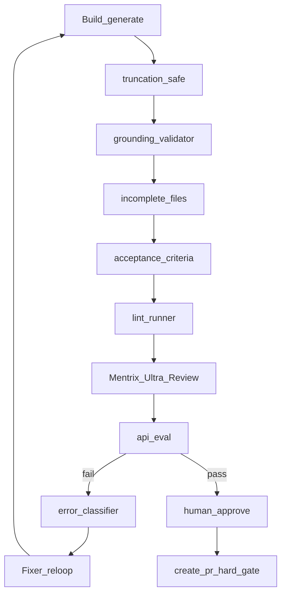

# Mentrix Anti-Hallucination Gates + Playwright + PR

## Context (locked)

- Screenshots describe **external agent stack** files (`generic_agent.py`, `code_executor.py`, `gate_adjudicator.py`). Those **do not exist in ZECT**.
- Implement equivalent defenses under Mentrix: [backend/app/services/phases/](backend/app/services/phases/), [backend/app/services/quality/](backend/app/services/quality/), [backend/app/services/forge_loop/orchestrator.py](backend/app/services/forge_loop/orchestrator.py), [backend/app/routers/mentrix.py](backend/app/routers/mentrix.py).
- No third-party review brand names; keep **Mentrix Ultra Review**.
- Current git: already on `develop` with large Mentrix work uncommitted → ship on branch `feat/mentrix-anti-hallucination-gates`, PR **into `develop`**.

## Gap → ZECT mapping

| Gap | ZECT implementation |
|-----|---------------------|
| #1 Truncation | `finish_reason` check + continuation stitch in build LLM path |
| #2 Invented APIs | AST grounding vs Lattice/blueprint symbol allowlist |
| #3 Design contract | Persist blueprint `required_mentions` / expected files; verify post-build |
| #4 Retry intelligence | `error_classifier` drives Fixer next_step / model tier hints |
| #5 Acceptance criteria | Satisfaction heuristics vs plan criteria (not presence-only) |
| #6 Silent partial PR | create-pr refuses if any required gate red or files rejected |
| #7 Adjudicator governance | Log every `acknowledge_issues` waiver with reason; block auto-ack for security/secrets findings |
| #G Eval harness | Minimal Mentrix golden fixtures + non-blocking score module |

## Implementation

### 1. Truncation-safe generation (gap #1)

In [backend/app/services/phases/build_phase_svc.py](backend/app/services/phases/build_phase_svc.py) `_generate_core`:

- Read `resp.choices[0].finish_reason`.
- If `"length"`: up to 3 continuation calls seeded with last ~200 tokens + instruction “continue verbatim, do not repeat”; stitch; re-check.
- After stitch: brace/paren balance + Python `ast.parse` when language is Python; fail generation if still incomplete (sets gate input for incomplete_files).
- Surface `finish_reason`, `continuations` on build result for audit.

Mirror the same helper for live path in [backend/app/routers/build_phase.py](backend/app/routers/build_phase.py) via a shared `backend/app/services/quality/truncation.py` so router and Mentrix do not diverge.

### 2. Grounding validator (gap #2)

New [backend/app/services/quality/grounding.py](backend/app/services/quality/grounding.py):

- Parse generated code (Python AST; regex fallback for TS/Java/Go for call/import names).
- Allowlist = stdlib/builtins + symbols from Lattice `query_graph` / scout hits + blueprint `files_sampled` / prompt identifiers.
- Flag unknown attribute/call names as `invented_api`.
- Wire after Build in upgrade (and deliver builder when code present) in orchestrator: fail → Fixer with precise feedback string; max recovery unchanged.

### 3. Design contract + acceptance criteria (gaps #3, #5)

- Extend blueprint result in [backend/app/services/phases/blueprint_phase.py](backend/app/services/phases/blueprint_phase.py) with `design_contract`: `{required_files, required_mentions, acceptance_criteria[]}`.
- Plan step already has criteria strings; merge into contract on upgrade `plan` agent.
- New [backend/app/services/quality/acceptance.py](backend/app/services/quality/acceptance.py): verify mentions appear in generated content; criteria keywords/phrases satisfied (heuristic satisfaction, not empty-field check).
- Orchestrator gates: `contract_ok`, `acceptance_ok` required for upgrade `awaiting_approval`.

### 4. Error classifier (gap #4)

New [backend/app/services/quality/error_classifier.py](backend/app/services/quality/error_classifier.py):

- Categories: `SYNTAX`, `LOGIC`, `VALIDATION`, `TIMEOUT`, `SECURITY`.
- Integrate into Fixer loops in orchestrator: SYNTAX → deterministic brace/import hint + `re_build`; LOGIC/VALIDATION → escalate prompt detail; TIMEOUT → same-tier backoff note; SECURITY → never auto-waive.

### 5. Hard completion + PR backstop (gap #6)

In [backend/app/routers/mentrix.py](backend/app/routers/mentrix.py) `create_pr_for_run` and `gates_allow_approve`:

- Re-evaluate gates at create-pr time (not only approve time).
- Refuse if `incomplete_ok`, `contract_ok`, `acceptance_ok`, `lint_ok`, `review_ok`, or `api_eval_ok` is false.
- Refuse if result lists `rejected_files` / grounding failures unresolved.
- Incomplete/contract never overridden by `acknowledge_issues`; security critical never waived.

### 6. Acknowledge governance (gap #7)

- On approve with `acknowledge_issues=true`, append audit event: waived gates, reason, actor, timestamp; include waiver summary in PR body.
- Reject acknowledge when Ultra Review has `security`/`secrets` critical findings.

### 7. Eval harness seed (gap G)

- Add [backend/app/services/quality/eval_harness.py](backend/app/services/quality/eval_harness.py) + `backend/tests/fixtures/mentrix_golden/` with 1–2 offline fixtures.
- Score grounding/incomplete/acceptance offline; **non-blocking** observability endpoint or test-only runner (document promotion path in [docs/MENTRIX_ARCHITECTURE.md](docs/MENTRIX_ARCHITECTURE.md)).

### 8. Tests + docs

- Unit tests for truncation stitch, grounding invented API, acceptance satisfaction, create-pr hard refuse, acknowledge security block.
- Extend [backend/tests/test_mentrix_platform.py](backend/tests/test_mentrix_platform.py).
- Update architecture doc: anti-hallucination doctrine, no external agent stack naming.

### 9. Playwright verification

- Ensure backend + frontend can start (prefer documented local auth defaults).
- Run existing Playwright specs; add `frontend/e2e/mentrix-quality-gates.spec.ts` covering: upgrade run shows new gates; create-pr stays blocked when incomplete; acknowledge path for non-security only.
- Use Playwright MCP against running app for interactive smoke (login → Mentrix upgrade → gates panel → approve/PR dry-run) after CLI e2e.

### 10. Git / PR

- Branch from current work: `feat/mentrix-anti-hallucination-gates`.
- Commit Mentrix quality + related Mentrix platform files (never `.env` secrets).
- Push `-u origin HEAD`, then `gh pr create --base develop` with summary + test plan.

## Out of scope

- Cloning or importing external agent stack / `runner` repos.
- Full nightly golden CI as merge-blocker (seed only).
- Inbound Slack Events / email inbox (already Wave 2).
