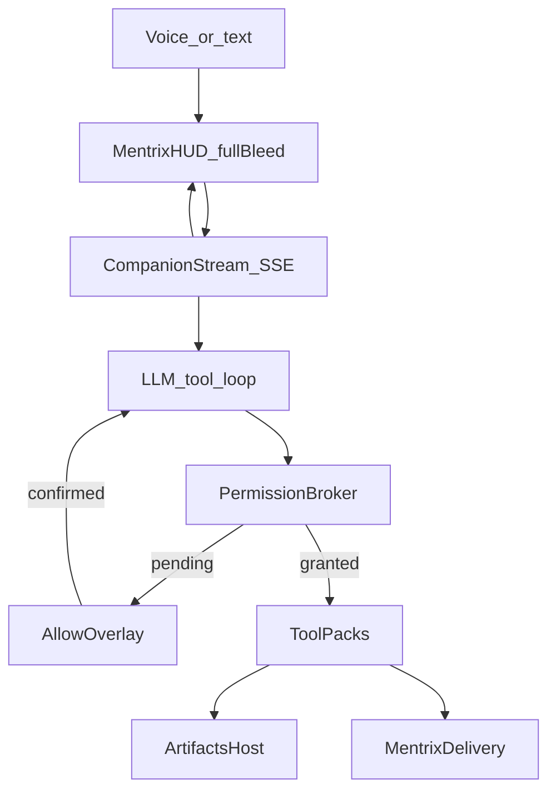

# Mentrix HUD + Streaming Agentic Companion

## Brand and reference lock

- **Ship only:** Mentrix, Lattice, ForgeLoop, ZECT.
- **Capability reference only** (do not clone, vendor, or name third-party agent products in UI/APIs/commits/user docs): public desktop companion patterns such as realtime voice, animated face states, artifact panel (markdown / Mermaid / notes / images / progress), web search, and opt-in computer control — see research link [rbrown101010/rileyjarvis](https://github.com/rbrown101010/rileyjarvis) for UX/feature ideas only.
- **Company security:** always-ask for send / desktop-write / computer / Delivery start / image upload; default deny secrets paths; full audit.

## Why it fails today

- Blocking `POST /companion/turn` — no live `thinking → tool_start → artifact → token → done`.
- Navigate dropped when any tool is `pending_confirm`.
- `start_delivery` stub — does not call `run_mentrix`.
- Board is plain `<pre>` — no Mermaid / table / chart / note host.
- Companion lives inside ZECT sidebar chrome — not a Mentrix operator HUD.
- Keyword intents only — not a true LLM tool-calling agent loop.

## Target experience

Desktop login → `/mentrix-home` Mentrix HUD. Connect Voice for dialogue. Mentrix streams tool progress to Live Log, posts rich Artifacts (including Mermaid workflows), navigates ZECT, and after Allow can engage real Delivery / desktop tools.

## Capability map (reference → Mentrix)

| Capability class | Mentrix ship |
|------------------|--------------|
| Realtime voice dialogue | **v1:** Windows STT (wake + Connect Voice) + `speechSynthesis` TTS driven by stream `token`/`done`. **v1.1 optional:** OpenAI Realtime speech-to-speech behind `MENTRIX_REALTIME=1` if keyed — never required for core path |
| Animated face states | Mentrix orb: `idle\|listening\|thinking\|speaking\|working\|needs_permission` with CSS/canvas motion |
| Artifact panel | Artifacts host: `markdown\|mermaid\|table\|chart\|note\|image\|progress\|record` |
| Web search | Existing `research_news` + stream artifact citations |
| Local notes/records | Mentrix Notes tool → `backend/data/mentrix_notes/` (gitignored), list/add in Artifacts |
| Image generation | Confirm-gated avatar/image gen stub → OpenAI images when keyed |
| Computer use | Electron Computer Mode (Windows-first): open allowlisted apps, screenshot, read allowlisted path, click/type stubs; stream tool events; always-ask high risk |
| Agentic workflow | LLM tool-calling loop (max 3–5 tools/turn, short timeouts) + Delivery via `run_mentrix` after Allow |
| Display | Toggle Artifacts stage fullscreen / hide chrome (Display mode) |

Out of scope for company Mentrix: consumer thumbnail boards / non-ZECT product cloning.

## Concrete technical choices (locked)

### 1. Streaming Companion API

- **Primary:** `GET /api/mentrix/companion/stream` (SSE) with Bearer auth (header preferred; token query only for EventSource if needed).
- **Events (JSON lines / `data:`):**
  - `thinking` — orb + Live Log
  - `tool_start` / `tool_end` — `{tool, args_redacted, ok?, error?}`
  - `artifact` — `{type, title, body, data?}`
  - `token` / `reply_delta` — incremental assistant text
  - `navigate` — `{path}` applied immediately by client
  - `pending_confirm` — opens fast Allow overlay (does not block navigate events already emitted)
  - `done` — `{reply, run_id?, latency_ms}`
  - `error`
- **Fallback:** keep `POST /api/mentrix/companion/turn` for Playwright and non-SSE clients.
- Implementation: generator in [`companion.py`](backend/app/services/mentrix/companion.py); route in [`mentrix.py`](backend/app/routers/mentrix.py); client in [`api.ts`](frontend/src/lib/api.ts) via `fetch` + `ReadableStream` (works with Authorization header better than raw EventSource).

### 2. HUD shell for `/mentrix-home`

- Full-bleed Mentrix operator UI in [`MentrixCompanion.tsx`](frontend/src/pages/MentrixCompanion.tsx):
  - Center animated Mentrix orb + greeting
  - Controls: **Connect Voice**, **Display**, **Computer Mode**, **Artifacts**
  - Live Log (stream events)
  - Text/prompt input
  - Right/main **Artifacts** stage
- Auto-collapse / hide ZECT sidebar on this route ([`Layout.tsx`](frontend/src/components/Layout.tsx)) so first viewport is one Mentrix composition.
- Visual language: dark HUD, teal Mentrix accent (not purple-default AI chrome); brand name Mentrix as hero signal.

### 3. Artifacts host

- New [`MentrixArtifacts.tsx`](frontend/src/components/MentrixArtifacts.tsx) (+ small renderers):
  - `markdown`, `mermaid` (add `mermaid` dep), `table`, `chart` (simple SVG/Recharts if already in app, else lightweight SVG bars), `note`, `image`, `progress`, `record`
- Tools emit artifacts:
  - diagnose / start_delivery → **Mermaid** gate/workflow diagram
  - report / brief → markdown
  - research → markdown + citation table
  - notes → note/record rows
- Display mode: Artifacts fullscreen; Hide returns to split HUD.

### 4. True agent loop

- Replace open-chat “single LLM essay” with bounded tool-calling:
  1. Emit `thinking`
  2. LLM returns structured tool calls (JSON schema / function list from registry) — timeout ~6s
  3. For each tool: `tool_start` → permission broker → execute or `pending_confirm` → `tool_end` / `artifact`
  4. Emit `token` summary (or stream if model supports) → `done`
- Keep deterministic intents for navigate/status as fast path (no LLM) still streaming events.
- Max tools per turn: 5; parallel only for read-only tools.

### 5. Always-ask as fast Allow overlay

- Upgrade [`MentrixConfirmModal.tsx`](frontend/src/components/MentrixConfirmModal.tsx): compact “Allow?” overlay, optional spoken prompt, keyboard Enter=Allow / Esc=Deny.
- Stream continues for already-granted tools; sensitive tools wait on overlay then client re-POSTs `confirmed_tools` on same stream or resume endpoint `POST /companion/stream/resume`.
- Locked resume approach: client holds `turn_id`; `POST /api/mentrix/companion/stream/resume` with `{turn_id, confirmed_tools}` continues SSE.

### 6. Navigate + Delivery (agentic work)

- Emit/apply `navigate` even when other tools pending.
- Electron: `window.location.assign(path)` fallback if router no-op.
- `start_delivery` (after Allow) → `run_mentrix(...)` → artifact Mermaid of gates + `run_id` + optional navigate `/mentrix`.

### 7. Voice + Computer + Notes

- **Connect Voice:** continuous listen after connect (desktop STT IPC / Web Speech in browser) → each utterance starts a stream turn → TTS on tokens/done.
- **Computer Mode:** existing Electron IPC; stream `tool_start`/`tool_end` for open_app/screenshot/read; idle auto-off unchanged.
- **Mentrix Notes:** `note_add` / `note_list` tools → files under `backend/data/mentrix_notes/` (gitignore); Artifacts `note`/`record` views.

## Implementation phases

### Phase A — Navigate + Delivery + Allow overlay
- Fix navigate-on-pending; Delivery → `run_mentrix`; Mermaid gates artifact; fast Allow overlay + spoken Allow.

### Phase B — SSE stream + agent loop
- `companion_stream` + `stream/resume`; LLM tool-calling registry; Live Log wired to events; turn fallback retained.

### Phase C — HUD + Artifacts host
- Full-bleed Mentrix HUD; Artifacts renderers including Mermaid; Display toggle; sidebar collapse on `/mentrix-home`.

### Phase D — Voice, Computer stream, Notes
- Connect Voice loop; Computer Mode events in log; notes/records persistence; optional Realtime flag documented but off by default.

### Phase E — Validate
- Unit: broker + stream event order + delivery create + notes.
- Playwright: HUD loads; Open Lattice navigates; Allow deny; artifact Mermaid present after diagnose; stream/fallback status ask.
- Desktop smoke: wake → HUD; Connect Voice → status; Computer Mode off blocks control.

## Key files

- [`frontend/src/pages/MentrixCompanion.tsx`](frontend/src/pages/MentrixCompanion.tsx)
- [`frontend/src/components/MentrixArtifacts.tsx`](frontend/src/components/MentrixArtifacts.tsx) (new)
- [`frontend/src/components/MentrixConfirmModal.tsx`](frontend/src/components/MentrixConfirmModal.tsx)
- [`frontend/src/components/Layout.tsx`](frontend/src/components/Layout.tsx)
- [`frontend/src/lib/api.ts`](frontend/src/lib/api.ts)
- [`backend/app/services/mentrix/companion.py`](backend/app/services/mentrix/companion.py)
- [`backend/app/routers/mentrix.py`](backend/app/routers/mentrix.py)
- [`electron/main.js`](electron/main.js) / [`preload.js`](electron/preload.js)
- [`docs/MENTRIX_COMPANION.md`](docs/MENTRIX_COMPANION.md)

## Success criteria

- Mentrix Companion feels realtime: stream events within ~1s, Live Log shows tools, Artifacts update with Mermaid workflows.
- Navigate and Delivery agentic paths work after Allow.
- Connect Voice + Computer Mode + Notes match capability bar of reference desktop companions without copying or naming them.
- Always-ask remains; audits complete; ZECT-only branding.
