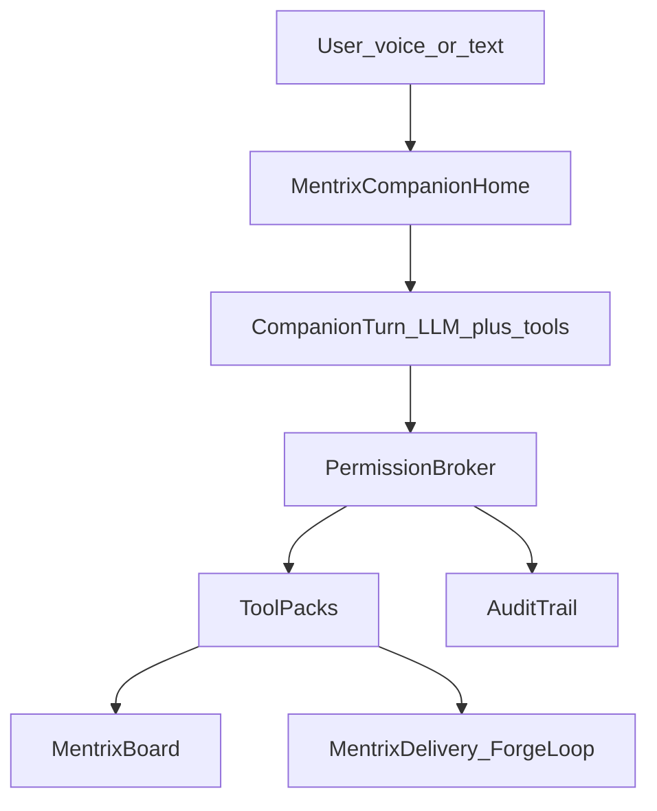

# Mentrix Personal Company Agent

## Product locks

- **Brand only:** Mentrix (agent), Lattice (code graph), ForgeLoop (delivery runtime), ZECT (platform). No third-party agent product names in UI, APIs, commits, or docs.
- **Audience:** Every desktop user in the company—not only engineers. Day-to-day work across **ads, research, content, reporting, internal docs**, plus engineering Delivery when needed.
- **Security:** Sensitive desktop, send, and write actions **always ask** (modal + optional voice confirm). Default deny for secrets paths. Every tool call audited.
- **Shareable company agent:** Org policy pack (tiers, allowlists, connector scopes) importable/exportable; same Mentrix Companion for all installs; per-user grants on top of org defaults.

## Problem vs today

| Need | Today |
|------|--------|
| Personal conversational Mentrix | Delivery runs only ([`Mentrix.tsx`](frontend/src/pages/Mentrix.tsx), [`/api/mentrix/runs`](backend/app/routers/mentrix.py)) |
| Visual companion after login | Dashboard + wake shell ([`electron/main.js`](electron/main.js)) |
| Business tools (research/docs/ads/report) | Partial MCP ([`mcp.py`](backend/app/routers/mcp.py), Confluence/Slack/email send); no companion router |
| Right permissions | [`/api/permissions`](backend/app/routers/permissions.py) exists but Mentrix does not call it |
| Desktop computer help | Wake/hotkey only—no OS control IPC |
| Gmail/Slack inbox digests | Slack notify + SMTP; inbound inbox marked wave2 |

## Target experience

After desktop login: **Mentrix Companion Home** (avatar states, chat, board). User asks in natural language; Mentrix answers, shows artifacts, navigates ZECT, and only runs tools after permission checks / confirms.

## Concrete technical choices (locked)

1. **Companion route:** `/mentrix-home` — Electron post-login landing; Delivery remains `/mentrix`.
2. **Dialogue API:** `POST /api/mentrix/companion/turn` — LLM turn with structured tool calls; reuse OpenAI path from [`llm.py`](backend/app/routers/llm.py) Ask; persist via conversations + memory.
3. **Voice v1:** Desktop Windows STT (extend wake) + `speechSynthesis` TTS; companion turn drives answers (not a separate cloud realtime product dependency for v1).
4. **Permission path:** Every tool → `POST /api/permissions/check` → `granted` | `pending_approval` | `denied`; UI confirm for `require_approval` and all **send / desktop-write / computer** classes.
5. **Tools:** Mentrix Tool Registry wrapping existing MCP + new companion tools; org policy JSON under Settings.
6. **Computer Mode:** Windows-first Electron main-process tools; off by default; session toggle; per-action confirm for high risk.
7. **Connectors:** Slack digest via existing Slack adapter + list_channels; email read via new Gmail OAuth (read) + keep SMTP send behind confirm; news via pluggable HTTP news/search backend; Confluence via existing MCP for internal docs.

## Permission model (company-ready)

**Tiers (user enables upward; org can cap max tier):**

| Tier | Examples |
|------|----------|
| T0 Chat | Talk, navigate ZECT UI, read own Mentrix status |
| T1 Work read | Lattice query, Confluence/docs search, news/research fetch, report drafts on Board |
| T2 Work write (confirm) | Create doc draft, save report, start Mentrix Delivery run, Slack/email **send** |
| T3 Desktop read (confirm) | Allowlisted folders, screenshot |
| T4 Desktop control (confirm) | Open app, click/type—Computer Mode ON only |

**Always-ask classes:** file delete/write outside sandbox, shell/install, computer click/type on forms, email/Slack send, PR create/approve, upload personal photo for avatar, screen capture, access to `.env`/keys/password stores (default **never**).

**Org share pack:** export/import rules + allowlists + enabled connectors (reuse Permissions + Integrations patterns).

## Tool packs (right tools for business)

| Pack | Tools (illustrative) | Primary permissions |
|------|----------------------|---------------------|
| **Research** | web/news search, summarize URLs, cite sources | T1 |
| **Content / Ads** | brief generator, copy variants, image gen (confirm upload), campaign checklist | T1–T2 |
| **Reporting** | pull metrics stubs/MCP Datadog, draft report markdown on Board | T1–T2 |
| **Internal docs** | Confluence search/read (MCP), draft page (confirm publish) | T1–T2 |
| **Comms** | Slack list/read digest, Slack send (confirm); Gmail read digest; email send (confirm) | T1–T2 |
| **Delivery** | Mentrix run status, engage Delivery, gates, approve/PR (confirm) | T1–T2 |
| **Desktop** | open allowlisted app, read allowlisted path, screenshot, Computer Mode actions | T3–T4 |

Wire enforcement through Permissions defaults expanded beyond eng-only patterns in [`permissions.py`](backend/app/routers/permissions.py).

## Phased delivery

### Phase A — Security broker + Companion Home shell
- Backend: permission check helper used by companion; audit helper `log_mentrix_tool(...)`.
- Electron IPC: `mentrix.confirmAction`, `mentrix.getPolicy`.
- Frontend: [`MentrixCompanion.tsx`](frontend/src/pages/) — avatar states (`idle|listening|thinking|speaking|working|needs_permission`), chat, Board pane, status strip; route `/mentrix-home`; Electron landing after auth.
- Nav intents: open Lattice/Blueprint/Delivery/Sandbox; **go back**.

### Phase B — Companion turn + business tools (read)
- `POST /api/mentrix/companion/turn` with tool definitions for Research, Internal docs (Confluence MCP), Delivery status, navigate.
- Board renders markdown + citations.
- Playwright: companion status Q&A + navigate + permission deny path.

### Phase C — Voice dialogue + always-ask UX
- Desktop continuous listen after wake → companion turn → TTS.
- Confirm modal component shared (text + optional spoken “Allow?”).
- Expand permission rules for send/desktop categories.

### Phase D — Write/send connectors + content/ads/reporting
- Slack digest + send confirm; Gmail OAuth read + SMTP/send confirm; news search.
- Content/ads brief + image gen with photo consent; reporting drafts to Board / export.
- Org policy export/import for shareable company agent.

### Phase E — Computer Mode (Windows) + fix loop
- Electron: screenshot, open app, UI Automation click/type behind T4 + confirms.
- “Diagnose and fix” loop: gather (allowed) context → Board plan → confirm → Delivery or desktop steps → verify.
- Hardening: idle auto-off Computer Mode, allowlists, full audit.

## Key files to extend

- [`frontend/src/pages/Mentrix.tsx`](frontend/src/pages/Mentrix.tsx) — keep Delivery; link from Companion
- [`frontend/src/App.tsx`](frontend/src/App.tsx) — route `/mentrix-home`
- [`frontend/src/components/MentrixWakeBridge.tsx`](frontend/src/components/MentrixWakeBridge.tsx) — wake → Companion Home
- [`electron/main.js`](electron/main.js) / [`preload.js`](electron/preload.js) — confirm + later computer tools
- [`backend/app/routers/mentrix.py`](backend/app/routers/mentrix.py) — companion turn
- [`backend/app/routers/permissions.py`](backend/app/routers/permissions.py) — business/desktop rule defaults
- [`backend/app/routers/mcp.py`](backend/app/routers/mcp.py) — tool calls from companion
- [`backend/app/routers/audit_trail.py`](backend/app/routers/audit_trail.py) — agent act logging
- Docs: Mentrix Companion + Security (ZECT-only naming)

## Validation

- Unit: permission broker (grant/deny/pending) for sample tools
- Playwright: Companion Home loads; status intent; navigate/back; send tool shows confirm
- Manual desktop: wake → Companion; ask research/docs question; Computer Mode off blocks control

## Success criteria

- Company users get one sharable Mentrix Companion for ads/research/content/reporting/docs and Delivery.
- Right tools exposed; wrong tools blocked by org policy.
- Sensitive work always asks permission; audits complete.
- No third-party agent product names anywhere in the ship.