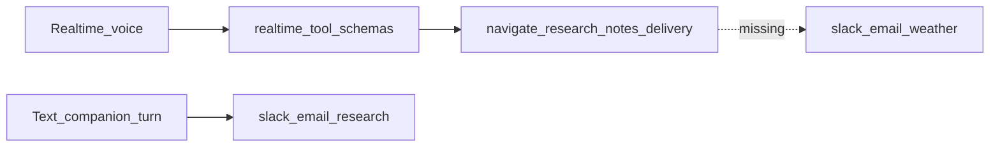
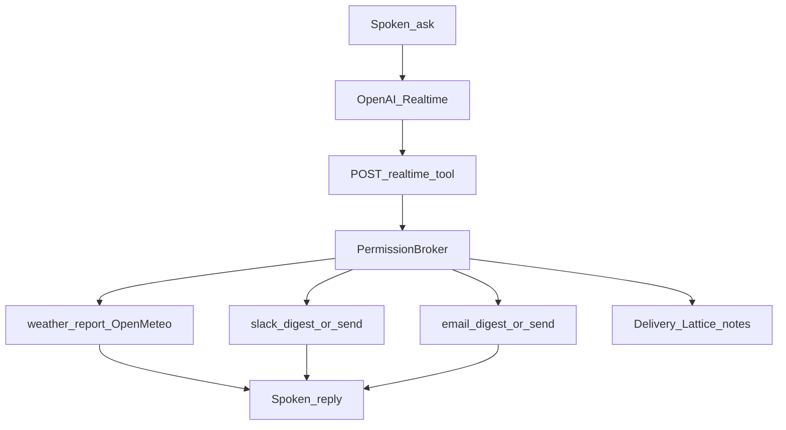

# Mentrix Personal Ops Voice (weather + Slack + email on Realtime)

## Locked decisions

- **Brand:** Mentrix / Lattice / ForgeLoop / ZECT only. Capability ideas only from public desktop companions — no cloning names, UI, or Exa.
- **Voice path:** Keep OpenAI Realtime as primary Connect Voice; expand **Realtime function tools** so spoken asks hit Slack / email / weather (today those tools exist for text turns but are **missing** from [`realtime_tool_schemas()`](backend/app/services/mentrix/realtime.py)).
- **Weather:** New Mentrix tool `weather_report` via **Open-Meteo** (no API key; geocode + current/forecast). Fallback to `research_news` only if Open-Meteo fails.
- **Slack / email:** Use existing MCP adapters (`SLACK_BOT_TOKEN`, SMTP). Improve digests so voice gets speakable summaries. Sends stay **always-ask**.
- **Email inbox:** Add optional IMAP read when `MENTRIX_IMAP_*` env vars are set; if unset, digest returns a clear setup message (no fake inbox).

## Why voice cannot “answer all” today

Realtime schemas omit `slack_*` / `email_*` / weather ([`realtime.py`](backend/app/services/mentrix/realtime.py) lines 36–149). Text path already routes Slack/email intents in [`companion.py`](backend/app/services/mentrix/companion.py).

## Target flow

## Phase 1 — Expand Realtime tool surface

In [`backend/app/services/mentrix/realtime.py`](backend/app/services/mentrix/realtime.py):

- Add function schemas: `weather_report`, `slack_digest`, `slack_send`, `email_digest`, `email_send`, plus `content_brief` / `report_draft` for common personal asks.
- Update `mentrix_instructions()` so Mentrix prefers tools for weather/Slack/email (never invent inbox contents).
- Keep `run_realtime_tool` → broker → `_exec_tool` (already shared).

In [`permission_broker.py`](backend/app/services/mentrix/permission_broker.py) / [`org_policy.py`](backend/app/services/mentrix/org_policy.py):

- Map `weather_report` → `companion_weather` (allow).
- Seed rule allow for weather; Slack/email send remain require_approval / ALWAYS_CONFIRM.

## Phase 2 — Weather tool (Mentrix)

New helper [`backend/app/services/mentrix/weather.py`](backend/app/services/mentrix/weather.py):

- `weather_report(location: str)` → Open-Meteo geocoding + forecast (httpx, short timeout).
- Return compact dict: location, temp, conditions, next hours — plus Artifacts `markdown` board card.

Wire in [`companion.py`](backend/app/services/mentrix/companion.py) `_exec_tool` + `_parse_intents` (`weather`, `forecast`, `how's the weather`).

## Phase 3 — Slack + email digests for voice

**Slack** ([`adapters/slack.py`](backend/app/services/mcp/adapters/slack.py) + companion `slack_digest`):

- After `list_channels`, if token present fetch recent messages from default channel (`SLACK_DEFAULT_CHANNEL` / `#engineering`) via `conversations.history` (limit ~10).
- Shape reply as short bullet digest for Realtime to speak; artifact markdown table optional.
- If no token: honest `ok` + note “Set SLACK_BOT_TOKEN in backend/.env”.

**Email digest** ([`companion.py`](backend/app/services/mentrix/companion.py) + small IMAP helper):

- If `MENTRIX_IMAP_HOST` / `USER` / `PASSWORD` set → fetch last N subjects (read-only).
- Else return setup note (SMTP alone cannot read inbox).
- `email_send` unchanged (SMTP MCP); always-ask.

Document env in [`backend/.env.example`](backend/.env.example): `MENTRIX_IMAP_*` + remind Slack/SMTP.

## Phase 4 — Spoken-friendly tool outputs

- In `_exec_tool` / realtime tool wrapper, add a short `spoken_summary` string (1–3 sentences) on weather/slack/email results so Realtime function output is easy to vocalize.
- HUD: on Realtime tool events, push Live Log + Artifacts (existing handlers in [`MentrixCompanion.tsx`](frontend/src/pages/MentrixCompanion.tsx) / [`mentrixRealtime.ts`](frontend/src/lib/mentrixRealtime.ts)).

## Phase 5 — Docs + validate

- Update [`docs/MENTRIX_COMPANION.md`](docs/MENTRIX_COMPANION.md): personal-ops voice tools, Open-Meteo weather, Slack/IMAP setup, Always-ask for sends, no Exa.
- Unit: weather parse (mock httpx), realtime schemas include new tools, slack digest without token returns setup note, IMAP unset digest.
- Playwright: text ask “What's the weather in Austin?” gets reply containing temp/conditions or research fallback; Slack send still shows Allow modal; companion HUD Connect Voice still toggles.
- Manual smoke: Connect Voice → Realtime log line → ask weather / Slack digest / email digest aloud.

## Key files

- [`backend/app/services/mentrix/realtime.py`](backend/app/services/mentrix/realtime.py)
- [`backend/app/services/mentrix/companion.py`](backend/app/services/mentrix/companion.py)
- [`backend/app/services/mentrix/weather.py`](backend/app/services/mentrix/weather.py) (new)
- [`backend/app/services/mcp/adapters/slack.py`](backend/app/services/mcp/adapters/slack.py)
- [`backend/app/services/mentrix/permission_broker.py`](backend/app/services/mentrix/permission_broker.py)
- [`backend/.env.example`](backend/.env.example)
- [`docs/MENTRIX_COMPANION.md`](docs/MENTRIX_COMPANION.md)
- [`backend/tests/test_mentrix_companion.py`](backend/tests/test_mentrix_companion.py)

## Success criteria

- Spoken “What's the weather in …” → Realtime calls `weather_report` → fast spoken answer + artifact.
- Spoken “Slack digest” / “any email?” → tools run; setup message if keys missing (no invented data).
- Spoken “Slack send …” → Allow overlay before send.
- ZECT tools (Delivery, Lattice, navigate) still work on the same Realtime session.
- No third-party companion product names; no Exa dependency.
