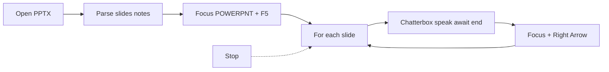

# Mentrix Present All Slides (PowerPoint control)

## Locked decisions

- **Desktop-only** (Electron Computer Mode). Browser keeps current “Narrate talking points” only.
- **Narration source:** speaker notes when present; else slide title + body text (truncated).
- **Advance:** after each slide’s audio **ends**, focus PowerPoint and send **Right Arrow**.
- **Start:** open `.pptx` → wait briefly → focus PowerPoint → **F5** (from beginning).
- **No Zoom auto-share** (unchanged). User still joins/shares if needed.
- **Stop** button cancels the run mid-deck.

## Current gaps

- [`PresentDeckPanel.tsx`](frontend/src/components/PresentDeckPanel.tsx): open + narrate free-text only; no slide loop.
- [`speak.ts`](frontend/src/mentrix/speak.ts): `audio.play()` returns when playback **starts**, not when it **ends** — must await `ended` before Next.
- [`electron/computer.js`](electron/computer.js): can `openPresentation` / `focusApp` / `typeText`, but no dedicated slideshow keys or PPTX note extract.
- No `python-pptx` in backend; parsing belongs in **Electron** (local allowlisted path).

## Implementation

### 1. Electron: PPTX parse + slideshow keys

In [`electron/computer.js`](electron/computer.js) (+ wire in [`electron/main.js`](electron/main.js)):

- **`parse_presentation_slides`** `{ path }`
  - Reuse allowlist / ext checks from `openPresentation`.
  - Read `.pptx` as ZIP (`adm-zip` or Node `zlib` + manual zip; prefer lightweight zip already available or add `jszip`/`adm-zip` in electron package).
  - Extract ordered slides; for each: speaker notes text; fallback to title/body from slide XML (strip tags, collapse whitespace).
  - Return `{ ok, slides: [{ index, notes, text }], count }`.
- **`powerpoint_key`** `{ key: "f5" | "right" | "esc", app?: "POWERPNT" }`
  - `focusApp("POWERPNT")` then SendKeys: `{F5}`, `{RIGHT}`, `{ESC}` (Windows). Darwin: System Events key codes as best-effort.
- Keep existing `open_presentation`.

### 2. Frontend speak: wait until done

In [`frontend/src/mentrix/speak.ts`](frontend/src/mentrix/speak.ts):

- Add `speakMentrixAwait(text, enabled)` (or option `waitUntilDone: true`):
  - After `audio.play()`, resolve on `ended` / reject on `error`; clear `lastAudio`.
  - Browser speechSynthesis fallback: resolve on `utterance.onend`.
- Export `cancelMentrixSpeech()` already covered by `cancelBrowserSpeech` — ensure Present All calls it on Stop.

### 3. Present Deck UI: Present all slides

In [`frontend/src/components/PresentDeckPanel.tsx`](frontend/src/components/PresentDeckPanel.tsx):

- New button **Present all slides** (`data-testid="present-deck-present-all"`).
- Flow:
  1. Require Electron + `.pptx` path.
  2. `parse_presentation_slides` → if empty, status error.
  3. `open_presentation` → delay ~2s → `powerpoint_key f5`.
  4. For `i = 0..n-1`: status `Slide i+1 / n` → `speakMentrixAwait(notes||text)` → if not last, `powerpoint_key right` (+ short gap ~400ms).
  5. On finish: status complete; optional Esc not auto-sent (leave slideshow).
- **Stop presenting** sets abort flag, cancels speech, stops loop (no further Right).
- Keep existing **Narrate talking points** for manual one-shot script.

### 4. Docs / e2e light touch

- Update Companion Present Deck blurb in [`frontend/src/pages/Docs.tsx`](frontend/src/pages/Docs.tsx).
- Extend [`frontend/e2e/present-deck.spec.ts`](frontend/e2e/present-deck.spec.ts): mock `zectDesktop.mentrix.computer` for parse + keys; assert Present all calls sequence (open → parse → f5 → speak mocked → right).

## Out of scope

- Auto Zoom share / Meeting SDK.
- Parsing `.ppt` legacy binary (`.pptx` only for Present all; open can still allow `.ppt`/`.pdf` without auto-run).
- COM/VBA deep automation beyond focus + keys.
- Mentrix reading slides from a remote URL.

## Verify manually

1. Electron + Computer Mode on; clone default ready.
2. Path to a `.pptx` with speaker notes → **Present all slides**.
3. Confirm F5 slideshow, voice per slide, Right between slides; **Stop** halts mid-deck.
