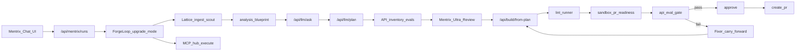

# Mentrix Unified Upgrade + MCP Agent Plan

## Product intent (locked)

- **Any language → any language** upgrade, driven by user goal (not C→Java only).
- **One Mentrix chat** orchestrates: Lattice → Blueprint → Ask/Plan → API analysis + Mentrix Ultra Review → Build → lint/sandbox/eval gates → human Approve → PR, with **live status**.
- **Reuse** existing ZECT Ask/Plan/Build/Review/Blueprint routers — Mentrix is the orchestrator, not a second parallel LLM stack.
- **MCP agentic work:** Mentrix Integrator/Ops execute Slack send, email send, Datadog logs (outbound-first in this ship; inbound Slack Events / email inbox in a later wave).
- **Review branding:** best-in-class PR/code review inspired by industry practice — product name **Mentrix Ultra Review** (never third-party names in UI/docs).
- **Quality doctrine:** LLMs can err; ZECT enforces **refuse-incomplete** via gates so a run cannot claim done or open a PR with missing files, failed lint, failed evals, or critical review findings. Target is operational “ship only at 100% gate green,” not magical zero-hallucination.

## Login unblock (local test)

In [backend/app/routers/auth.py](backend/app/routers/auth.py) / startup:

- If `ZECT_USERNAME` / `ZECT_PASSWORD` unset in local mode, set documented defaults for dev only: `admin@zect.local` / `zect-dev-local` (log once at startup; never in production when `ZECT_AUTH_ENFORCE` + non-local env).
- Update [backend/.env.example](backend/.env.example) and Login placeholder copy.
- Smoke: login → Mentrix page with those creds.

## Architecture: wire existing phases into ForgeLoop

Today ForgeLoop heuristics **do not call** `/api/llm`, `/api/build`, `/api/review-phase`. That is the core fix.

### New mode: `upgrade` (and deepen `deliver`)

In [backend/app/services/forge_loop/orchestrator.py](backend/app/services/forge_loop/orchestrator.py):

| Step | Call into existing code | Output on run |
|------|-------------------------|---------------|
| lattice | ensure ingest if `workspace`/`project_key`; `_run_scout` | graph + RAG cites |
| blueprint | `repo_analysis` blueprint builders (+ optional `llm.enhance_blueprint`) | phase map + migration prompt |
| ask | extract/call ask logic from [llm.py](backend/app/routers/llm.py) with blueprint+scout context | clarifying requirements |
| plan | `llm` plan with **phased** steps (inventory → port module N → tests → eval) | structured plan JSON |
| api_analyze | new thin service: route/OpenAPI inventory from Lattice + regex/OpenAPI files | API catalog + eval stubs |
| ultra_review | [review_phase.py](backend/app/routers/review_phase.py) analyze + [review_service.py](backend/app/review_service.py) patterns; severity policy | Mentrix Ultra Review report |
| build | [build_phase.py](backend/app/routers/build_phase.py) `from-plan` / `generate` with `write_to_repo=true` when workspace/repo_id set; **one phase/module per cycle** | files written + file list |
| lint / sandbox / eval | existing lint_runner + pr-readiness + new eval runner | gates |
| fixer | autofix carry-forward + re-build until max recovery or needs_human | recovery events |
| integrate | MCP execute (not only suggest) when user goal asks Slack/email/Datadog | tool audit |

Ship path unchanged: [mentrix.py](backend/app/routers/mentrix.py) approve → create-pr.

### Anti-hallucination / no halfway stop (concrete rules)

1. **Phase commits:** Build only the current plan step’s file list; require `files_expected` vs `files_written` match.
2. **Incomplete = fail gate:** if LLM returns truncated/partial (token cut, empty file, TODO placeholders matching deny-list), status `needs_human` or auto-Fixer — never `awaiting_approval`.
3. **API eval gate:** generate/run contract checks from inventory (HTTP smoke or schema asserts); score stored on `gates.api_eval_ok`.
4. **Lint must pass** (`MENTRIX_LINT_STRICT=true` for upgrade mode).
5. **Mentrix Ultra Review:** critical findings block approve unless acknowledge.
6. **Live status:** persist step events (`phase`, `progress`, `next_step`); add `GET /api/mentrix/runs/{id}/events` or SSE later — v1 poll `GET /runs/{id}` every N seconds from UI.

## Mentrix chat UI (Cursor-like)

Evolve [Mentrix.tsx](frontend/src/pages/Mentrix.tsx) into a single chat:

- Message list = Mentrix run events + assistant summaries per phase.
- Mode default `upgrade` for migration goals; keep `chat`/`ops`/`deliver`.
- Inputs: goal, `project_key`, `workspace`, source/target language (optional hints).
- Live panel: current phase, gates, next_step, Approve / Create PR.
- Sidebar remains journeys; Mentrix is the primary agent entry under Deliver.

## MCP agentic automation (outbound-first)

Hub already at [backend/app/services/mcp/hub.py](backend/app/services/mcp/hub.py).

- Mentrix Integrator/Ops: on tool intents in goal/plan, call `execute_tool` (Slack send, email via [email_integration.py](backend/app/routers/email_integration.py), Datadog `query_logs`).
- Rules Engine still blocks secrets.
- Integrations UI: enable toggles + env docs for `SLACK_BOT_TOKEN`, SMTP, `DATADOG_*`.
- **Out of this ship:** Slack Events inbound reply bot and email inbox poll (document as Wave 2).

## Mentrix Ultra Review (best-in-class, ZECT-branded)

Deepen (no competitor names in UI):

- Chunked diffs + line mapper (already started).
- Severity taxonomy, categories, actionable fixes, autofix prompts.
- Wire into upgrade pipeline before/after Build as “preflight + postflight.”
- UI label: **Mentrix Ultra Review** on Code Review / Mentrix panels.

## API evals

New module `backend/app/services/quality/api_eval.py`:

- From Lattice/blueprint extract endpoints (OpenAPI JSON if present; else route regex for common stacks).
- Persist eval cases on Mentrix run result.
- Runner: schema presence checks + optional HTTP smoke against sandbox/base URL.
- Gate `api_eval_ok` required for upgrade approve.

## Docs / honesty

Update [docs/MENTRIX_ARCHITECTURE.md](docs/MENTRIX_ARCHITECTURE.md): upgrade mode diagram, gate doctrine (“ship only when 100% green”), MCP outbound scope, Ultra Review naming.

## Implementation order

1. Local login defaults + smoke login.
2. Extract callable service wrappers from llm/build/review_phase/repo_analysis (avoid HTTP self-calls).
3. ForgeLoop `upgrade` pipeline wiring + incomplete-file / lint / eval gates.
4. Mentrix chat UI + live poll status.
5. MCP execute from Integrator/Ops + Integrations config UX.
6. Mentrix Ultra Review branding + post-build review step.
7. API inventory + eval gate.
8. Tests: upgrade mode contract, gates block incomplete, approve/PR; Playwright Mentrix chat smoke.

## Exit criteria

- Login works with documented local defaults without empty `.env`.
- Mentrix `upgrade` run invokes real Ask/Plan/Build/Review-phase code paths (not heuristic-only).
- Phase-by-phase plan visible in events; Build writes files when workspace set.
- Lint / Ultra Review critical / API eval / incomplete-file block approve and PR.
- Mentrix can send Slack/email and query Datadog when configured (MCP).
- UI shows live status; human still required before PR.
- No third-party review product names in shipped UI.
