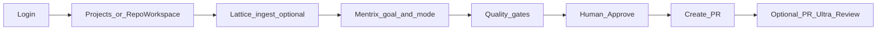

# Mentrix Best-in-Class UX + Lattice Intelligence Plan

## Product decisions (locked)

- **Product:** ZECT; **agent:** Mentrix; **graph:** Lattice (Graphify-class capability, ZECT-branded).
- **No external agent stack** clone from `C:\runner`; use only as capability reference.
- **No user-facing Graphify install step** — deepen Lattice; Mentrix auto-scouts it.
- **Primary workflow:** Mentrix goal → ForgeLoop → gates → Approve → Create PR (no paste for normal delivery).
- **Python:** local backend stays on **3.12** (not 3.14).

## Target user journey



---

## Phase 0 — Current-state assessment (no major product changes)

Execute [docs/prompts/zect-platform-assessment.md](docs/prompts/zect-platform-assessment.md) against the live repo. Write evidence-labeled docs under `docs/zect-assessment/`:

- Repository map, sidebar matrix (status: Fully Connected / Partially / Disconnected / Placeholder), Mentrix/ForgeLoop/Lattice/MCP analysis
- Scores, top strengths/gaps, Dream Engine / harness / hooks status
- external agent stack capability **reference matrix** (ideas only → Lattice/Mentrix gaps) citing `C:\runner` paths
- Recommended sidebar structure and first 20 implementation tasks (aligned with Phases 1–3 below)
- Label every major finding: Verified / Partially Verified / Inferred / Not Implemented / Unable to Verify

**Gate:** assessment pack complete before Phase 2 Lattice architecture work ships (Phase 1 UX auth can proceed in parallel after draft sidebar matrix).

---

## Phase 1 — User-friendly Mentrix workflow + Labs 401 + Ultra Review clarity

### 1A. Labs auth (root cause of many 401s)

**Problem:** Labs pages use raw `fetch` without Bearer; shared helper is private in [frontend/src/lib/api.ts](frontend/src/lib/api.ts).

**Fix:**

- Export `request` (or thin wrappers) from `api.ts`.
- Replace raw fetches in:
  - [MemoryDashboard.tsx](frontend/src/pages/MemoryDashboard.tsx)
  - [DreamEngine.tsx](frontend/src/pages/DreamEngine.tsx)
  - [DataFlywheel.tsx](frontend/src/pages/DataFlywheel.tsx)
  - [DataLayer.tsx](frontend/src/pages/DataLayer.tsx)
  - [SkillsEngine.tsx](frontend/src/pages/SkillsEngine.tsx)
  - [Permissions.tsx](frontend/src/pages/Permissions.tsx)
  - [TransferOnboarding.tsx](frontend/src/pages/TransferOnboarding.tsx)
- Leave pages already on `@/lib/api` alone (Skill Library, Mentrix, etc.).

### 1B. Guided Mentrix workflow in sidebar / Mentrix UI

**Problem:** Sidebar is a toolbox; Dashboard is metrics-only; users do not see one connected path.

**Fix (concrete):**

- In [Sidebar.tsx](frontend/src/components/Sidebar.tsx): add a top **Workflow** section with a single primary item **Mentrix Delivery** → `/mentrix`; keep Deliver phase pages under Deliver but demote visual primacy (Mentrix first).
- On [Mentrix.tsx](frontend/src/pages/Mentrix.tsx): add a compact step rail — `Lattice → Plan/Build → Gates → Ultra Review → Approve → PR` — driven by run `events` / `gates` / `status` / `next_step` (already polled).
- Short empty-state copy: bind workspace + project key, pick mode, type goal; link to Lattice if no graph.

### 1C. Ultra Review de-duplication (no paste for delivery)

| Surface | Action |
|---------|--------|
| Mentrix ForgeLoop Ultra Review | Keep as automatic gate (primary) |
| Quality `/code-review` | Keep label **Mentrix Ultra Review** — PR/repo review |
| Deliver `/review` | Rename nav to **Snippet Review**; page banner: “Manual paste only — delivery uses Mentrix” |

No backend merge required in this phase; naming + Mentrix step rail removes the “copy code to review” misunderstanding.

### 1D. Playwright

- Extend e2e: Labs Memory (or Skills Engine) loads **200** with auth (not 401).
- Mentrix step rail visible; existing Mentrix smoke/upgrade/gates remain green.

---

## Phase 2 — Lattice → Graphify-class code intelligence (in ZECT)

Stay on JSON cache in [backend/app/services/lattice/indexer.py](backend/app/services/lattice/indexer.py) — **no Neo4j, no Graphify package**.

**Implementation order:**

1. **Resolve imports** → file nodes (relative imports) so edges are traversable.
2. **`calls` edges** — Python `ast` within-file (+ same-module when resolved); light TS/JS call regex.
3. **APIs** on [backend/app/routers/lattice.py](backend/app/routers/lattice.py):
   - `POST /api/lattice/path` — BFS between two node ids / names
   - `POST /api/lattice/neighbors` — 1-hop expand
   - `POST /api/lattice/explain` — structured path + neighbor summary (template first; short LLM only if key present)
4. **Business/route heuristic nodes** — FastAPI/Flask/Express route decorators → `endpoint` / `business` kind + edges (Mosaic-style *idea*, Mentrix-native data).
5. **ForgeLoop scout** in [orchestrator.py](backend/app/services/forge_loop/orchestrator.py): after substring hits, attach path/neighbor snippets for top files so Mentrix plans with graph structure, not names alone.
6. **UI** [LatticeGraph.tsx](frontend/src/pages/LatticeGraph.tsx): path + explain query panel; keep Mentrix as consumer, not a second product.

Unit tests: ingest fixture repo → calls/path/neighbors; Mentrix scout still returns graph_hits.

---

## Phase 3 — Desktop Mentrix wake: real STT + TTS status

Scope: **Electron only** (browser remains typed Mentrix).

- Replace STT stub in [electron/main.js](electron/main.js) / [preload.js](electron/preload.js): expose mic transcript IPC; match wake phrases (`Hey Mentrix`, `Mentrix engage`, `Mentrix`); hotkey remains fallback.
- Renderer ([Mentrix.tsx](frontend/src/pages/Mentrix.tsx)): on wake → focus Mentrix; optional listen for short follow-up goal after wake.
- **TTS:** `speechSynthesis` (or Electron-safe equivalent) speaks run status transitions (`running` → `needs_human` / `approved` / gate blockers) when desktop flag enabled.
- Document limitations (OS mic permissions) in Mentrix empty state + architecture doc.

Playwright: browser path unchanged; add a small unit/mock test for wake phrase matching if extractable; Electron e2e only if harness already supports it (otherwise manual checklist in assessment/how-it-works).

---

## Phase 4 — “What was fixed and how it works” deliverable

Update [docs/MENTRIX_ARCHITECTURE.md](docs/MENTRIX_ARCHITECTURE.md) and add `docs/zect-assessment/HOW_IT_WORKS_MENTRIX.md`:

- User workflow (sidebar → Mentrix → Approve → PR)
- Lattice capabilities after Phase 2
- Ultra Review: when automatic vs Snippet vs PR page
- Voice: how to call Mentrix on desktop
- Checklist: fixed vs deferred (Labs deep features, Neo4j, Graphify package, LangGraph)

---

## Explicitly out of scope

- Cloning or wiring `C:\runner` external agent stack services into ZECT
- Adopting LangGraph or renaming Lattice to Graphify
- Full Labs feature completion (Dream/Flywheel product depth) beyond auth + assessment notes
- Magical zero-hallucination claims — keep refuse-incomplete gates

## Validation commands (after implementation)

```bash
# backend (py -3.12)
cd backend && py -3.12 -m pytest -q tests/test_mentrix_platform.py tests/test_mentrix_quality_gates.py
# lattice unit tests added in Phase 2

# frontend e2e
cd frontend && npx playwright test e2e/mentrix-smoke.spec.ts e2e/mentrix-quality-gates.spec.ts
```

## Success criteria

- Assessment pack exists under `docs/zect-assessment/` with evidence labels.
- Labs Memory/Dream/Flywheel/Skills Engine return authenticated success when logged in.
- Mentrix shows a visible delivery step rail; Ultra Review naming no longer implies paste-for-PR.
- Lattice supports path/neighbors/calls and Mentrix scout uses them.
- Desktop wake + spoken status work with hotkey fallback.
- HOW_IT_WORKS doc lists fixed items and how users operate Mentrix day-to-day.
