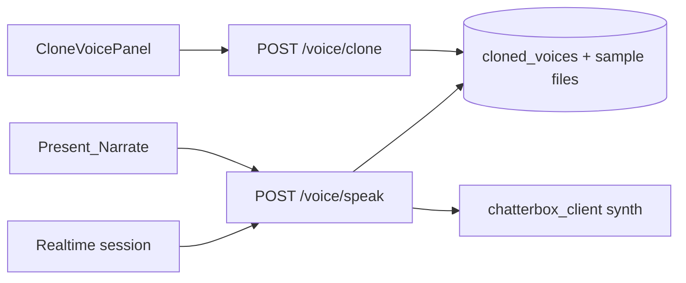

# Mentrix Companion, Chatterbox Voice, Lattice, Docs

## Decisions (locked)

- **Chatterbox Phase 1 (this work):** ZECT owns the clone API + persistence + branding. Store sample audio + metadata in ZECT (DB + `backend/data/voices/`). List / set-default / delete. Present + Realtime sessions always use the user’s **default** clone when present. Synthesis stays a **pluggable local engine** behind `chatterbox_client` (can still call the existing local HTTP engine under the hood) — **no Voicebox UI, links, or status copy**. Full in-process TTS training engine is out of scope.
- **Nav:** Keep one **Mentrix Companion** primary entry. Incident and Voice become **in-Companion tabs/panels** (deep links `?incident=1` / `?voice=1` still work). Remove separate top-level “Voice Cloning” sidebar item; keep Incident as a Workflow shortcut only if labeled as a mode, not a second Companion.
- **Lattice:** Add a real **node inspector** wired to click/Fly-to (not docs-only).

---

## 1. Fix double response (long replies)

**Root cause (cloned Realtime):** [`frontend/src/lib/mentrixRealtime.ts`](frontend/src/lib/mentrixRealtime.ts) appends on `*_audio_transcript.done` **and again** on `response.done` + `speakWithClonedVoice` — two bubbles; stock `output_audio.delta` can also play before clone TTS.

**Secondary:** [`MentrixSessionContext.tsx`](frontend/src/mentrix/MentrixSessionContext.tsx) `runTurn` — if SSE `done` already appended/spoke, a late stream error still falls back to full `mentrixCompanionTurn` and appends/speaks again.

**Changes:**
- When `clonedVoiceActive`: skip `onTranscript` on transcript.done; finalize **once** on `response.done` (track `response_id`); ignore `output_audio.delta` / clear play queue.
- Non-cloned: append from transcript.done only (not also from `response.done`).
- `runTurn`: set `streamFinalized` on `done`; catch must not re-run turn/speak if already finalized.
- Dedupe consecutive identical assistant appends in `onTranscript`.
- Ensure mint/`session.update` stays text-only when clone is active ([`realtime.py`](backend/app/services/mentrix/realtime.py)).

Add a focused unit/e2e assertion: one assistant bubble + one speak for a long cloned reply.

---

## 2. ZECT Chatterbox + DB-owned clones

**Today:** [`ClonedVoice`](backend/app/models.py) stores only `voice_id` pointer; sample lives in Voicebox; UI says “Voicebox offline” ([`CloneVoicePanel.tsx`](frontend/src/components/CloneVoicePanel.tsx)).

**Model / storage:**
- Extend `cloned_voices`: drop one-row-per-user uniqueness (or add related table); columns e.g. `name`, `provider` (`chatterbox`), `sample_path`, `reference_text`, `is_default`, `created_at`, `external_voice_id` (optional engine id).
- Persist uploaded/recorded sample under `backend/data/voices/{user_id}/{voice_id}.…`.
- APIs in [`voice_clone.py`](backend/app/routers/voice_clone.py):
  - `POST /clone` — save sample + row; mark default (or first).
  - `GET /voices` — list user’s clones.
  - `GET /my-voice` — keep as “default” for backward compat.
  - `POST /voices/{id}/default` — set default.
  - `DELETE /voices/{id}` — delete DB row + sample file (+ best-effort engine profile).
  - `POST /speak` — load **default** (or explicit id) → synth via renamed [`chatterbox_client`](backend/app/services/llm/voicebox_client.py) (file rename + env `CHATTERBOX_BASE_URL` with fallback to old `VOICEBOX_*` for local engines).

**UI:**
- Rebrand Clone panel: Chatterbox / “Mentrix Voice”; remove Voicebox GitHub/status.
- List saved voices with **Use for Present/sessions** (default) and **Delete**.
- After clone, auto-set default and show “Ready for Present & voice sessions.”
- [`speak.ts`](frontend/src/mentrix/speak.ts) / Realtime already prefer `/speak` when a row exists — keep that path on **default** only.

---

## 3. Companion nav redundancy

**Files:** [`Sidebar.tsx`](frontend/src/components/Sidebar.tsx), [`MentrixCompanion.tsx`](frontend/src/pages/MentrixCompanion.tsx)

- Sidebar WORKFLOW: **Mentrix Companion** + **Incident Runbook** (deep link). Remove standalone **Voice Cloning** from Labs (or move to Companion “Voice” tab only).
- Companion: clear tabs/sections — Chat | Incident | Voice — driven by `?incident=` / `?voice=` without looking like three products.
- Desktop wake phrase stays on Companion shell only (no duplicate “Companion” framing inside Incident/Voice).

---

## 4. Lattice Interactive Graph — selectable details

**Files:** [`LatticeForceGraph.tsx`](frontend/src/components/LatticeForceGraph.tsx), [`LatticeGraph.tsx`](frontend/src/pages/LatticeGraph.tsx)

- On node click / Fly-to: show **inspector panel** (name, kind, path, neighbor count; actions **Explain** / copy id).
- Wire selection into existing Path/Explain inputs and auto-run Explain (or fill + enable button).
- Optional label on selected node (name truncate) so the canvas is not “dots only.”
- Short in-page hint: what Ingest / Load / Query / layers / blueprint / path do.

---

## 5. Docs (operator + management + Docs Center)

Update:
- [`docs/ZECT_OPERATOR_WORKFLOW_GUIDE.md`](docs/ZECT_OPERATOR_WORKFLOW_GUIDE.md) — Companion modes; Chatterbox DB voices; Present/sessions; Lattice how-to (click → inspector); Code Index vs Lattice; double-reply fix note if relevant.
- [`docs/ZECT_MANAGEMENT_GUIDE_v2.md`](docs/ZECT_MANAGEMENT_GUIDE_v2.md) — Mentrix voice section (replace Voicebox), Lattice section enrichment, Code Index when-to-use.
- Docs Center: add/update browsable operator page content if that guide is sourced from `docs/` (same content as above; no separate product fiction).

---

## 6. Verification

- Pytest: voice list/default/delete + speak uses default; chatterbox client env alias.
- Frontend/unit or Playwright: clone → list → delete; Present uses default; Realtime long reply **single** bubble.
- Manual: Lattice click shows inspector; sidebar no duplicate Voice entry.
