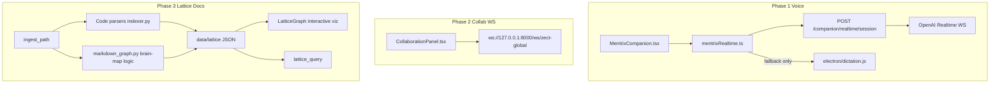

# Mentrix Voice, Collaboration WS, and Lattice Docs Graph

## Goals

1. **Voice-first:** Make Connect Voice reliably use OpenAI Realtime (Whisper STT + spoken replies), not Windows dictation fallback that mishears "email" as "event".
2. **Reduce console noise:** Fix or defer `CollaborationPanel` WebSocket errors during local dev.
3. **Brain-map adoption (correct scope):** Do **not** replace Lattice code graphify. Port brain-map's **markdown wikilink + folder-tree** logic into Lattice as a **docs layer**, with **interactive graph viz** on `/lattice`, wired to Mentrix `lattice_query` and voice.

## Architecture (target state)

---

## Phase 1 — Mentrix Voice / Realtime (P0, ship first)

### 1.1 Realtime readiness preflight

**Problem:** Users discover Realtime is broken only after speaking; fallback Windows STT is inaccurate.

**Changes:**
- On [`frontend/src/pages/MentrixCompanion.tsx`](frontend/src/pages/MentrixCompanion.tsx) mount, call existing `POST /api/mentrix/companion/realtime/session` (via [`frontend/src/lib/api.ts`](frontend/src/lib/api.ts)) and show a persistent status chip:
  - Green: `Realtime ready`
  - Amber: `Voice fallback — {reason}` (from `session.reason`)
- Add `data-testid="mentrix-realtime-status"` for e2e.

**Backend:** No new endpoint required; reuse [`backend/app/services/mentrix/realtime.py`](backend/app/services/mentrix/realtime.py) `mint_realtime_session()` (lines 224–285).

**Verify:** `OPENAI_API_KEY` in [`backend/.env`](backend/.env), `MENTRIX_REALTIME=1`, user logged in (`zect_token`).

### 1.2 Fix Realtime Allow overlay (broken tool args)

**Problem:** After Allow, Slack/email sends use **redacted** args (`"…"`) because [`MentrixCompanion.tsx`](frontend/src/pages/MentrixCompanion.tsx) stores `args_redacted` in `pendingArgsRef` (lines 160–168, 416–419).

**Changes:**
- Store full `args` in pending state (keep redacted copy for display only).
- Optionally include full `args` in pending payload from [`backend/app/services/mentrix/realtime.py`](backend/app/services/mentrix/realtime.py) `run_realtime_tool()` pending branch (lines 325–331).
- After Allow in Realtime mode, trigger `response.create` on the active WS so Mentrix speaks the tool result — extend [`frontend/src/lib/mentrixRealtime.ts`](frontend/src/lib/mentrixRealtime.ts) to expose `resumeAfterTool(output: string)`.

### 1.3 Audio pipeline hardening

**Problem:** [`mentrixRealtime.ts`](frontend/src/lib/mentrixRealtime.ts) uses deprecated `ScriptProcessorNode` and assumes 24 kHz without resampling (lines 146–162), causing `mic_failed` / garbled audio on some devices.

**Changes:**
- Replace with `AudioWorklet` (or `MediaRecorder` chunk path) + resample device rate → 24 kHz PCM before `input_audio_buffer.append`.
- Add explicit error log lines: `realtime_mic_denied`, `realtime_audio_context_failed`.

### 1.4 Electron fallback chain improvements (Windows)

**Problem:** Electron skips Web Speech (`MentrixCompanion.tsx:179`); Windows dictation only starts **after** Realtime fails; wake listener + dictation both use `System.Speech` on the same mic.

**Changes in [`electron/main.js`](electron/main.js) + [`frontend/src/pages/MentrixCompanion.tsx`](frontend/src/pages/MentrixCompanion.tsx):**
- After preflight shows Realtime unavailable, **skip** Realtime WS attempt and go straight to dictation (faster fallback).
- Pause wake listener while dictation is active (`winWakeHandle.stop()` / restart after dictation stop) to reduce mic contention.
- Strip wake phrases from dictation text (already in `main.js:188–195`); also strip TTS echo phrases ("Mentrix ready").

### 1.5 Intent / transcript hardening for common mishears

**Problem:** Windows STT produces "any event" instead of "check my email"; backend only matches explicit phrases including `"any email"` ([`companion.py:314–325`](backend/app/services/mentrix/companion.py)).

**Changes:**
- Add fuzzy intent aliases in `_parse_intents()`: `"check mail"`, `"my inbox"`, `"read email"`, regex `\b(e-?mail|inbox|gmail)\b`.
- **Remove** brittle phrase `"any email"` (too close to misheard "any event").
- Show **received transcript** prominently in HUD before running turn (user can edit/correct before send).
- Realtime instructions in [`realtime.py:24–36`](backend/app/services/mentrix/realtime.py): prefer `email_digest` tool when user mentions mail/inbox.

### 1.6 Tests and smoke checklist

| Test | File |
|------|------|
| Session preflight returns reason without key | extend [`backend/tests/test_mentrix_companion.py`](backend/tests/test_mentrix_companion.py) |
| Email intent aliases | new cases in same file |
| Allow passes full args | frontend unit or Playwright in [`frontend/e2e/mentrix-companion.spec.ts`](frontend/e2e/mentrix-companion.spec.ts) |
| Preflight status visible | e2e assertion on `mentrix-realtime-status` |

**Manual smoke:** Connect Voice → Live Log shows `Connect Voice — OpenAI Realtime` → say "check my email" → transcript matches intent → spoken reply.

---

## Phase 2 — Collaboration WebSocket (P1, quick win)

### 2.1 Fix localhost / timing issues

**Problem:** [`CollaborationPanel.tsx`](frontend/src/components/CollaborationPanel.tsx) uses `VITE_API_URL || "http://localhost:8000"` (line 5). On Windows/Electron, `localhost` can hang; WS closes before connect if backend not ready.

**Changes:**
- Default WS base to `http://127.0.0.1:8000` (match product convention).
- Delay first `connect()` until `apiFetch('/api/auth/config')` succeeds (backend up).
- On [`/mentrix-home`](frontend/src/pages/MentrixCompanion.tsx), hide or collapse CollaborationPanel via [`Layout.tsx`](frontend/src/components/Layout.tsx) (already collapses chrome on mentrix HUD) — optional `collabEnabled` env flag for dev.

### 2.2 Quieter dev experience

- Suppress console `WebSocket connection failed` after 3 retries (already stops at `failCountRef >= 3`, line 34).
- Show disconnected state in UI only, not console error spam.

---

## Phase 3 — Brain-map docs layer in Lattice (P2, after voice stable)

### 3.1 Design principle (locked)

| Use brain-map for | Do NOT use brain-map for |
|-------------------|--------------------------|
| Markdown wikilink graph | Code symbol/import/call graph |
| Folder tree for docs | Replacing [`indexer.py`](backend/app/services/lattice/indexer.py) |
| Interactive viz UX patterns | Standalone port-4710 sidecar app |

Reference implementation: [brain-map `build.py`](https://github.com/zubair-trabzada/brain-map/blob/main/build.py) (wikilink regex, stem map, folder tree).

### 3.2 New module: `markdown_graph.py`

**Create:** [`backend/app/services/lattice/markdown_graph.py`](backend/app/services/lattice/markdown_graph.py)

Port brain-map logic:
- Collect `.md` / `.mdx` under ingest root (respect existing `SKIP_DIRS`)
- Parse `[[wikilink]]` and `](relative.md)` links
- Build stem map for resolution
- Synthetic folder nodes (`vault`, `folder`) + `in_folder` edges for link-free trees
- Track `wikilinks_resolved` / `wikilinks_unresolved`

**New node kinds:** `doc`, `folder`, `vault`, `wikilink_stub`  
**New edge kinds:** `wikilink`, `md_link`, `in_folder`, `references` (doc → code `file` when link targets `.py`/`.ts`)

**Integrate:** Call from [`ingest_path()`](backend/app/services/lattice/indexer.py) after code walk (~line 495); extend `LatticeGraph` stats (`doc_files_indexed`, etc.).

### 3.3 API extensions

**File:** [`backend/app/routers/lattice.py`](backend/app/routers/lattice.py)

| Endpoint | Change |
|----------|--------|
| `GET /graph` | Query param `layer=code\|docs\|combined` |
| `POST /query` | Optional `kinds[]`, `include_backlinks` |
| `GET /graph/backlinks` | **New** — inbound wikilinks for a doc path |
| `POST /ingest` | Flags `index_docs=true`, `build_doc_tree=true` |

**Extend** [`query_graph()`](backend/app/services/lattice/indexer.py) to search doc titles, slugs, and backlink metadata.

### 3.4 Structural blueprint + RAG bridge

**Files:**
- [`backend/app/services/lattice/structural_blueprint.py`](backend/app/services/lattice/structural_blueprint.py) — add doc inventory, broken links, backlinks to blueprint JSON and `build_deep_prompt()`.
- [`backend/app/services/rag/retriever.py`](backend/app/services/rag/retriever.py) — boost hybrid search using wikilink neighbors from Lattice graph (GraphRAG-lite).

**Optional DB migration:** `doc_backlinks_json`, `broken_links_json` on `LatticeStructuralBlueprint` ([`backend/app/models.py`](backend/app/models.py)).

### 3.5 Interactive graph visualization (v1 requirement)

**File:** [`frontend/src/pages/LatticeGraph.tsx`](frontend/src/pages/LatticeGraph.tsx)

Add force-directed graph component (recommend **d3-force** or **react-force-graph-2d** — evaluate bundle size; d3 is likely already available or lightweight addition):

- Layer toggle: **Code | Docs | Combined**
- Brain-map-inspired UX:
  - Pan/zoom, drag nodes
  - Click node → highlight neighbors (fade others)
  - Search box → fly-to node
  - Color by folder/group (`GraphNode.group`)
  - Stats row: docs, wikilinks, broken links
- Consume `GET /api/lattice/graph?layer=docs|combined`
- ZECT/Mentrix branding only (no "Brain Map" in UI)

**API client:** extend [`frontend/src/lib/api.ts`](frontend/src/lib/api.ts) with layer/backlinks params.

### 3.6 Mentrix voice integration

**Files:**
- [`backend/app/services/mentrix/companion.py`](backend/app/services/mentrix/companion.py) — enrich `lattice_query` results with doc hits + backlinks table artifact; extend intent triggers (`wiki`, `docs`, `markdown`, `knowledge graph`).
- [`backend/app/services/mentrix/realtime.py`](backend/app/services/mentrix/realtime.py) — update tool description + instructions for doc graph queries.
- Navigate intent: "open lattice docs" → `/lattice?layer=docs`.

**Voice examples after integration:**
- "Show my documentation graph" → navigate + docs layer
- "What docs link to Delivery?" → backlinks tool
- "Find symbol AuthRouter" → code layer (unchanged)

### 3.7 Tests

| Test | Scope |
|------|-------|
| `backend/tests/test_markdown_graph.py` | Wikilink resolution, folder tree, unresolved stubs |
| Extend `test_lattice_intelligence.py` | Combined ingest, path across doc chain |
| `frontend/e2e/lattice-docs.spec.ts` | Ingest fixture vault, interactive graph renders, layer toggle |

**Fixture:** `backend/tests/fixtures/doc_vault/` with linked `.md` files mirroring brain-map patterns.

---

## Phase 4 — Documentation and ops

- Update [`docs/MENTRIX_COMPANION.md`](docs/MENTRIX_COMPANION.md): Realtime preflight, fallback behavior, Windows mic tips.
- Add [`docs/LATTICE_DOCS_GRAPH.md`](docs/LATTICE_DOCS_GRAPH.md): how docs graph relates to code graph; brain-map as **reference only** (not runtime dependency).
- Update [`backend/.env.example`](backend/.env.example): `MENTRIX_REALTIME`, `LATTICE_INDEX_DOCS=1`.

---

## Execution order (confirmed)

1. **Phase 1** — Voice/Realtime (all of 1.1–1.6)
2. **Phase 2** — Collaboration WS (quick)
3. **Phase 3** — Lattice docs graph + interactive viz
4. **Phase 4** — Docs

## Out of scope (explicit)

- Replacing Lattice code indexer with brain-map
- Running brain-map as separate server on port 4710
- Neo4j / Graphify CLI user install
- macOS native wake/dictation (document hotkey + Realtime as primary; optional follow-up)
- Backend Realtime audio relay WS ([`mentrix.py:638–704`](backend/app/routers/mentrix.py)) — browser-direct OpenAI WS remains primary path

## Success criteria

| Area | Done when |
|------|-----------|
| Voice | Live Log shows OpenAI Realtime; "check my email" transcribed correctly; spoken reply |
| Collab WS | No spurious console errors on `/mentrix-home` after backend up |
| Docs graph | Ingest repo + `docs/` produces wikilink graph; interactive viz on `/lattice`; Mentrix voice can query doc links |
