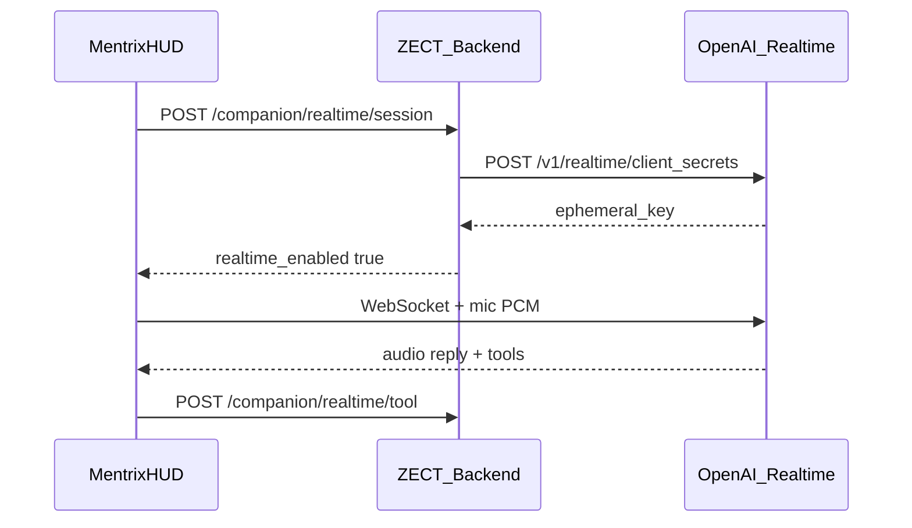

# Mentrix Voice 100% Fix + PR to develop

## Problem (confirmed)

You already have `OPENAI_API_KEY` set. Typed Mentrix works. Voice still shows:

`Voice fallback — openai_404 · use Hey Mentrix, then Send corrected`

That happens when preflight mint fails and Mentrix drops into **Windows dictation + edit-before-send**. That UX is rejected.

Root causes to close for good:

1. **Stale / wrong Realtime mint** — live app may still hit old `/v1/realtime/sessions` (404). Code in repo already targets GA [`/v1/realtime/client_secrets`](backend/app/services/mentrix/realtime.py); we must prove the **running** backend returns `realtime_enabled: true`.
2. **Bad fallback UX** — [`MentrixCompanion.tsx`](frontend/src/pages/MentrixCompanion.tsx) arms dictation and shows **Send corrected**.
3. **No mic selection** — [`mentrixRealtime.ts`](frontend/src/lib/mentrixRealtime.ts) uses `getUserMedia({ audio: true })` (Windows default only).
4. **Slack/Jira** — already read from `backend/.env`; ensure docs + status surface so keys are usable once voice works.

**Chosen UX (from your feedback):** Connect Voice → pick headset mic → speak naturally → Mentrix replies by voice. **No tone, no Send corrected** when Realtime is up. Windows dictation is disabled as a voice path (type or reconnect Realtime instead).

## Implementation plan

### 1. Prove and harden Realtime mint (backend)

File: [`backend/app/services/mentrix/realtime.py`](backend/app/services/mentrix/realtime.py)

- Keep GA mint only via `POST https://api.openai.com/v1/realtime/client_secrets` with model fallbacks: `gpt-realtime`, `gpt-realtime-mini`, then legacy preview names.
- Ensure env defaults: `MENTRIX_REALTIME=1`, `MENTRIX_REALTIME_MODEL=gpt-realtime` in [`backend/.env.example`](backend/.env.example) (already present; sync local `.env` if needed — never commit secrets).
- Add a focused unit/integration test that mocks `client_secrets` 200 and asserts `realtime_enabled` + `client_secret` shape (`value` field).
- Add a small diagnostic field in mint response: `api: "client_secrets"` (already there) so UI can show why mint failed with detail, not a vague 404 from a dead endpoint.

### 2. Fix Electron/browser Realtime client (frontend)

File: [`frontend/src/lib/mentrixRealtime.ts`](frontend/src/lib/mentrixRealtime.ts)

- Use ephemeral key WS subprotocols without retired beta header (already started).
- GA session.update + handle `response.output_audio.delta` / transcript / function_call events (already partially done) — finish and dedupe tool calls.
- Accept optional `deviceId` in `getUserMedia({ audio: { deviceId: { exact } } })`.
- On WS/mic failure: surface clear error + **Retry Connect Voice**; do **not** auto-start Windows dictation.

### 3. Remove Send-corrected as primary voice UX

File: [`frontend/src/pages/MentrixCompanion.tsx`](frontend/src/pages/MentrixCompanion.tsx)

- When `realtimePreflight.ready`: Connect Voice opens Realtime only; status shows **Realtime ready**.
- Remove wake → `armDictation` / “speak after the tone” / auto-stage path for desktop.
- Hide **Heard / Send corrected** when Realtime is connected (keep typed input always).
- If mint fails: show actionable error (`Realtime unavailable: …`) + Retry; typed Quick asks remain.

### 4. Mic / headphone picker

New small helper + UI in Mentrix HUD:

- `navigator.mediaDevices.enumerateDevices()` → list `audioinput` devices.
- Persist choice in `localStorage` (e.g. `mentrix_mic_device_id`).
- Dropdown next to Connect Voice: **Mic: Headset / Laptop / …**
- Pass selected `deviceId` into `startMentrixRealtime`.
- Prompt for mic permission once so labels are visible.

### 5. Slack / Jira keys (confirm, don’t invent)

No minibot runner exists in this repo. Mentrix already uses:

- Slack: `SLACK_BOT_TOKEN`, `SLACK_DEFAULT_CHANNEL` — [`backend/app/services/mcp/adapters/slack.py`](backend/app/services/mcp/adapters/slack.py)
- Jira: `MCP_JIRA_URL`, `JIRA_EMAIL`, `JIRA_API_TOKEN` — [`backend/app/services/mcp/adapters/jira.py`](backend/app/services/mcp/adapters/jira.py)

Plan work:

- Document in [`docs/MENTRIX_COMPANION.md`](docs/MENTRIX_COMPANION.md) that OpenAI key ≠ Slack/Jira; copy any minibot tokens into `backend/.env` locally.
- Optionally expose a non-secret readiness chip in Mentrix (e.g. Slack configured / not) via existing status APIs if cheap; no secret logging.

### 6. Clean restart + acceptance gates (must pass before PR)

Before PR:

1. Kill all listeners on `8000` / `5173` and Electron (avoid zombie backends that still return `openai_404`).
2. Restart backend/frontend/Electron.
3. Call mint: `POST /api/mentrix/companion/realtime/session` → `realtime_enabled: true`, `model` present.
4. UI shows **Realtime ready** (never `openai_404` with current key).
5. Manual smoke: Connect Voice → select headset → say “Hi” → spoken reply; Quick ask weather still works.
6. Tests: `pytest` voice/realtime/companion subset + `frontend` `tsc -b` — zero failures.

### 7. PR to `develop`

- Branch from latest `develop` (e.g. `fix/mentrix-realtime-ga-voice`).
- Commit only voice/mic/docs/test changes (no `.env`, no secrets, no `zect.db`, no lattice data dumps).
- Push and `gh pr create` targeting `develop` with summary + test plan.
- After you merge: restart backend, frontend, Electron (and desktop shortcut if used) so production-local uses merged code.

## Out of scope (explicit)

- Full WebRTC rewrite (can follow later; GA WebSocket + correct mint is enough for this PR).
- Replacing Windows wake hotkey (keep as optional wake; not the STT engine).
- Committing real Slack/Jira/OpenAI secrets.

## Success criteria

- Status: **Realtime ready** with your existing OpenAI key.
- Speak → hear reply; no Send corrected for voice.
- Mic picker selects headset.
- Slack/Jira work when tokens are in `backend/.env`.
- PR open to `develop`; post-merge restart procedure documented in PR body.
