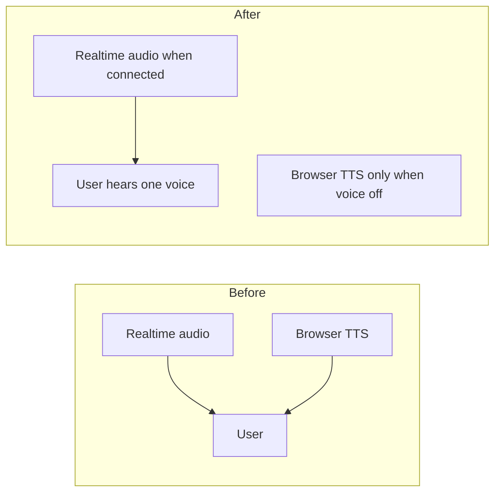

# Mentrix Voice + Computer Mode Fix PR

## Issues in scope (from your session)

| Issue | Root cause | Code fix? |
|-------|------------|-----------|
| Two voices / garbled speech | OpenAI Realtime audio + browser `speechSynthesis` (TTS + Allow modal) play together | Yes |
| Desktop/browser won't open after Allow | Realtime `confirmRealtimeTools` never calls `window.zectDesktop.mentrix.computer`; only typed fallback does | Yes |
| "Open browser" opens wrong app | `_parse_intents` maps generic `"open"` in computer block → `notepad.exe` | Yes |
| Open Slack app | Not on allowlist; "slack" routes to API digest tools | Yes (Slack.exe allowlist + launch intents) |
| OpenAI quota error | Account billing — not fixable in repo | UX only (clear message + disable Connect Voice) |
| Manual restart | `RESTART_MENTRIX.ps1` exists but is **untracked** | Commit + doc |

**Out of scope:** OpenAI billing/credits (you fix at [platform.openai.com/billing](https://platform.openai.com/settings/organization/billing)). Slack **API** token (`SLACK_BOT_TOKEN`) — you said you'll update later.

---

## Phase 1 — Single voice when Connect Voice is live

**Problem:** [`MentrixSessionContext.tsx`](frontend/src/mentrix/MentrixSessionContext.tsx) calls `speak()` on stream `done`, Allow, and fallbacks while Realtime already plays audio via [`mentrixRealtime.ts`](frontend/src/lib/mentrixRealtime.ts) `playNext()`. [`MentrixConfirmModal.tsx`](frontend/src/components/MentrixConfirmModal.tsx) also speaks on open.

**Changes:**

1. Add helper `shouldUseBrowserTts()` → `tts && !voiceConnected && realtimeRef.current?.mode !== "realtime"`.
2. Gate all `speak(...)` calls in session context with that helper.
3. Pass `speakPrompt={shouldUseBrowserTts()}` to both HUD and dock `MentrixConfirmModal`.
4. On Realtime `onPendingConfirm`, skip `speak("I need your permission...")` when voice is live (orb + Allow overlay is enough).
5. Optional: cancel `speechSynthesis` in `startVoice()` before opening WS.



---

## Phase 2 — Desktop / Computer Mode actually runs after Allow (voice path)

**Problem:** Backend returns `{ desktop: "open_app", app: "explorer.exe" }` from [`companion.py`](backend/app/services/mentrix/companion.py) `_exec_tool`, but frontend only invokes Electron IPC in typed `runTurn` fallback (~line 567). Realtime path in `onAllow` → `confirmRealtimeTools` → `resumeAfterTool` never calls IPC.

**New shared helper** (e.g. [`frontend/src/mentrix/desktopBridge.ts`](frontend/src/mentrix/desktopBridge.ts)):

```ts
export async function applyDesktopToolOutput(
  output: string,
  computerMode: boolean,
): Promise<{ ok: boolean; error?: string }>
```

- Parse JSON tool output / result for `desktop`, `app`, `path`.
- If `!computerMode` → return `{ ok: false, error: "computer_mode_off" }` and push user-visible status (not silent).
- Else `window.zectDesktop?.mentrix?.computer?.(action, args)`.

**Wire into:**

| Call site | File |
|-----------|------|
| Realtime Allow | [`MentrixSessionContext.tsx`](frontend/src/mentrix/MentrixSessionContext.tsx) `onAllow` after `confirmRealtimeTools` |
| Realtime auto-confirm tools | [`mentrixRealtime.ts`](frontend/src/lib/mentrixRealtime.ts) `executeTool` when `confirmed === true` and output contains `desktop` |
| Typed stream / fallback | existing loop in `runTurn` — refactor to use helper |
| Stream `tool_end` (optional) | if backend emits desktop in tool result events |

**UX when Computer Mode off but desktop tool requested:**

- Set status line: *"Enable Computer Mode on the HUD, then Allow again."*
- Do not pretend success in spoken summary.

**Prerequisite reminder in docs:** Computer Mode checkbox + Electron app (not browser tab alone).

---

## Phase 3 — Better desktop intents (browser, Slack app)

**File:** [`backend/app/services/mentrix/companion.py`](backend/app/services/mentrix/companion.py) `_parse_intents`

1. **Before** generic computer `"open"` block, add explicit mappings:
   - `"open browser"` / `"open chrome"` → `computer_open_app` `{ app: "chrome.exe" }`
   - `"open edge"` → `msedge.exe`
   - `"open slack app"` / `"launch slack"` / `"open slack desktop"` → `Slack.exe` (computer tool)
2. Keep **`slack digest`** / **`check slack`** → existing `slack_digest` API tools (unchanged).
3. Fix line ~449: `"open" in m` alone must not default to notepad — require app name or use explorer only for OS desktop phrase.

**Allowlist:** [`electron/computer.js`](electron/computer.js) add `Slack.exe` to `WIN_APPS` (matches Start Menu app name on Windows).

**Realtime instructions:** [`realtime.py`](backend/app/services/mentrix/realtime.py) one line: Slack desktop launch vs Slack digest API.

**Tests:** extend [`backend/tests/test_mentrix_companion.py`](backend/tests/test_mentrix_companion.py):

- `"open browser"` → `chrome.exe`, not notepad
- `"open slack app"` → `computer_open_app`, not `slack_digest`
- `"slack digest"` → still `slack_digest`

---

## Phase 4 — OpenAI quota UX (operational error)

**File:** [`frontend/src/lib/mentrixRealtime.ts`](frontend/src/lib/mentrixRealtime.ts) + session context `onError` / `onFallback`

When error message contains `quota` / `billing`:

- Set status: **"OpenAI quota exceeded — add billing at platform.openai.com, then Retry Realtime"**
- Set `realtimePreflight.ready = false` with reason `openai_quota`
- Log once; avoid retry loop

**Docs:** [`docs/MENTRIX_COMPANION.md`](docs/MENTRIX_COMPANION.md) — short "Quota / billing" troubleshooting section.

---

## Phase 5 — Small operator clarity (optional, low risk)

- HUD status chip: show **Active skill: {name}** or **None** next to integrations line ([`MentrixCompanion.tsx`](frontend/src/pages/MentrixCompanion.tsx)).
- `NAV_MAP` aliases: `"dream engine"` → `/dream-engine`, `"skills engine"` → `/skills-engine` ([`companion.py`](backend/app/services/mentrix/companion.py)).

---

## Phase 6 — Restart script + QA + PR

1. **Commit** untracked [`RESTART_MENTRIX.ps1`](RESTART_MENTRIX.ps1); mention in [`docs/MENTRIX_COMPANION.md`](docs/MENTRIX_COMPANION.md) post-merge restart.
2. **QA**
   - `npx tsc -b` (frontend)
   - `pytest tests/test_mentrix_companion.py tests/test_voice_gate.py` (backend)
   - Manual smoke (Electron):
     - Connect Voice → one voice only (TTS off implicitly)
     - Computer Mode ON → Allow → Explorer opens
     - "Open Chrome" / "Open Slack app" after Allow
     - Quota message readable when key exhausted
3. **Branch:** `fix/mentrix-voice-desktop-quota` from `develop`
4. **`gh pr create`** → `develop` with test plan + note: **restart via `.\RESTART_MENTRIX.ps1`** after merge
5. **Post-merge:** run restart script locally (you or agent)

---

## Success criteria

- Connect Voice connected → no overlapping browser TTS
- Allow on `computer_open_app` in voice mode → app opens on Windows (Computer Mode ON, Electron)
- "Open browser" → Chrome/Edge, not Notepad
- "Open Slack app" → launches Slack.exe (API key still separate for digest)
- Quota error shows actionable billing message, not raw log only
- PR merged to `develop`; servers restarted
