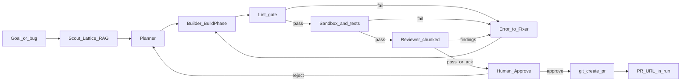
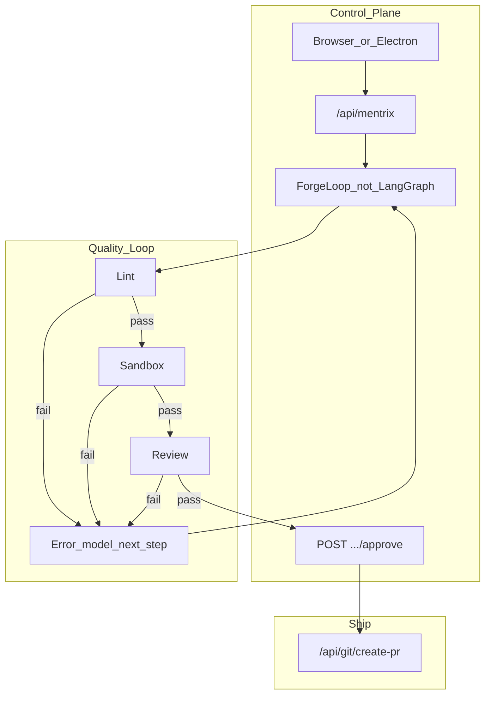

# Playwright Mentrix Smoke + Approve-to-PR Loop Architecture

## Decisions (locked)

- **Primary automation:** `@playwright/test` in-repo (CI-friendly). Cursor Playwright MCP = interactive debug only.
- **Loop engine:** custom **ForgeLoop** FSM in [orchestrator.py](backend/app/services/forge_loop/orchestrator.py). **Not LangGraph** (no `langgraph` dependency; do not introduce it in this plan).
- **Ship gate:** Mentrix must **not** open a PR until (1) review + sandbox/tests pass (or acknowledged), (2) lint clean (or fixed), (3) **human approve**.
- **PR create:** reuse existing [git_ops.py](backend/app/routers/git_ops.py) `POST /api/git/create-pr` + [github_service.create_pull_request](backend/app/github_service.py).
- **Error recovery pattern:** `Error → model (Fixer/Autofix) → next_step` with capped retries; surface in Mentrix run events.
- Mentrix MCP Playwright catalog stubs: remove or mark unsupported so docs match [hub.py](backend/app/services/mcp/hub.py).

---

## Are we using LangGraph?

**No.** Orchestration is a hand-rolled mode pipeline (`MODE_PIPELINE`: chat / understand / deliver / review_only / ops) inside ForgeLoop. Memory’s `next_step` field and episodic “harness” tags are ZECT intelligence telemetry, not LangGraph. This plan extends ForgeLoop; it does not migrate to LangGraph.

---

## Target delivery loop (codegen / bugfix)



### Gates before PR (hard)

| Gate | Mechanism | Owner |
|------|-----------|--------|
| Lint | Run project linter (ESLint / ruff / etc. by language) after codegen; fail → recovery | New Mentrix step + sandbox/autofix |
| Review | Chunked review / Mentrix Reviewer findings | [review_service.py](backend/app/review_service.py) |
| Test / sandbox | `/api/sandbox/pr-readiness` | [sandbox.py](backend/app/routers/sandbox.py) |
| Human approve | Explicit API + UI button; no silent PR | New `/api/mentrix/runs/{id}/approve` |
| Create PR | Only after approve + gates green | [git_ops.py](backend/app/routers/git_ops.py) `create-pr` |

### Error recovery: Error → model → next_step

On lint/test/review failure, ForgeLoop emits:

```json
{
  "event": "recovery",
  "error": "...",
  "model": "fixer|autofix",
  "next_step": "re_lint|re_sandbox|re_review|await_human",
  "attempt": 1
}
```

- Call [autofix.py](backend/app/routers/autofix.py) `carry-forward` / Fixer with prior findings (scoped files only).
- Cap retries via `MENTRIX_MAX_STEPS` / max recovery attempts (default 3).
- Persist `next_step` on the Mentrix run result (align with Working Memory `next_step` in [memory.py](backend/app/routers/memory.py) when useful).
- After cap: status `needs_human` — UI shows error + Approve disabled until fixed or acknowledged.

---

## Architecture today vs target

| Layer | Today | Target in this plan |
|-------|--------|---------------------|
| Loop | ForgeLoop specialists mostly heuristic | Wire Builder → Build Phase; Reviewer → review/sandbox; Integrator → create-pr **after approve** |
| Prompts | Build/review have real system prompts; ForgeLoop does not call LLM | Keep prompts in Build/Review/Autofix; ForgeLoop orchestrates |
| Context | Scout: Lattice+RAG live; memory/context_management unwired | Keep Scout; inject recovery context (prior error + lint output) into Fixer |
| Harness / quality | Sandbox + review exist; not auto-chained | Chain lint → sandbox → review → human → PR |
| LangGraph | Not used | Still not used |



---

## Playwright deliverable

### Layout

```text
frontend/
  playwright.config.ts
  e2e/
    auth.setup.ts
    mentrix-smoke.spec.ts
    mentrix-approve-pr.spec.ts   # gates block PR; approve enables create (mock GH if needed)
  package.json                   # test:e2e
```

### Smoke assertions

1. Login → `zect_token`
2. `/lattice`, `/mentrix`, `/sandbox`, `/integrations`
3. Sandbox low score → blockers (PR not ready)
4. Approve-to-PR: without approve, create-PR API/UI disabled or 403; with approve + green gates, PR create path invoked (GitHub mocked in CI)

### Supporting updates

- Refresh [.agents/skills/testing-zect/SKILL.md](.agents/skills/testing-zect/SKILL.md)
- CI e2e in [.github/workflows/ci.yml](.github/workflows/ci.yml)
- Expand [docs/MENTRIX_ARCHITECTURE.md](docs/MENTRIX_ARCHITECTURE.md) (LangGraph = no; approve→PR; recovery)
- Clean MCP Playwright stubs in [mcp.py](backend/app/routers/mcp.py)

---

## Backend / UI work for approve → PR

1. **API** on [mentrix.py](backend/app/routers/mentrix.py):
   - `POST /api/mentrix/runs/{id}/approve` — requires gates snapshot (`lint_ok`, `sandbox_ready`, `review_ok` or ack)
   - `POST /api/mentrix/runs/{id}/create-pr` — requires `approved_at`; calls git create-pr; stores `pr_url` on run
2. **ForgeLoop** — after builder: lint step; on failure recovery events; do not auto-create PR
3. **UI** — [Mentrix.tsx](frontend/src/pages/Mentrix.tsx): show gate status, Approve, Create PR buttons; surface recovery `next_step`
4. **Lint runner** — thin helper (e.g. `backend/app/services/quality/lint_runner.py`) invoking configured commands from env/project detect

---

## Implementation order

1. Architecture doc (ForgeLoop ≠ LangGraph; approve→PR; Error→model→next_step).
2. Playwright scaffold + Mentrix smoke.
3. Wire quality loop + approve/create-PR APIs + Mentrix UI.
4. Recovery events + lint gate + Playwright approve-PR spec.
5. CI + testing skill + MCP stub cleanup.
6. Local verify Playwright green.

## Exit criteria

- Docs state clearly: **not LangGraph**; ForgeLoop + human approve before PR
- Lint/sandbox/review failures enter recovery with `next_step`; no silent PR
- Human approve required before `create-pr`
- `npx playwright test` covers smoke + blocked/approve PR path
- CI e2e job present
