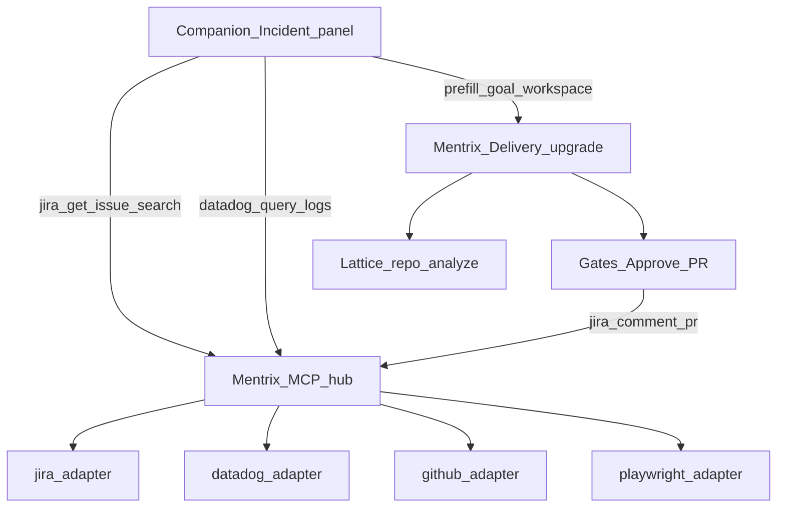

# ZECT Mentrix MCP + Incident Runbook + Voice Present

## Scope rules (product)

- **ZECT-only**: Mentrix MCP hub is the in-product tool system for the ZECT IDE/desktop. No Minion references in code, UI, or docs added by this work.
- **Org credentials**: Document and use ZECT’s own env (`MCP_JIRA_URL`, `JIRA_EMAIL`, `JIRA_API_TOKEN`, `DATADOG_*`, `GITHUB_TOKEN`, etc. in [`backend/.env.example`](backend/.env.example)). Same Atlassian/Datadog org APIs any integration would use; configure via Integrations + `.env` (prefer a ZECT service account for the team). Do not invent a cross-product bridge.
- **Out of UX story**: Third-party editor plugin MCP is not documented as how Mentrix works.

## Architecture

## 1. Harden Mentrix MCP adapters

**Jira** — [`backend/app/services/mcp/adapters/jira.py`](backend/app/services/mcp/adapters/jira.py)

- Fix `search_issues` to **POST** `/rest/api/3/search/jql` (current GET search is obsolete).
- Keep/implement tools Companion needs: `get_issue`, `search_issues`, `add_comment`; add `transition_issue` if trivial; align catalog in [`backend/app/routers/mcp.py`](backend/app/routers/mcp.py) with what the adapter actually supports.
- Accept ADF-safe comment body (plain text wrapped for Cloud).

**Datadog** — [`backend/app/services/mcp/adapters/datadog.py`](backend/app/services/mcp/adapters/datadog.py)

- Keep `query_logs` / `list_monitors`; implement `query_metrics` or remove it from the catalog to avoid false advertising.

**GitHub** — [`backend/app/services/mcp/adapters/github.py`](backend/app/services/mcp/adapters/github.py)

- Align tool names with catalog (`list_prs` ↔ `list_pulls`, etc.) and implement the tools Mentrix Incident/PR comment needs (`get_repo`, list/get PR). Stub only what remains unused.

**Playwright (ZECT hub)** — new [`backend/app/services/mcp/adapters/playwright_adapter.py`](backend/app/services/mcp/adapters/playwright_adapter.py)

- Register in [`hub.py`](backend/app/services/mcp/hub.py) + [`mcp.py`](backend/app/routers/mcp.py) BUILTIN servers.
- MVP tools (always-confirm / rules-gated): `navigate`, `snapshot` (accessibility/text), `click`, `fill` — local Playwright Python against URLs; no third-party editor dependency.
- Disable cleanly when Playwright not installed; document `pip install playwright` + `playwright install chromium` in `.env.example` comments.

**Integrations UI** — [`frontend/src/pages/Integrations.tsx`](frontend/src/pages/Integrations.tsx)

- Ensure Jira/Datadog/GitHub/Playwright appear in MCP enable panel; companion integrations status includes `datadog` / `github` readiness chips (non-secret).

## 2. Companion tools + Incident runbook

**Backend tools** in [`companion.py`](backend/app/services/mentrix/companion.py), [`permission_broker.py`](backend/app/services/mentrix/permission_broker.py), [`realtime.py`](backend/app/services/mentrix/realtime.py), [`org_policy.py`](backend/app/services/mentrix/org_policy.py):

| Tool | MCP call |
|------|----------|
| `jira_get_issue` | `jira` / `get_issue` |
| `jira_search_incidents` | `jira` / `search_issues` with Incident-oriented JQL (project/type from args or env default) |
| `datadog_query_logs` | `datadog` / `query_logs` |
| `jira_comment_pr` | `jira` / `add_comment` with PR URL body |

Wire intent parsing + Realtime schemas so voice can invoke the same tools.

**UI — Incident runbook on Companion** ([`MentrixCompanion.tsx`](frontend/src/pages/MentrixCompanion.tsx))

- Prominent panel (also deep-link `/mentrix-home?incident=1`): issue key input → Load → show summary/status/AC → optional Datadog query → **Use in Mentrix Delivery** (prefill `goal` + workspace via existing `zect_mentrix_workspace` / navigate to `/mentrix` with state) → after approve/PR, **Comment PR on ticket**.
- Sidebar: add **Incident Runbook** under Workflow pointing at `/mentrix-home?incident=1` (ZECT Mentrix, not a separate product).

**Delivery handoff** ([`Mentrix.tsx`](frontend/src/pages/Mentrix.tsx))

- Accept `location.state` / query: `goal`, `issue_key`, `projectKey`, `workspace` so Lattice + upgrade run use the incident text.
- On successful `create-pr`, offer/auto-call `jira_comment_pr` when `issue_key` present.

## 3. Cloned voice: Companion + Present

Already: Connect Voice uses `/api/mentrix/voice/speak` when a clone exists ([`mentrixRealtime.ts`](frontend/src/lib/mentrixRealtime.ts)).

Gaps to close:

- **Typed TTS**: when clone active and “Speak replies” on, call `/api/mentrix/voice/speak` instead of browser `speechSynthesis` only ([`MentrixSessionContext.tsx`](frontend/src/mentrix/MentrixSessionContext.tsx) / [`speak.ts`](frontend/src/mentrix/speak.ts)).
- **Present mode** on Companion: button “Present / Narrate” — reads selected artifact or a short agenda script through cloned `/speak` (fullscreen `displayMode` + sequential speak). This is ZECT’s presentation path; not an external meeting SaaS.

Keep clone UI on Companion only ([`CloneVoicePanel.tsx`](frontend/src/components/CloneVoicePanel.tsx)).

## 4. Tests

**Backend pytest** (new/extend under `backend/tests/fixes_and_phases/`):

- `test_jira_search_jql_post.py` — mock httpx, assert POST `/search/jql`
- `test_mcp_playwright_adapter.py` — disabled/not_installed + mocked navigate/snapshot
- `test_companion_incident_tools.py` — tools route to hub with mocked adapters
- Voice: typed TTS path / speak preference when clone present (unit or light integration)

**Playwright e2e** (frontend):

- `e2e/mentrix-incident.spec.ts` — open Companion incident panel, mock `/api/mcp` or companion tool APIs, assert Load → Delivery handoff URL/state
- Extend `mentrix-voice-clone.spec.ts` — Present/Narrate control visible when clone active (or expand path)
- Extend Integrations smoke for Playwright server id in MCP list

## 5. Verify, review, PR to develop

After implementation:

1. Run backend pytest for new suites + smoke Mentrix MCP.
2. Run Playwright specs above (API up on `:8000`).
3. Manual smoke checklist: Integrations enable Jira/Datadog; Companion Load incident (mock or real keys); Delivery engage; Present with Voicebox if available.
4. Ultra Review / quality gates on the branch if available in-repo.
5. Commit on branch `feat/mentrix-mcp-incident-voice` from latest `develop`, push, `gh pr create --base develop` (title/body cover MCP + Incident + voice Present; test plan checklist).

## Key files

- [`backend/app/services/mcp/adapters/jira.py`](backend/app/services/mcp/adapters/jira.py), `datadog.py`, `github.py`, new `playwright_adapter.py`
- [`backend/app/services/mcp/hub.py`](backend/app/services/mcp/hub.py), [`backend/app/routers/mcp.py`](backend/app/routers/mcp.py)
- [`backend/app/services/mentrix/companion.py`](backend/app/services/mentrix/companion.py), `permission_broker.py`, `realtime.py`
- [`frontend/src/pages/MentrixCompanion.tsx`](frontend/src/pages/MentrixCompanion.tsx), [`Mentrix.tsx`](frontend/src/pages/Mentrix.tsx), [`Sidebar.tsx`](frontend/src/components/Sidebar.tsx)
- [`frontend/src/lib/mentrixRealtime.ts`](frontend/src/lib/mentrixRealtime.ts), [`MentrixSessionContext.tsx`](frontend/src/mentrix/MentrixSessionContext.tsx)

## Explicitly not in this PR

- OCR / Unlimited-OCR (separate later PR)
- External Zoom/Teams meeting bots
- Changing another product’s codebase
