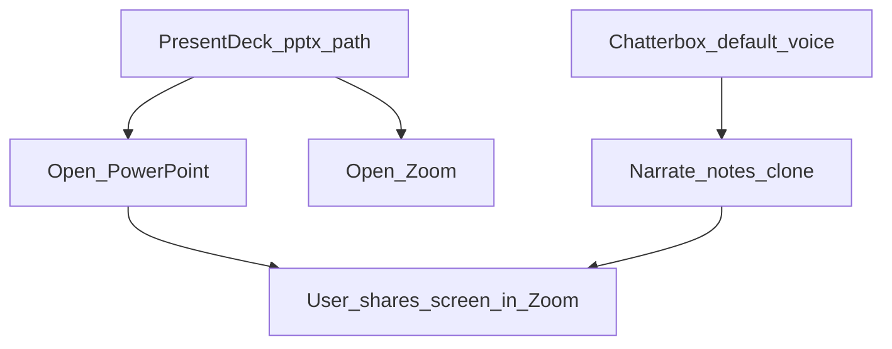

# ZOAS E2E, Docs, Present Voice + PPTX/Zoom

## All enhancements in this plan (summary)

| # | Enhancement | What you get |
|---|-------------|--------------|
| 1 | **ZOAS Delivery E2E (mocked)** | Playwright covers Engage → Confirm plan → Approve → Create PR → Ultra Review SAST panel |
| 2 | **Ask → Plan → Mentrix handoff E2E** | Navigation + mocked LLM so analyze→ask→plan→Delivery is covered |
| 3 | **Lattice docs** | Clear operator/Docs Center explanation (graph, Ingest, Query/Explain vs Code Index) |
| 4 | **Semgrep docs** | SAST via **GitHub Checks** only; how to enable on ZOAS; not inside Build |
| 5 | **Present + Chatterbox** | Clone voice → Mentrix Board artifacts → Present/Narrate |
| 6 | **Prepared PPTX in Zoom** | Electron opens your `.pptx` in PowerPoint + Zoom; Mentrix narrates talking points with clone; you share screen in Zoom |
| 7 | **Present Deck UI** | Companion path picker / remembered presentation file + Open PPTX / Open Zoom / Narrate notes |

## Locked decisions

- **Playwright:** API-mocked CI suite (no live LLM/Semgrep/GitHub).
- **Semgrep:** Remains GitHub Check Runs consumed by ZECT — **not** embedded in Mentrix Build.
- **PPTX / Zoom:** **Electron Computer Mode assist**, not a Zoom SDK or in-app PowerPoint renderer. Mentrix does **not** upload PPTX into Zoom; it **opens** PowerPoint + Zoom on the desktop and can **speak** cloned-voice notes while you share the PPT window.
- **Delete:** Still never (existing guardrails).
- **MSTF:** Still MinionBot-only (docs pointer).

---

## 1. Playwright — ZOAS Mentrix Delivery (mocked)

**New:** [`frontend/e2e/zoas-mentrix-full-delivery.spec.ts`](frontend/e2e/zoas-mentrix-full-delivery.spec.ts)

| Step | Mock / assert |
|------|----------------|
| Mentrix `bugfix` + workspace / `zinnia-zoas` | Fill fields |
| Engage | `POST /api/mentrix/runs` → `awaiting_plan_confirm` + plan steps |
| Confirm plan | UI + `POST .../confirm-plan` → `awaiting_approval` |
| Approve / Create PR | Mocked approve + create-pr with `pr_url` |
| Ultra Review SAST | Mock `**/sast-status` → Semgrep success |
| Context pack fail | Engage without key → 400 in error banner |

Ask/Plan handoff: sibling or same file, mocked LLM (pattern from [`workflow-handoff.spec.ts`](frontend/e2e/workflow-handoff.spec.ts)).

Keep live [`zoas-workflow.spec.ts`](frontend/e2e/zoas-workflow.spec.ts) as optional smoke; new suite stays fully mocked.

---

## 2. Docs — Lattice, Semgrep, Present, PPTX/Zoom

Update [`docs/ZECT_OPERATOR_WORKFLOW_GUIDE.md`](docs/ZECT_OPERATOR_WORKFLOW_GUIDE.md) + [`Docs.tsx`](frontend/src/pages/Docs.tsx):

1. Lattice (graph/RAG, Ingest vs Load, inspector, vs Code Index).
2. Semgrep (GitHub Action/Cloud; ZECT gate; env vars; Snippet ≠ SAST).
3. Present paths:
   - **A. Mentrix Board** — artifacts + Present/Narrate (no files).
   - **B. Prepared PPTX + Zoom** — save `.pptx` under Desktop/Documents (allowlisted) → Companion Present Deck → Open PowerPoint → Open Zoom → share screen → Narrate notes with default Chatterbox voice.
4. Browser = Delivery/Lattice; Electron = OS Present Deck / Zoom assist.

---

## 3. Companion Present UX (artifacts + Deck)

**Mentrix Board Present** ([`MentrixCompanion.tsx`](frontend/src/pages/MentrixCompanion.tsx)): short hint — artifacts + Chatterbox.

**Present Deck (new panel on Companion Voice/Present area):**

- Path input (or last-used from `localStorage`) for `.pptx` under allowlisted roots.
- Buttons: **Open presentation**, **Open Zoom**, **Narrate talking points** (uses board notes / textarea notes + `speakMentrix` / cloned speak — same as Present/Narrate).
- Copy: “Share the PowerPoint window in Zoom yourself; Mentrix opens apps and narrates.”

---

## 4. Electron + Companion tools — PPTX / Zoom

**[`electron/computer.js`](electron/computer.js) / [`main.js`](electron/main.js):**

- Expand allowlist: Windows `POWERPNT.EXE`, `Zoom.exe` (and macOS `Microsoft PowerPoint`, `zoom.us` as applicable).
- New action `open_path` / `open_presentation`: open allowlisted `.pptx`/`.ppt` via `shell.openPath` or `start "" path` — path must pass existing allowlist/blocked-fragment checks (no delete).
- Refuse non-pptx/non-pdf opens for this action to avoid arbitrary executables.

**Backend companion** ([`companion.py`](backend/app/services/mentrix/companion.py), [`realtime.py`](backend/app/services/mentrix/realtime.py), [`permission_broker.py`](backend/app/services/mentrix/permission_broker.py)):

- Tools: `computer_open_app` for PowerPoint/Zoom; `desktop_open_presentation` with `{ path }` → Electron.
- Intent phrases: “open my deck”, “present on Zoom”, “narrate my slides”.
- Instructions: never delete; open PPTX + Zoom; user shares screen; narrate notes with clone.

**Optional API:** persist last presentation path per user in localStorage only for Phase 1 (no new DB table).

---

## 5. Playwright — Present Deck smoke

Mock Electron bridge if needed (`window.zectDesktop`); assert Present Deck UI controls visible on Companion `?voice=1` or Present section; clicking Open Presentation calls IPC mock / does not error in browser (graceful “Electron required” message when not desktop).

---

## 6. Verification

- `npx playwright test e2e/zoas-mentrix-full-delivery.spec.ts` (+ present-deck smoke).
- Manual Electron: open sample `.pptx` + Zoom from Companion; Narrate with cloned voice; confirm delete still refused.

## Out of scope

- Zoom Meeting SDK / auto-join / auto screen-share.
- In-app PPTX slide renderer or slide-advance sync.
- Semgrep CLI inside Build.
- Live ZOAS LLM E2E in CI.
- MSTF implementation in ZECT.
