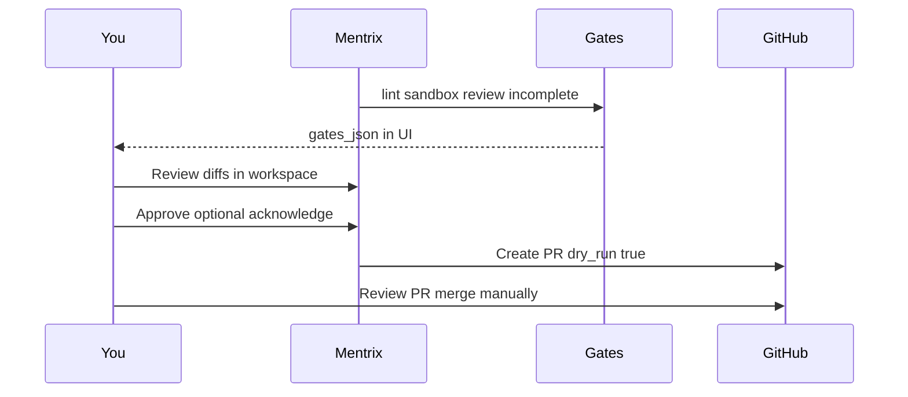

# ZOAS-in-ZECT Workflow Plan

## Goal

Work **zinnia/zoas** inside ZECT using the full pipeline: **import → Lattice graph → Blueprint → Ask/Plan (triage) → Mentrix bugfix or Build (execution) → human Approve → Create PR → test**.

Target repo is documented in [Comprehensive Analysis doc](docs/prompts/Comprehensive%20Analysis%20%26%20Enhancement%20Plan%20for%20ZECT%20AI%20Development%20Platform.md) as the Playwright evaluation target (`https://github.com/zinnia/zoas`).

```mermaid
flowchart TD
    prep[EnvPrep_StopMinionBot] --> clone[RepoWorkspace_Clone_zoas]
    clone --> ingest[LatticeIngest_projectKey]
    ingest --> graph[LatticeGraph_Explore]
    graph --> blueprint[Blueprint_FromLattice]
    blueprint --> ask[AskMode_Triage]
    ask --> plan[PlanMode_FixPlan]
    plan --> bugfix[MentrixBugfix_Execute]
    plan --> build[BuildPhase_ManualApply]
    bugfix --> gates[Sandbox_UltraReview_Gates]
    build --> gates
    gates --> approve[HumanApprove]
    approve --> pr[CreatePR_dryRunThenReal]
    pr --> test[RepoTests_ZECT_E2E]
```

---

## Phase 0 — Environment prerequisites (Windows)

**Port isolation:** ZECT backend uses **8000**; MinionBot orchestrator also binds **8000**. Stop MinionBot before starting ZECT ([`RESTART_MENTRIX.ps1`](RESTART_MENTRIX.ps1) kills listeners on 8000/5173).

**Critical Windows config** — clone default root is Linux-only unless overridden:

```15:15:backend/app/services/repo_clone.py
WORKSPACE_ROOT = os.getenv("ZECT_WORKSPACE_ROOT", "/opt/zect-workspaces")
```

Add to [`backend/.env`](backend/.env) (not committed):

| Variable | Recommended value | Why |
|----------|-------------------|-----|
| `ZECT_WORKSPACE_ROOT` | `C:\Users\karuppk\zect-workspaces` | Clone target on Windows |
| `GITHUB_TOKEN` | Your PAT with `repo` scope | Clone private `zinnia/zoas` |
| `MENTRIX_ENABLED` | `true` | Mentrix Delivery |
| `LATTICE_ENABLED` | `true` | Graph ingest |
| `RAG_ENABLED` | `true` | Scout/RAG in bugfix |
| `MENTRIX_PR_DRY_RUN` | `true` (first runs) | Safe PR simulation |
| `MENTRIX_COMPANION_MODEL` | e.g. `gpt-4o-mini` | Avoid Realtime quota issues in typed chat |

**Start stack:**

```powershell
cd C:\Users\karuppk\Downloads\ZECT
.\RESTART_MENTRIX.ps1
```

Login: `admin@zect.local` / `zect-dev-local` (or your configured creds).

**Pull latest ZECT** on `develop` before starting (Agent mode): ensures bugfix orchestrator, voice clone, and recent Mentrix fixes are present.

---

## Phase 1 — Import zinnia/zoas

**UI path:** Sidebar → **Repo Workspace** ([`frontend/src/pages/RepoWorkspace.tsx`](frontend/src/pages/RepoWorkspace.tsx)) → Clone tab.

**Steps:**

1. **Projects** — create or select a project (e.g. "ZOAS Eval").
2. **Clone form:**
   - Owner: `zinnia`
   - Repository: `zoas`
   - Branch: default (`main` or repo default)
   - Shallow clone: checked (faster first pass)
3. Click **Clone Repository** → backend [`POST /api/repos/clone`](backend/app/routers/repo_clone.py) writes to `{ZECT_WORKSPACE_ROOT}/zinnia/zoas`.
4. **Post-clone auto-ingest** (built into Repo Workspace):
   - `POST /api/lattice/ingest` with `project_key = zinnia-zoas`
   - Writes `localStorage["zect_mentrix_workspace"]` = `{ path, workspace, project_key }`
5. **Verify clone:** Browse tab → file tree; Search tab → grep symbols.

**Expected local path:** `C:\Users\karuppk\zect-workspaces\zinnia\zoas` (after env set).

**If clone fails:** confirm `GITHUB_TOKEN` in Settings or `.env`; confirm `ZECT_WORKSPACE_ROOT` directory exists and is writable.

---

## Phase 2 — Lattice graph + Blueprint

### 2a. Explore the graph

**Route:** `/lattice` ([`frontend/src/pages/LatticeGraph.tsx`](frontend/src/pages/LatticeGraph.tsx))

| Action | API | Purpose |
|--------|-----|---------|
| Ingest (if re-run) | `POST /api/lattice/ingest` | Rebuild after pull |
| Load graph | `GET /api/lattice/graph?project_key=zoas-zinnia&layer=combined` | Visual force graph |
| Query | `POST /api/lattice/query` | Find symbols/modules |
| Path | `POST /api/lattice/path` | Dependency chain between nodes |
| Explain | `POST /api/lattice/explain` | LLM summary of a node |
| RAG search | `POST /api/lattice/rag/search` | Semantic code search |

Use **combined / code / docs** layer toggles to inspect code vs documentation graph.

### 2b. Structural Blueprint

**Route:** `/blueprint` → **From Lattice** mode ([`frontend/src/pages/BlueprintGenerator.tsx`](frontend/src/pages/BlueprintGenerator.tsx))

- Project key should auto-fill from `zect_mentrix_workspace` (`zinnia-zoas`).
- Run **Build blueprint prompt** → `POST /api/lattice/blueprint/prompt`.
- Optional: `GET /api/lattice/blueprint?project_key=zinnia-zoas` for stored structural blueprint (APIs, tech stack, god nodes from [`structural_blueprint.py`](backend/app/services/lattice/structural_blueprint.py)).

**Deliverable:** save blueprint summary + key god-nodes as context for Ask/Plan and Mentrix goal.

---

## Phase 3 — Ask + Plan (triage, no writes)

Per [`docs/workflows/ASK_PLAN_DEVELOP_WORKFLOW.md`](docs/workflows/ASK_PLAN_DEVELOP_WORKFLOW.md):

### Ask (`/ask`)

- Attach **repo context** (paste blueprint summary, failing test output, or Lattice RAG hits).
- Example goals for ZOAS eval (from analysis doc):
  - "Map navigation flows: App Runner, Deliver, Labs, Workspace."
  - "Where is auth/security handled?"
  - "What breaks if we change the prompt context retention layer?"

**Ask mode is read-only** — use for diagnosis and architecture understanding only.

### Plan (`/plan`)

- Input: feature/fix description + repo context from Phase 2.
- Output: phased plan with impacted files (cross-check against Lattice path queries).
- Export plan text → paste into Mentrix goal or Build phase.

---

## Phase 4 — Execute fixes (two paths)

### Path A — Mentrix bugfix (recommended for automated fix loop)

**Route:** `/mentrix` ([`frontend/src/pages/Mentrix.tsx`](frontend/src/pages/Mentrix.tsx))

| Field | Value |
|-------|-------|
| Mode | `bugfix` |
| Workspace | Auto from `zect_mentrix_workspace` |
| Project key | `zinnia-zoas` |
| Goal | Specific issue + Plan output + repro steps |

**Bugfix pipeline** ([`orchestrator.py`](backend/app/services/forge_loop/orchestrator.py)):

```
lattice → blueprint → reproduce → trace_impacted → root_cause → build → incomplete → sandbox → ultra_review → integrator
```

- **Reproduce:** auto-detects test cmd (`pytest`, `npm test`, etc.) from repo stack.
- **Root cause:** [`bugfix_phase.py`](backend/app/services/phases/bugfix_phase.py) → numbered fix steps.
- **Build:** applies patches to workspace clone.
- **Sandbox:** re-runs tests with autofix retries.

### Path B — Classic Build (manual control)

**Route:** `/build` ([`frontend/src/pages/BuildPhase.tsx`](frontend/src/pages/BuildPhase.tsx))

- Paste one plan step at a time.
- Generate → review diff → Apply → Autofix → Commit/Push/Create PR.
- Use when you want step-by-step human review of each file change.

**When to use which:**

| Situation | Path |
|-----------|------|
| Known failing test / bug with repro | Mentrix **bugfix** |
| Exploratory refactor, multi-phase feature | Ask/Plan then **Build** or Mentrix **upgrade** |
| ZOAS Playwright UX eval (no code change) | Ask + manual Playwright only |

---

## Phase 5 — Human-in-the-loop gates



**Gate review** ([`gates_policy.py`](backend/app/services/quality/gates_policy.py)):

- Watch: `lint_ok`, `sandbox_ready`, `review_ok`, `incomplete_ok`, `grounding_ok`, `security_critical`.
- **Acknowledge issues** (`mentrix-acknowledge`) can waive non-security failures (sandbox/review) at Approve time — **not** at Create PR time.
- **Approve** → `POST /api/mentrix/runs/{id}/approve`
- **Create PR** → `POST /api/mentrix/runs/{id}/create-pr` (default dry run per `MENTRIX_PR_DRY_RUN=true`)

**Companion Allow modal** ([`MentrixConfirmModal.tsx`](frontend/src/components/MentrixConfirmModal.tsx)): confirms risky tools (desktop, Slack, `create_pr`) when using Mentrix chat/companion alongside delivery.

**Manual testing checklist (you):**

1. Run ZOAS app locally (discover start command from blueprint/README after clone).
2. Walk eval flows from analysis doc: navigation, AI generation, security, error handling.
3. Confirm Mentrix patches did not regress critical paths.
4. Only then: set `MENTRIX_PR_DRY_RUN=false` + real `GITHUB_TOKEN` for actual PR.

---

## Phase 6 — Automated testing

### 6a. ZOAS repo tests (in clone)

After clone, detect stack from blueprint/README and run in `C:\Users\karuppk\zect-workspaces\zinnia\zoas`:

- Python: `pytest -q`
- Node: `npm test` / `npm run test:e2e`
- Document the command Mentrix sandbox should use.

### 6b. ZECT backend pytest

```powershell
cd C:\Users\karuppk\Downloads\ZECT\backend
pytest -q tests/fixes_and_phases/test_bugfix_phase.py
```

### 6c. ZECT Playwright E2E

Backend must be on `:8000`; then:

```powershell
cd C:\Users\karuppk\Downloads\ZECT\frontend
npm run test:e2e
```

**Existing coverage:** [`mentrix-smoke.spec.ts`](frontend/e2e/mentrix-smoke.spec.ts), [`mentrix-approve-pr.spec.ts`](frontend/e2e/mentrix-approve-pr.spec.ts), companion/voice toggle.

**Gaps to add (Agent mode implementation):**

| Spec | Covers |
|------|--------|
| `frontend/e2e/zoas-workflow.spec.ts` (new) | Repo clone smoke OR mock; Mentrix bugfix mode engage; gates visible |
| Extend bugfix test IDs on [`Mentrix.tsx`](frontend/src/pages/Mentrix.tsx) if missing | Stable selectors for bugfix mode |

**ZOAS app Playwright eval** (per analysis doc): run **against the cloned ZOAS app** (separate config pointing at ZOAS dev URL), not ZECT UI — capture screenshots and UX issues as a manual/separate Playwright project unless ZOAS already ships e2e tests.

---

## Known gaps and optional code fixes

These are **not blockers** for GitHub clone path if `ZECT_WORKSPACE_ROOT` is set, but worth fixing in a follow-up PR:

| Gap | Impact | Fix location |
|-----|--------|--------------|
| Default workspace root is `/opt/...` | Clone fails on Windows without env | Document in `.env.example`; validate on startup |
| [`ALLOWED_ROOTS`](backend/app/routers/file_explorer.py) excludes `C:\` | Build/git ops via File Explorer may 403 | Add Windows workspace root to allowed list |
| Manual Lattice ingest does not write `zect_mentrix_workspace` | Mentrix autofill broken for local-only path | [`LatticeGraph.tsx`](frontend/src/pages/LatticeGraph.tsx) mirror Repo Workspace behavior |
| `zect_lattice_key` read but never set | Dead localStorage key | Wire or remove |
| Pull does not re-ingest | Stale graph after `git pull` | Hook re-ingest in Repo Workspace pull handler |
| No bugfix-mode e2e | Regression risk | New Playwright spec |

---

## Execution order (checklist)

1. Stop MinionBot; set `ZECT_WORKSPACE_ROOT` + tokens in `.env`.
2. Pull ZECT `develop`; run `RESTART_MENTRIX.ps1`.
3. Create project → clone `zinnia/zoas` → confirm ingest + `zect_mentrix_workspace`.
4. `/lattice` — explore graph; `/blueprint` — From Lattice prompt.
5. `/ask` — triage target area; `/plan` — structured fix plan.
6. `/mentrix` — mode **bugfix**, run with plan as goal; review gates.
7. Human: run ZOAS locally; verify fix; **Approve** → **Create PR** (dry run first).
8. Run ZECT pytest + Playwright; add `zoas-workflow.spec.ts` if gaps found.
9. Real PR when satisfied (`MENTRIX_PR_DRY_RUN=false`).

---

## Success criteria

- `zinnia/zoas` cloned under Windows workspace root with Lattice graph + blueprint loaded.
- Ask/Plan artifacts document the issue and impacted files (aligned with graph).
- Mentrix bugfix run completes with gate panel populated; human Approve + dry-run PR succeed.
- Repo tests pass in workspace (or failures documented with acknowledge + follow-up).
- ZECT regression: bugfix pytest + existing Mentrix e2e green.
