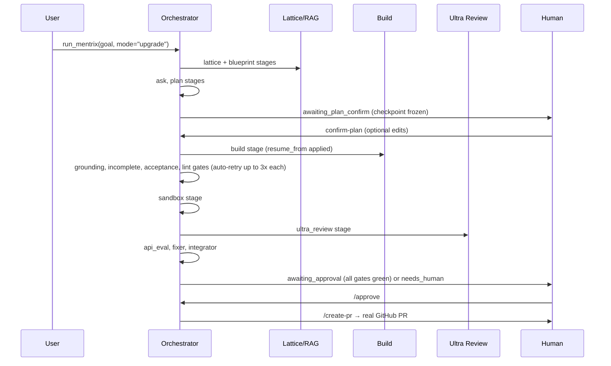
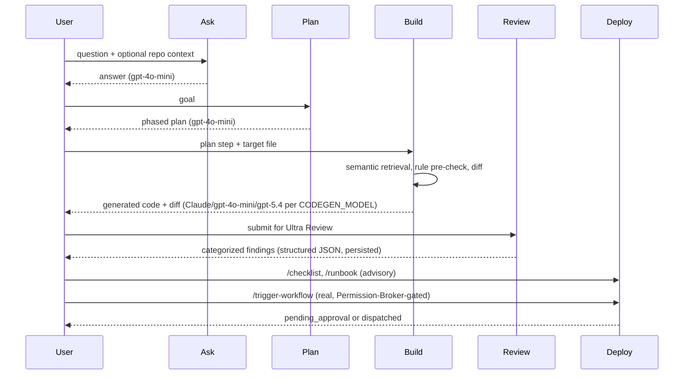
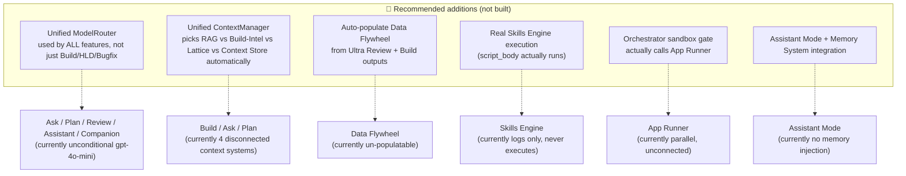

# ZECT — Complete Architecture & Workflow Reference

Status legend used throughout this document:

- ✅ **Implemented** — real, verified end-to-end behavior (DB-backed, real LLM call, or real external API call)
- 🟡 **Partial** — real CRUD/UI exists, but part of the advertised behavior is stubbed, disconnected, or manual
- ❌ **Missing/Stub** — UI and/or schema exist, but the core behavior does not happen
- 🔮 **Recommended (not built)** — a suggestion for future work, not a claim about current behavior

Every claim below is grounded in a specific file/line in the ZECT repo (`C:\Users\karuppk\Downloads\ZECT`), verified this session by direct code reading. Nothing here is inferred from feature names.

---

## 0. Plain-language summary (for end users)

ZECT is your personal engineering control tower. Point it at a repo (ZOAS, ZAF, or anything else), and it can:

- **Answer questions** about the codebase (Ask, Lattice, Mentrix Companion)
- **Plan** a change before writing any code (Plan mode, and the mandatory Plan-Confirm gate in Upgrade/Bugfix modes)
- **Write code** for you (Build), across one file or several files at once, in whatever language the target file is already in (Python for ZOAS, Java for ZAF — it infers this from the file, not a hardcoded assumption)
- **Review the code** it or a human wrote (Ultra Review — real OpenAI structured-output review, posts real inline PR comments)
- **Ship it** — real git commits, a real GitHub PR, and a real (human-approved) deploy trigger
- **Talk to you** — Mentrix Companion is a voice-and-text assistant that can check delivery status, search the codebase, read/write your desktop notes, open PowerPoint and narrate a presentation in your cloned voice, and (as of this session) scan for suspicious account activity and file a real Jira ticket
- **Remember things across sessions** — a 4-layer memory system, plus a nightly "Dream" job that looks for repeated patterns in what happened and turns them into lessons

What you provide, in every case: a repo (cloned via Repo Workspace), a plain-English goal or question, and — for anything that writes code or touches GitHub/Jira/Slack — an explicit approval click when ZECT asks for one. ZECT never merges, deploys, or messages anyone without a human clicking "approve" first.

---

## 1. Current-state system architecture

```mermaid
flowchart TB
    subgraph UI["Frontend (React/TS) — Sidebar sections"]
        WF["Workflow<br/>Mentrix Companion / Mentrix Delivery"]
        WS["Workspace<br/>Dashboard, Projects, Repo Workspace, Settings"]
        UN["Understand<br/>Lattice, Repo Analysis, Blueprint, Doc Gen, Code Index"]
        DL["Deliver<br/>Agent Mode, Ask, Plan, Build, Review, Deploy, Orchestration"]
        QL["Quality<br/>Ultra Review, Rules, Sandbox, CI Monitor, Git Ops"]
        EN["Enterprise<br/>Integrations, Audit, Export, Analytics, Token Controls, Secrets"]
        LB["Labs<br/>Skills, Memory, Dream Engine, Data Flywheel/Layer, Permissions, App Runner..."]
    end

    subgraph CORE["Backend (FastAPI)"]
        ORCH["ForgeLoop Orchestrator<br/>MODE_PIPELINE stage dispatch"]
        ASSIST["Assistant Mode<br/>model-driven tool loop"]
        COMPANION["Mentrix Companion<br/>text + Realtime voice"]
        REVIEW["review_service.py<br/>canonical Ultra Review"]
        BUILD["build_phase_svc.py<br/>codegen"]
        PERM["Permission Broker<br/>allow / require_approval / never"]
    end

    subgraph CTX["Context sources"]
        LATTICE["Lattice graph<br/>AST symbols, calls, imports"]
        RAG["RAG index (local hash embeddings)<br/>project_key-scoped"]
        BUILDINTEL["Build-Intel index (real OpenAI embeddings)<br/>repo_id-scoped, Build-only"]
        CSTORE["Context Store<br/>per-user/page KV blobs"]
        MEMORY["Memory System<br/>working/episodic/semantic/personal"]
    end

    subgraph EXT["External systems"]
        GH["GitHub (PyGithub)"]
        JIRA["Jira Cloud REST v3"]
        SLACK["Slack Web API"]
        OPENAI["OpenAI API"]
        ANTHROPIC["Anthropic API"]
        CHATTERBOX["Local Chatterbox voice engine"]
    end

    WF --> COMPANION
    DL --> ORCH
    DL --> BUILD
    QL --> REVIEW
    WS --> LATTICE
    UN --> LATTICE
    UN --> RAG

    ORCH --> LATTICE
    ORCH --> RAG
    ORCH --> BUILD
    ORCH --> REVIEW
    ORCH --> PERM
    COMPANION --> PERM
    COMPANION --> MEMORY
    ASSIST --> PERM
    ASSIST --> ORCH

    BUILD --> BUILDINTEL
    BUILD --> CSTORE
    BUILD --> ANTHROPIC
    BUILD --> OPENAI

    REVIEW --> OPENAI
    COMPANION --> OPENAI
    COMPANION --> CHATTERBOX
    PERM --> GH
    PERM --> JIRA
    PERM --> SLACK
```



---

## 2. Section-by-section reference

Each section below answers, in order: **Purpose · Where to access · What to provide · What happens automatically · Agents/tools/models/context · Output · Connections · Approval required · Context preservation · Cost optimization.**

### 2.1 ZECT (the whole app)

1. **Purpose:** A personal, GitHub-connected engineering delivery platform — code intelligence, AI-assisted planning/building/reviewing, deployment gating, and an AI operator (Mentrix) layered over all of it.
2. **Access:** Desktop Electron app or browser at the ZECT frontend URL; sidebar is the primary nav (`frontend/src/components/Sidebar.tsx`).
3. **What to provide:** A GitHub token (Settings) and either an `OPENAI_API_KEY` or `ANTHROPIC_API_KEY` (backend `.env`) to unlock LLM features. Everything else is optional per-feature config (Jira/Slack/Datadog tokens, a cloned voice, etc.).
4. **Automatic:** Nothing runs unattended by default — every AI feature is triggered by a specific user action (a button click or a Companion request).
5. **Agents/tools/models:** No single "one true model" — ✅ verified: `gpt-4o-mini` is the default across almost every OpenAI call site; `build_phase_svc.py`/`build_phase.py`/`bugfix_phase.py`/`hld_phase.py` prefer Claude Sonnet 5 when `ANTHROPIC_API_KEY` is set (now centralized in `resolve_generation_model()`, see §6); **GPT-5.4 is now selectable** (see §6).
6. **Output:** Varies per feature — code diffs, PRs, review findings, plans, chat replies, dashboards.
7. **Connections:** Every section below is a module of this one app; the Permission Broker and token_tracker are the two things every feature shares.
8. **Approval:** PR creation, real deploy triggers, and several Companion actions (Slack/email send, desktop file operations, Jira writes) require an explicit approval click — enforced by the Permission Broker, not by convention.
9. **Context preservation:** Four independent, non-unified context systems (Context Store, RAG index, Build-Intel index, Lattice graph) — see §6.2 for how they differ and where each is used.
10. **Cost optimization:** ✅ OpenAI structured-output JSON schemas (fewer malformed-response retries), ✅ Anthropic prompt-prefix caching, ✅ exact-match SHA-256 response cache (`LLMResponseCache`), ✅ per-user/team token budgets with hard enforcement (Token Controls).

### 2.2 Mentrix (the orchestrator + delivery brand)

1. **Purpose:** The name for both the orchestration engine (`ForgeLoop`, `app/services/forge_loop/orchestrator.py`) and the delivery UI built on top of it (`/mentrix`, `/mentrix-home`).
2. **Access:** Sidebar → Workflow → "Mentrix Delivery" (`/mentrix`) for pipeline runs; "Mentrix Companion" (`/mentrix-home`) for the conversational assistant.
3. **What to provide:** A goal (plain English), a mode (`upgrade`/`bugfix`/`deliver`/`assistant`/`chat`/`ops`/`review_only`/`understand`), and a workspace path or `repo_id`.
4. **Automatic:** ✅ Full stage pipeline execution per mode (see MODE_PIPELINE table in §7), gate checks, recovery-retry loops (up to `MENTRIX_MAX_RECOVERY`, default 3, **per gate type**), event/state persistence after every stage (crash-safe).
5. **Agents/tools/models:** Stage dispatch is a single `for agent in pipeline:` loop with an `if/elif` chain (not a multi-agent framework, not LangGraph) — ✅ verified `orchestrator.py:646-1536`. Models per stage follow §6's routing table.
6. **Output:** A `MentrixRun` row with `events_json`, `gates_json`, `result_json`; ultimately a PR link (if gates pass and a human approves).
7. **Connections:** Everything — Lattice/RAG for context, Build for codegen, Ultra Review for quality gates, Permission Broker + gates_policy for the ship decision, Companion/Assistant for the conversational front-end.
8. **Approval:** ✅ Two independent human gates: **Plan-Confirm** (after `plan`/`root_cause` stage, `upgrade`/`bugfix` modes only by default) and **Ship-Approval** (`/approve` before `/create-pr`, all delivery modes). Neither can be bypassed by `acknowledge_issues` waivers — hard-blocked.
9. **Context preservation:** ✅ Resumable — `awaiting_plan_confirm` status freezes a full checkpoint (`_checkpoint` dict with every stage's state); `continue_mentrix_after_plan()` resumes from the exact stage via `resume_from`/`resume_state`, optionally applying a human-edited plan patch first.
10. **Cost optimization:** Same as §2.1; additionally the `steps >= max_steps` hard stop (env `MENTRIX_MAX_STEPS`, default 40) prevents runaway loops from burning tokens indefinitely.

### 2.3 The AI Assistant (Assistant Mode)

1. **Purpose:** The one mode that isn't a fixed stage list — a model-driven tool-calling loop that decides what to do based on the actual request, for asks that don't match a pre-scripted pipeline.
2. **Access:** Mentrix Delivery → mode dropdown → "Assistant"; or any Companion conversation that triggers a heavy tool.
3. **What to provide:** A goal in plain English. That's it — the model decides which of ~7 tools to call (`start_upgrade_run`, `start_bugfix_run`, `trigger_build`, `request_review`, `trigger_deploy`, `scan_for_anomalies`, `file_security_ticket`) plus every Companion "light" tool (navigate, weather, Slack, email, Jira, etc.).
4. **Automatic:** For heavy/long-running tools, it kicks off a **background** `MentrixRun` (a daemon thread with its own DB session) and reports the run ID immediately — it does not block the conversation waiting for a multi-minute pipeline.
5. **Agents/tools/models:** `gpt-4o-mini` (hardcoded, `assistant_phase.py:367` — not yet on the Anthropic/GPT-5.4 override path; see §6 recommendation). Max 6 steps (`MENTRIX_ASSISTANT_MAX_STEPS`). Every tool call passes through the same Permission Broker as Companion — no bypass.
6. **Output:** A final text answer plus a `tool_calls` log (tool name, args, result) for auditability.
7. **Connections:** Reuses Companion's light-tool executor (`_exec_tool`) and realtime tool schemas verbatim; heavy tools reuse the same orchestrator/review/deploy/Jira/threat-detection code every other feature uses — no parallel implementation.
8. **Approval:** Identical Permission Broker gate as everything else — `denied`/`pending_approval` results block execution before the tool ever runs.
9. **Context preservation:** None beyond the single conversation's message list — no memory-system integration yet (🔮 recommended: inject Memory System lessons the way Companion's `build_agent_context` already does).
10. **Cost optimization:** Step cap bounds worst-case cost per request; no caching specific to this mode yet (🔮 recommended: route through the same response-cache/prompt-cache levers Build and Review already use).

### 2.4 Workspace

1. **Purpose:** Where a repo becomes usable by everything else — clone, browse, search, configure.
2. **Access:** Sidebar → Workspace → Dashboard / Projects / Repo Workspace / Settings.
3. **What to provide:** A GitHub owner/repo/branch (Repo Workspace → Clone tab) or an existing project; a GitHub token and/or OpenAI/Anthropic key (Settings).
4. **Automatic:** ✅ Cloning also auto-triggers Lattice ingestion (`latticeIngest`) and writes the active workspace to `localStorage` — every other page (Ask/Plan/Blueprint/Lattice) picks this up automatically, no re-entry needed.
5. **Agents/tools/models:** None directly (pure GitHub API + git + DB CRUD) except the optional `/index` step, which does real semantic embedding indexing via Build-Intel (`text-embedding-3-small`).
6. **Output:** A local clone on disk, a `Repo` DB row, an indexed Lattice graph, optionally a semantic index.
7. **Connections:** Feeds Understand, Deliver, Quality — this is the entry point for almost every other section.
8. **Approval:** None — cloning/indexing is a direct user action, not gated.
9. **Context preservation:** `zect_mentrix_workspace`/`zect_lattice_key` in `localStorage` is the de facto "active workspace" session token read across pages.
10. **Cost optimization:** Semantic indexing is capped (`MAX_FILES=500`, `MAX_CHUNKS=2000`, 500KB/file) to bound embedding spend on large repos. ⚠️ Settings' API-key "Configure" buttons write only to `os.environ` (not encrypted, not DB-persisted) — a backend restart loses the runtime-entered key.

### 2.5 Understand

1. **Purpose:** Build a mental model of a repo before touching it — structure, symbols, docs, architecture notes.
2. **Access:** Sidebar → Understand → Lattice Graph / Repo Analysis / Blueprint / Doc Generator / Code Index / Docs Center.
3. **What to provide:** A cloned repo/workspace (from §2.4). Optional: a focus area for Blueprint's "Focused" mode.
4. **Automatic:** Lattice indexing on clone (§2.4); Repo Analysis/Blueprint/Doc Generator are otherwise on-demand.
5. **Agents/tools/models:** ⚠️ Mostly **not LLM-based** despite the AI-heavy neighborhood — Repo Analysis and Doc Generator are 100% deterministic GitHub-API + string-templating (**Doc Generator's own UI copy incorrectly claims LLM usage** — flagged as a doc-accuracy bug, not a functional one). Blueprint's "Enhance with AI" button is the one real LLM call (`gpt-4o-mini`). Lattice's `/hld` endpoint is the one genuinely LLM-backed structural-doc generator (`hld_phase.py`, routed through `resolve_generation_model()`).
6. **Output:** A structural blueprint (functions, classes, endpoints, god-nodes, tech stack), a documentation bundle, a searchable symbol index, an interactive node graph.
7. **Connections:** Lattice graph feeds the orchestrator's Scout stage and (via a `+0.15` boost) the RAG retriever; Blueprint's HLD feeds Build via Context Store.
8. **Approval:** None — read-only analysis.
9. **Context preservation:** Lattice's `LatticeStructuralBlueprint` is persisted per `project_key`; the HLD doc is persisted to Context Store under page `"blueprint"`.
10. **Cost optimization:** Three of four Blueprint generation paths and all of Doc Generator/Repo Analysis are free (no LLM call at all) — only "Enhance with AI" and `/hld` spend tokens.
11. ⚠️ **Known bugs found this session:** Code Index's stats UI expects `languages`/`repos_indexed` fields the backend never returns (always shows 0).

### 2.6 Deliver

1. **Purpose:** Actually produce and ship code — ask questions, plan, generate, review, deploy.
2. **Access:** Sidebar → Deliver → Agent Mode / Ask / Plan / Build / Snippet Review / Deploy / Orchestration.
3. **What to provide:** A question (Ask), a goal (Plan/Agent Mode), a plan step + target file (Build), a snippet (Snippet Review), or a workflow file + environment (Deploy).
4. **Automatic:** Build auto-injects repo context (semantic retrieval first, static snapshot fallback), runs rule pre-checks, and computes a diff before you ever see the generated code.
5. **Agents/tools/models:** All `gpt-4o-mini` except Build (Claude-preferred via `resolve_generation_model()`, now GPT-5.4-selectable via `CODEGEN_MODEL`). ⚠️ **Every page's on-screen model dropdown (Ask/Plan/Build/Review) is currently decorative** — the selection is never sent to the backend; the backend picks the model itself. This is the concrete gap GPT-5.4 selection should close (see §6.3 recommendation).
6. **Output:** An answer, a phased plan, generated code + diff + rule-check results, a review verdict, a real deploy trigger (or an advisory checklist/runbook).
7. **Connections:** Build is what the orchestrator's `build`/`builder` stage actually calls; Deploy's `/trigger-workflow` is the only genuinely destructive action in this section, and it's Permission-Broker-gated.
8. **Approval:** `/trigger-workflow` requires approval if a `deploy_{environment}` rule says so; `/checklist` and `/runbook` are pure advisory text with no side effects.
9. **Context preservation:** Build checks Context Store for a saved HLD doc when no other context is available.
10. **Cost optimization:** Build prefers semantic retrieval (top_k=6) over dumping the whole repo into the prompt; `complete_with_continuations` avoids re-sending the whole conversation on a truncated response.
11. ⚠️ **Orphaned backend found this session:** `/api/orchestration/*` (a separate LLM task-decomposer) has zero frontend callers — the "Orchestration" sidebar page is an unrelated repo-overview screen that happens to share a name.

### 2.7 Quality

1. **Purpose:** Catch problems before they ship — AI review, deterministic rules, sandboxed execution, CI diagnostics.
2. **Access:** Sidebar → Quality → Mentrix Ultra Review / Rules Engine / Sandbox Gate / CI Monitor / Git Operations.
3. **What to provide:** A PR number, snippet, or repo (Ultra Review); a regex condition (Rules Engine); code to sandbox-test.
4. **Automatic:** Ultra Review's Auto-Fix Loop reviews → drafts fixes → **posts them to GitHub as real inline PR comments** automatically, stopping early once quality ≥ 90 with ≤ 2 issues.
5. **Agents/tools/models:** `gpt-4o-mini` with **strict JSON-schema structured outputs** (bugs/vulnerabilities/performance/code-quality/architecture/best-practices, with CWE/OWASP mapping) — this is the most mature LLM feature in the app; every result persists to `ReviewSession`/`ReviewFinding`, unlike most other LLM calls elsewhere.
6. **Output:** Categorized findings with severity/suggestion/fixed-code, a sandbox pass/fail + blockers list, CI job/step pass-fail + (if configured) a fix suggestion.
7. **Connections:** `review_service.py::review_code_snippet` is the single canonical reviewer — the orchestrator's `ultra_review`/`ultra_review_pre` stages, `code_review.py`, and `review_phase.py` all delegate to it (previously 4 duplicate implementations, consolidated).
8. **Approval:** Sandbox execution itself needs none; but its `create_pr_hard_blocked` output feeds the orchestrator's non-waivable PR gate.
9. **Context preservation:** Every review persists — this is genuinely queryable history, not a one-shot ephemeral call.
10. **Cost optimization:** Per-chunk exact-match response caching + Anthropic-style structured outputs reduce both retries and repeat-review cost.
11. ⚠️ CI Monitor's "logs" are step metadata only (pass/fail), not real console output — AI failure analysis is necessarily shallow because of this, by honest design (falls back to "requires manual investigation" rather than fabricating a diagnosis when no API key is set).

### 2.8 Enterprise

1. **Purpose:** Org-facing controls — integrations, audit, cost governance, secrets, sharing.
2. **Access:** Sidebar → Enterprise → Integrations / Audit Trail / Export-Share / Output History / Analytics / Token Controls / Secrets Manager.
3. **What to provide:** Jira/Slack/Datadog credentials (Integrations); budget limits (Token Controls); secret name/value (Secrets Manager).
4. **Automatic:** Token Controls' `check-limit` endpoint is designed to gate LLM calls before they run — whether every call site actually invokes it wasn't verified this session (🟡 partial — the enforcement path exists but isn't confirmed universal).
5. **Agents/tools/models:** None in this section directly — it's a control plane over what every other section does.
6. **Output:** Dashboards, exported Markdown, an audit trail, encrypted secret storage.
7. **Connections:** Every LLM call anywhere in ZECT logs to `TokenLog` via `token_tracker.log_tokens` — Token Controls/Analytics/Session Insights are all views over that one table.
8. **Approval:** Jira/Slack integration writes are Permission-Broker-gated when reached via Companion/Assistant.
9. **Context preservation:** N/A — this section is itself the persistence/audit layer for everything else.
10. **Cost optimization:** This *is* the cost-optimization control surface (budgets, per-model/per-user/per-team breakdowns).
11. ⚠️ **Real security findings this session:** (a) Secrets Manager's create/read(reveal)/update/rotate endpoints have **no authentication dependency at all**, and `rotate_secret`'s new value is bound as a URL query parameter (leaks into server/proxy logs) — only list and delete are properly gated; (b) Jira/Slack config tokens are stored in columns named `*_encrypted` but are **not actually encrypted** (plaintext), unlike Secrets Manager's genuine Fernet encryption; (c) the Integrations page's "Send test Slack message" button is **hardcoded to fake success** (`"Simulated — connect real Slack Bot Token..."`) even though a real Slack-sending path exists elsewhere (the MCP adapter); (d) MCP GitHub adapter's `create_issue`/`create_pr`/etc. (beyond read operations) return a placeholder `{"status": "accepted"}` without calling GitHub.

### 2.9 Labs

1. **Purpose:** Experimental/incubating features — knowledge management, automation scaffolding, dev tooling.
2. **Access:** Sidebar → Labs (14 pages — the largest section).
3. **What to provide:** Varies per page; see §2.10–§2.14 for the six most-asked-about ones in detail.
4. **Automatic:** Varies wildly — some pages (Memory, Dream Engine, Permissions, Transfer, Knowledge Base, File Explorer) are fully real; some (Skills Engine, Data Flywheel, Data Layer, Playbooks, Scheduled Tasks) are real CRUD with **no automated execution behind them**.
5. **Agents/tools/models:** Only Skill Library's `/detect` endpoint and (indirectly) Skills' `template` field flowing into Companion use an LLM in this entire section.
6. **Output:** Varies per page.
7. **Connections:** Dream Engine writes into Memory's tables; Memory's `Skill`/`Lesson` rows feed into Companion's context injection — otherwise most Labs pages are islands (see per-page connection notes below).
8. **Approval:** Permissions (the page) *is* the approval-rule engine everything else reads from.
9. **Context preservation:** Memory System is the closest thing to genuine cross-session context preservation in the whole app.
10. **Cost optimization:** N/A for most pages (no LLM calls); Skill Library's `/detect` is token-logged like everything else.

### 2.10 Dream Engine

1. **Purpose:** A batch memory-consolidation job — **not** a creative/ideation feature despite the name.
2. **Access:** Labs → Dream Engine.
3. **What to provide:** A project ID, and optionally thresholds (max age, min occurrences, cluster similarity).
4. **Automatic:** On "Run Dream Cycle": loads recent episodic memories → clusters by **lexical word-overlap** (Jaccard similarity, not embeddings) → for clusters ≥3, templates a sentence like *"Pattern: 'X' succeeds reliably with N/M success rate"* → stages it as a `Lesson` → decays memories >30 days old → archives stale working-memory rows.
5. **Agents/tools/models:** **Zero LLM calls, zero embeddings** — pure Python string/set logic. This is the single most important "name vs. substance" gap in the app.
6. **Output:** A `DreamCycleRun` summary (episodes processed, clusters found, lessons staged, decayed/archived counts).
7. **Connections:** Reads/writes the exact same tables as the Memory System (§2.11) — Dream Engine *is* Memory's maintenance job, not a separate store.
8. **Approval:** None.
9. **Context preservation:** This is literally how context gets preserved long-term — raw episodes → clustered patterns → durable lessons.
10. **Cost optimization:** N/A (no LLM cost).
11. 🔮 **Recommended:** Replace/augment the word-overlap clustering with real embedding similarity (reusing the RAG index's approach) so pattern detection generalizes beyond exact keyword overlap.

### 2.11 Memory System

1. **Purpose:** A structured, 4-layer knowledge base (working / episodic / semantic / personal) — genuinely the most substantial "AI-adjacent" Labs feature, though it is lexical, not embeddings-based.
2. **Access:** Labs → Memory System.
3. **What to provide:** Task/action/outcome text (usually written by other code, but can be entered manually via the dashboard's "Teach a Lesson" form).
4. **Automatic:** Salience scoring on episodic entries (`importance`/`confidence` → a 0–1 score); nothing else runs unattended (Dream Engine is the batch job that acts on this data).
5. **Agents/tools/models:** None — `recall`/`search` are plain word-overlap/substring matching, not vector similarity.
6. **Output:** Per-layer records; a lexical-relevance-ranked "recall" result for a given intent; a "brain state" summary.
7. **Connections:** Feeds Mentrix Companion's system context via `companion.py::build_agent_context` — the 3 most-recent staged Lessons plus the active Skill template are injected into every Companion turn (text and voice).
8. **Approval:** Lesson lifecycle has its own staged→accepted/rejected workflow (a lightweight internal approval), not the Permission Broker.
9. **Context preservation:** ✅ This is real cross-session, cross-conversation preserved context — the clearest implementation of "memory" in the product.
10. **Cost optimization:** N/A (no LLM cost in this router).
11. **Distinct from Context Store** (§2.4/§6.2) — different tables, different purpose (structured cognitive memory vs. generic per-page KV blobs). Do not conflate the two in future docs.

### 2.12 Skills Engine (and Skill Library — two separate systems)

1. **Purpose:** Reusable capability definitions — but there are genuinely **two independent backends** sharing the word "skill."
2. **Access:** Labs → Skill Library (`/skills`) and Labs → Skills Engine (`/skills-engine`) are different pages, different tables, different logic.
3. **What to provide:** For Skill Library: a name/template/trigger pattern, or pasted code for auto-detection. For Skills Engine: a manifest (inputs/outputs/config) — though there's currently no reason to use it (see below).
4. **Automatic:** Skills Engine auto-seeds 8 fixed "zinnia-*" skill definitions on first read.
5. **Agents/tools/models:** Skill Library's `/detect` is a real `gpt-4o-mini` call. Skills Engine's `/match` is keyword/substring scoring, no LLM.
6. **Output:** Skill Library: a selectable skill whose `template` gets injected into Companion conversations. Skills Engine: match scores and execution-log rows.
7. **Connections:** **Only Skill Library is actually wired into Companion** — the "Skill: None" dropdown in Mentrix reads from `Skill`, not `SkillDefinition`. Skills Engine's `SkillDefinition`/`script_body` is never read or executed by anything else in the codebase.
8. **Approval:** None.
9. **Context preservation:** The selected `activeSkillId` persists in `localStorage` across the session.
10. **Cost optimization:** N/A.
11. ❌ **Skills Engine's core premise — "run a skill" — does not exist.** `POST /execute/{skill_id}` only *logs* a caller-supplied result; nothing interprets or runs `script_body`. 🔮 If a real execution engine is wanted, that's new work, not a fix to something broken.

### 2.13 Data Flywheel

1. **Purpose:** A scaffold for a future model fine-tuning/distillation data pipeline — traces → context cards → eval cases → "readiness."
2. **Access:** Labs → Data Flywheel.
3. **What to provide:** Manually — an input/output pair to record as a trace, a title/description to group traces into a context card, an eval case's expected/actual values.
4. **Automatic:** Nothing — every step (create trace, approve, rate, build card, grade eval) is a manual UI action.
5. **Agents/tools/models:** None.
6. **Output:** A `readiness_level` label (`collecting` → `adapter_candidate`) based on hardcoded approved-trace-count thresholds (10/25/100/500) — a count heuristic, not a real ML signal.
7. **Connections:** ❌ **None** — no other feature (Ultra Review, Build, token_tracker) automatically creates a trace here. It cannot self-populate.
8. **Approval:** Its own internal approve/rate workflow (not the Permission Broker).
9. **Context preservation:** N/A.
10. **Cost optimization:** N/A.
11. 🔮 **Recommended:** wire Ultra Review findings and/or Build generations to auto-create traces (with the existing redaction step already built in) — this is the single highest-leverage connection missing in the whole Labs section, since the schema and approval workflow are already built and waiting for a producer.

### 2.14 App Runner

1. **Purpose:** A raw shell-command executor and long-lived dev-server process manager with a live iframe preview — not a sandboxed container runtime.
2. **Access:** Labs → App Runner.
3. **What to provide:** A working directory, an install command, a startup command, and a preview port.
4. **Automatic:** "Configure" (Install & Launch) runs the install command, then starts the startup command, then returns a `preview_url` the UI iframes automatically.
5. **Agents/tools/models:** None — pure `subprocess.run`/`Popen`, `shell=True`, **no sandboxing, no allow-list, no resource limits**.
6. **Output:** Rolling stdout/stderr (5000-line buffer), process status, a live preview iframe.
7. **Connections:** ⚠️ **Not** what the orchestrator's sandbox/test-execution gate uses, despite that gate's own code comment implying reuse — the orchestrator has its own independent `subprocess.run` implementation in `autofix.py`. They are parallel, not shared.
8. **Approval:** None — this executes arbitrary shell commands with no gate at all. Treat this page as trusted-user-only.
9. **Context preservation:** Process state is in-memory (module-global dict) — **lost on backend restart**.
10. **Cost optimization:** N/A (no LLM involved).
11. 🔮 **Recommended:** if this is meant to be the orchestrator's real execution backend (as its docstring implies), either (a) point the orchestrator's sandbox gate at App Runner's actual endpoints, or (b) update that docstring to stop claiming a connection that doesn't exist in code.

### 2.15 Documentation generation

1. **Purpose:** Produce repo documentation for humans (README-style sections) and architecture docs (this file's own category).
2. **Access:** Understand → Doc Generator (`/doc-generator`) for per-repo docs; Understand → Docs Center (`/docs`) for ZECT's own static reference material.
3. **What to provide:** A repo (GitHub-connected).
4. **Automatic:** Generates 6 sections (overview/architecture/api/setup/testing/deployment) from GitHub metadata + file-tree pattern matching.
5. **Agents/tools/models:** ❌ **None** — despite the page's own help text claiming "GitHub API + LLM," `_generate_doc_section` is 100% deterministic string templating (identical technique to Repo Analysis/Blueprint's Standard mode). The unknown-section-key fallback literally returns the placeholder string `"content would be generated from repo analysis."` (unreachable via the current UI, which only offers the 6 known keys).
6. **Output:** Markdown-ish documentation text per section.
7. **Connections:** Shares its underlying data source (`_analyze_repo`) with Repo Analysis and Blueprint's Standard mode — three UI surfaces, one deterministic analysis function.
8. **Approval:** None — read-only generation.
9. **Context preservation:** None — regenerated fresh each call.
10. **Cost optimization:** Free — no LLM call.
11. This very document (`ZECT_ARCHITECTURE_AND_WORKFLOW.md`) was produced the way ✅ real AI-assisted documentation should be — by reading actual code, not by a template — which is the gap between what Doc Generator claims and what it does. 🔮 **Recommended:** either wire a real LLM pass into Doc Generator (matching Blueprint's "Enhance with AI" pattern) or correct its UI copy.

### 2.16 Context management

Covered in depth in §6.2. Summary: four separate systems (Context Store, RAG index, Build-Intel index, Lattice graph) with no unifying abstraction — the orchestrator's Scout stage is the only place all of them are manually assembled together into one "pack."

### 2.17 Agent orchestration

Covered in depth in §7 (MODE_PIPELINE, plan-confirm gate, recovery loops, gates policy).

### 2.18 Model routing (including GPT-5.4)

Covered in depth in §6.

---

## 3. Context management deep dive

Four systems, genuinely distinct, verified this session:

| System | Scope key | Embedding | Storage | Used by |
|---|---|---|---|---|
| **Context Store** | `user_id` + `page` + `key` | none (opaque text blob) | `context_store_entries` | HLD saves its doc here; Build reads it as a last-resort fallback |
| **RAG index** | `project_key`/`project_id` | local deterministic hash (no API call) | `embedding_chunks` | Orchestrator's Scout stage (`RAG_ENABLED`), Lattice's "RAG search" UI button |
| **Build-Intel index** | `repo_id` | real OpenAI `text-embedding-3-small` | `code_embeddings` | **Only** Build's code generation (`build_phase_svc.py`) |
| **Lattice graph** | `project_key` | none — AST/regex structural graph | in-process cache + `lattice_structural_blueprints` snapshot | Orchestrator Scout, Lattice page, RAG boost (+0.15 for graph-adjacent hits) |

**Key insight:** a repo indexed via Build-Intel (for Build to use) is invisible to Lattice's RAG search, and vice versa — they never cross-populate. If you `Ingest + RAG` on Lattice but never click `/index` in Repo Workspace, Build falls back to the static repo-snapshot context, not the semantic one.

🔮 **Recommended future state:** a single `ContextManager` facade that Build, Ask, Plan, Assistant, and Companion all call into, internally deciding RAG vs. Build-Intel vs. Lattice vs. Context Store based on what's actually indexed for that project — removing the current "which index did I forget to build" failure mode.

---

## 4. Agent orchestration deep dive

### 4.1 MODE_PIPELINE (verified, `orchestrator.py:57-103`)

| Mode | Stages |
|---|---|
| `chat` | scout → orchestrator |
| `understand` | scout |
| `deliver` | scout → planner → builder → lint → sandbox → reviewer → fixer → integrator |
| `review_only` | reviewer → fixer |
| `ops` | scout → ops → integrator |
| `upgrade` | lattice → blueprint → ask → plan → api_analyze → ultra_review_pre → build → grounding → incomplete → acceptance → lint → sandbox → ultra_review → api_eval → fixer → integrator |
| `bugfix` | lattice → blueprint → reproduce → trace_impacted → root_cause → build → incomplete → sandbox → ultra_review → integrator |
| `assistant` | assistant_loop (the only non-fixed-list mode) |

### 4.2 Two independent human gates

1. **Plan-Confirm** — triggers after `plan` (upgrade) or `root_cause` (bugfix), only when `mode in ("upgrade", "bugfix")` by default (env `MENTRIX_REQUIRE_PLAN_CONFIRM` overrides). Freezes a full checkpoint; `PATCH /runs/{id}/plan` lets a human edit it; `POST /runs/{id}/confirm-plan` resumes exactly where it paused.
2. **Ship-Approval** — after the full pipeline completes, 9 boolean gates are checked; if all pass, status becomes `awaiting_approval` (needs a human `/approve` call before `/create-pr` will succeed); otherwise `needs_human`.

Neither gate can be waived by `acknowledge_issues` — this is a hard architectural guarantee, not a UI convention.

### 4.3 Sequence diagram — a single `upgrade` run



---

## 5. Model routing deep dive (including GPT-5.4)

### 5.1 What was true before this session

No central model router existed. The identical 3-line pattern —

```python
use_anthropic = anthropic_available()
model_name = ANTHROPIC_MODEL if use_anthropic else "gpt-4o-mini"
```

— was copy-pasted independently across **5 call sites** (`build_phase_svc.py`, `build_phase.py` ×2, `bugfix_phase.py`, `hld_phase.py`). Ask/Plan/Review/Assistant/Companion had no Anthropic branch at all — unconditionally `gpt-4o-mini`. The on-screen `ModelSelector` dropdowns on Ask/Plan/Build/Review pages were **decorative** — never forwarded to the backend.

### 5.2 What changed this session

- ✅ Centralized the 5 duplicated call sites into one function: `resolve_generation_model()` in `app/services/llm/anthropic_client.py`.
- ✅ Added a `CODEGEN_MODEL` environment-variable override — set `CODEGEN_MODEL=gpt-5.4` (or any model string) to force that model for Build/HLD/Bugfix generation, bypassing the Claude-vs-gpt-4o-mini default entirely. Provider is inferred from the string (`claude*` → Anthropic, else OpenAI).
- ✅ Registered `gpt-5.4` in `model_selection.py`'s `MODELS` registry (so `/api/models/chat` — the one endpoint that already does real per-request provider dispatch — can serve it today) and in `token_tracker.py`'s `PRICING` table (so usage isn't silently mis-costed at gpt-4o-mini's rate).
- ⚠️ **Pricing for GPT-5.4 is an estimate**, not confirmed against OpenAI's published rate card — correct `cost_per_1k_input`/`cost_per_1k_output` in `model_selection.py` and `PRICING` in `token_tracker.py` once real pricing is known. This only affects displayed cost, not model behavior.

### 5.3 Strong codegen models (verified)

GPT-5.4 and Claude Sonnet 5 are both registered for Build/HLD/Bugfix. Prefer Anthropic when `ANTHROPIC_API_KEY` is set; override with `CODEGEN_MODEL`.

### 5.4 When to select GPT-5.4 vs. the alternatives

| Model | Best for | How to select today |
|---|---|---|
| `gpt-4o-mini` | Everything else — Ask, Plan, Review, Assistant, Companion, cheap/fast turns | Default everywhere; no action needed |
| `claude-sonnet-5` | Build/HLD/Bugfix code generation on real repo-editing tasks (current default when `ANTHROPIC_API_KEY` is set) | Set `ANTHROPIC_API_KEY`; no `CODEGEN_MODEL` needed |
| **`gpt-5.4`** | Build/HLD/Bugfix generation when comparing against Claude Sonnet 5 | Set `CODEGEN_MODEL=gpt-5.4` in `backend/.env`; listed in `/api/models/chat` |

### 5.5 How the workflow operates end-to-end with this change

1. You set `CODEGEN_MODEL=gpt-5.4` in `backend/.env` (or leave it unset to keep the Claude-preferred default).
2. You provide the same thing you always provide to Build/Upgrade/Bugfix — a goal, a workspace/repo, a plan step.
3. ZECT does everything the same as before (context retrieval, rule pre-checks, diff computation, gates) — the **only** difference is which model actually writes the code.
4. Cost/usage for that generation now logs against `gpt-5.4` in Token Controls/Analytics, correctly priced (once you've corrected the estimate).
5. Nothing else changes — this was an intentionally minimal, backward-compatible addition, not a rearchitecture.

### 5.6 🔮 Recommended future state for model routing

- A single `ModelRouter` service that Ask/Plan/Review/Assistant/Companion also call into (not just Build/HLD/Bugfix) — today they're unconditionally `gpt-4o-mini` with no override at all.
- Wire the existing `ModelSelector` frontend components' selection into the actual request bodies — right now every one of those dropdowns is disconnected from the backend call it sits next to.
- Extend `CODEGEN_MODEL`-style overrides to Assistant Mode and Companion, so a user preference set once applies everywhere instead of per-feature.

---

## 6. User journeys

### 6.1 New application (no existing repo)

1. **Workspace** → Projects → create a project.
2. **Deliver → Plan**: describe the app in plain English → get a phased plan.
3. **Deliver → Build**: for each plan step, generate code (`write_to_repo=false` first to review the diff, then apply).
4. **Quality → Sandbox Gate**: run the generated code in a sandboxed subprocess/Docker container before trusting it.
5. **Quality → Mentrix Ultra Review**: review the assembled code.
6. **Deliver → Git Operations**: commit, push, `create-pr` (real GitHub PR).
7. **Enterprise → Token Controls**: check what this cost you.

### 6.2 Existing/legacy repository (e.g. ZOAS or ZAF)

1. **Workspace → Repo Workspace**: clone the repo (auto-triggers Lattice ingestion).
2. **Workspace → Repo Workspace → Index**: run semantic indexing (Build-Intel) so Build has real repo-aware context, not just the static snapshot.
3. **Understand → Lattice Graph**: explore the structural graph — click nodes to see typed connections, use the new fullscreen/legend view (this session's addition).
4. **Understand → Blueprint**: generate (and optionally "Enhance with AI") a structural blueprint.
5. **Mentrix Delivery → mode = `bugfix` or `upgrade`**: state the goal. Orchestrator runs lattice → blueprint → (reproduce/root_cause for bugfix, or ask/plan for upgrade) → **pauses for Plan-Confirm**.
6. **You review/edit the plan**, then confirm — pipeline resumes exactly where it paused.
7. Build → grounding/incomplete/acceptance/lint gates auto-retry on failure (up to 3x each) → sandbox → Ultra Review → fixer.
8. **Pipeline reaches `awaiting_approval`** (all gates green) or `needs_human` (something needs your attention).
9. You `/approve`, then `/create-pr` — a real GitHub PR is opened, targeting whichever `base_branch` you specify.

### 6.3 Mentrix Companion conversation flow

1. Open Mentrix Companion (text or "Connect Voice").
2. Companion builds system context: active Skill template + 3 most-recent staged Lessons (`build_agent_context`) + your message.
3. If text: OpenAI streams real token-by-token deltas (fixed this session — previously computed the whole reply, then fake-streamed it in 4 instant chunks).
4. If voice with a cloned voice set: the Realtime session locks to text-only output; the reply is split into sentence-sized chunks (`chunkSpeakText`) and synthesized+played with 1-chunk lookahead prefetch, so audio starts after roughly one sentence's synthesis time instead of the whole reply's.
5. If the reply requires a tool (navigate, weather, Jira, Slack, Present Deck, `scan_for_anomalies`, `file_security_ticket`, etc.), the Permission Broker checks the action first — `allow` runs it immediately, `require_approval` surfaces an inline confirm control, `never` blocks it outright.
6. Everything is audit-logged (`AuditLog`, `PermissionAudit`).

### 6.4 Ask → Plan → Build → Review → Deploy



Note: as of this session, none of Ask/Plan/Build/Review's on-screen model selectors actually control which model runs (§5.6) — Build is the one exception with a real (if coarse) override via `CODEGEN_MODEL`/`ANTHROPIC_API_KEY`.

---

## 7. Recommended future-state architecture



Priority order (highest-leverage first, all 🔮 not yet built):
1. Wire the frontend `ModelSelector` components into their actual API calls (small, high-value — makes existing UI truthful).
2. Auto-populate Data Flywheel from Ultra Review/Build (schema and approval flow already exist — just needs a producer).
3. Unified ModelRouter across Ask/Plan/Review/Assistant/Companion.
4. Unified ContextManager.
5. Real Skills Engine execution, or removal of the "execute" affordance if it's not going to be built.
6. Reconcile App Runner and the orchestrator's sandbox gate (either share code or correct the misleading docstring).

---

## 8. Technical appendix — verified security/correctness findings from this research pass

These are concrete, file-cited findings, not speculation — worth tracking as follow-up work regardless of the architecture-doc request:

1. **Secrets Manager** (`backend/app/routers/secrets_manager.py`) — `create_secret`, `get_secret?reveal=true`, `update_secret`, and `rotate_secret` have no authentication dependency; `rotate_secret`'s new value is a URL query parameter, not a request body. Only `list_secrets` and `delete_secret` are properly gated.
2. **Jira/Slack integration configs** — token fields named `*_encrypted` (`JiraConfig.api_token_encrypted`, `SlackConfig.bot_token_encrypted`) store plaintext; no `_encrypt()` call is ever made on them, unlike Secrets Manager's genuine Fernet encryption.
3. **Slack "test notification"** — `/api/slack/notify` always returns `sent: True` with a "Simulated" note; never calls Slack, even though a real Slack-sending path exists in the MCP `slack` adapter.
4. **MCP GitHub adapter** — only read operations (`get_repo`, `list_pulls`, `get_pull`) are real; write operations (`create_issue`, `create_pr`, etc.) return a placeholder `{"status": "accepted"}` with no actual GitHub call.
5. **Audit Trail frontend** — `AuditTrail.tsx` fetches `/api/audit` with no Authorization header; will 401 in practice unless a global fetch wrapper attaches one.
6. **Code Index stats mismatch** — frontend expects `languages`/`repos_indexed` fields the backend `/stats` endpoint never returns.
7. **`/api/orchestration/*`** — a fully-built LLM task-decomposer with zero frontend callers; the "/orchestration" sidebar page is an unrelated feature.
8. **Data Layer** (`AgentEvent`/`token_tracker.TokenLog`) — two parallel, non-overlapping usage-tracking systems; only `TokenLog` has real producers across 20+ call sites. `AgentEvent`/Data Layer would show all-zero dashboards in practice.
