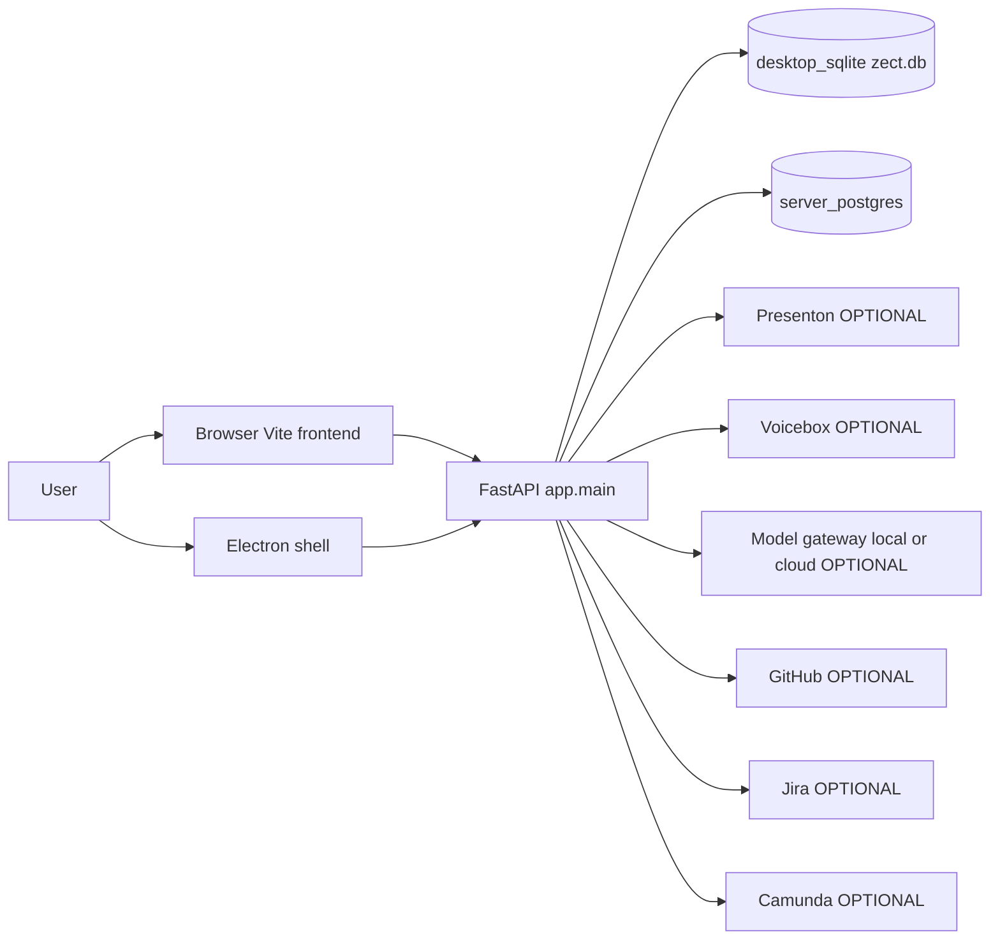
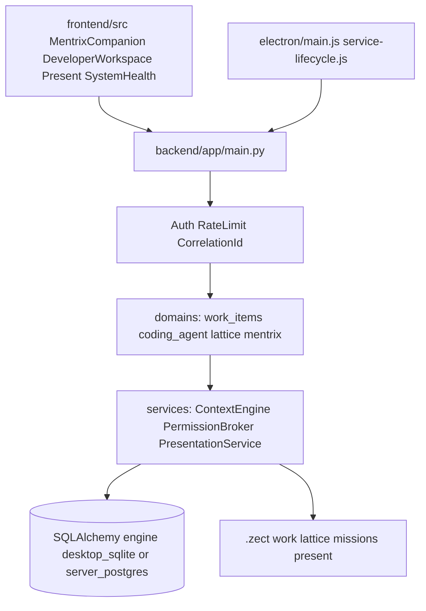
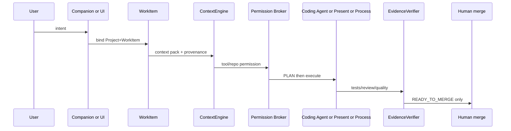
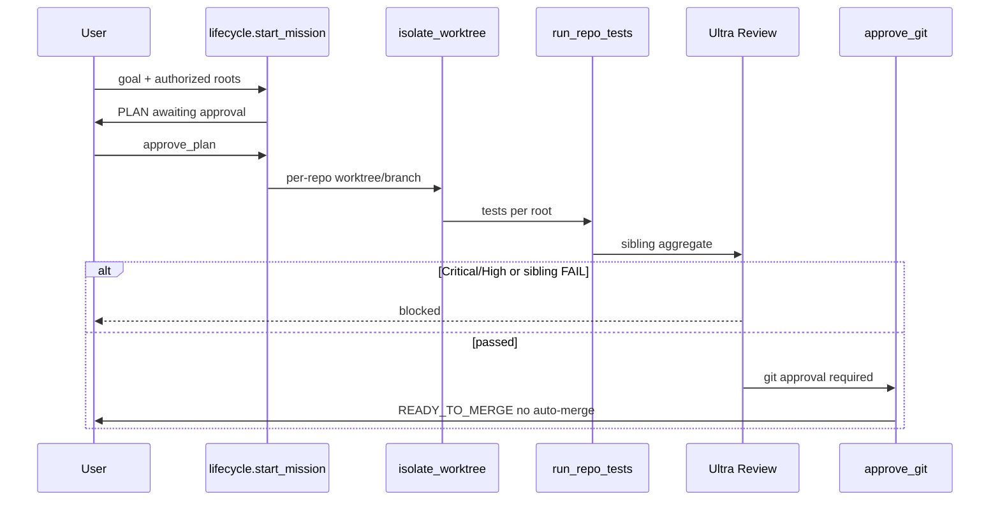
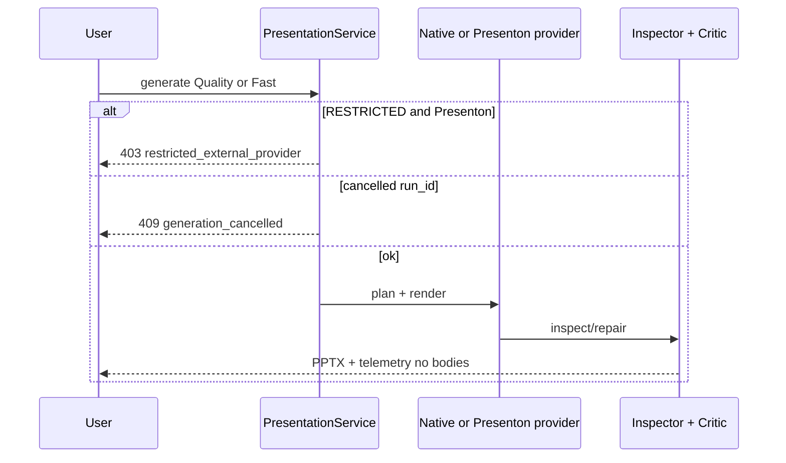
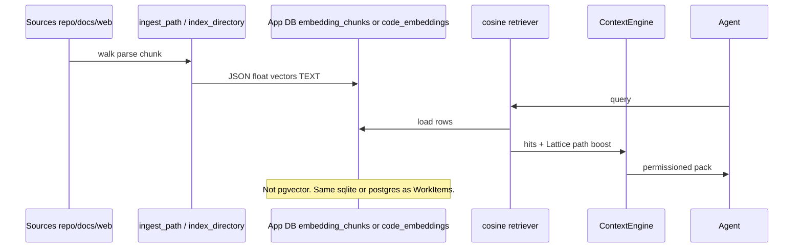
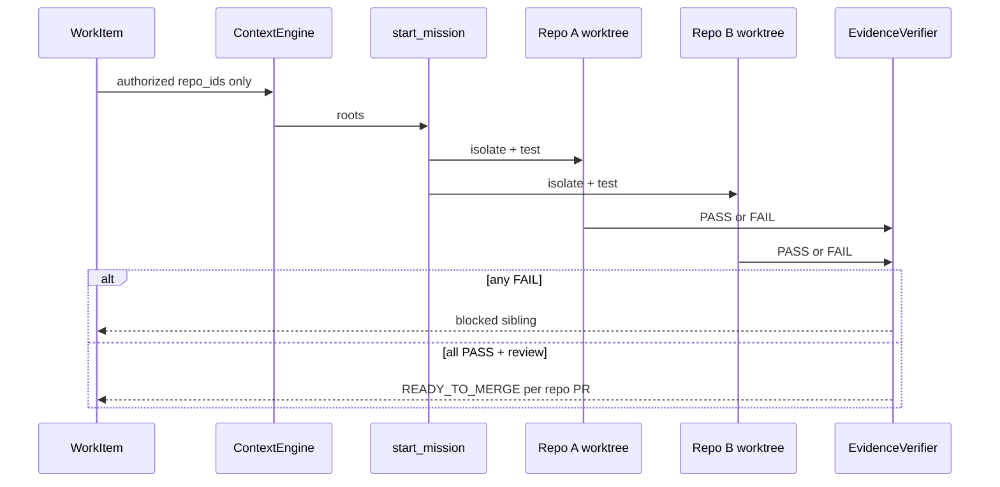
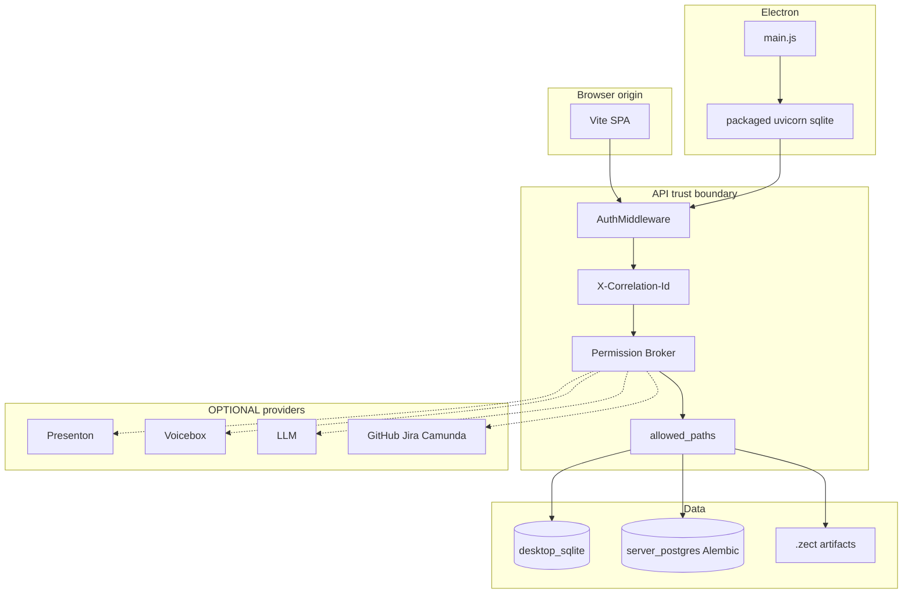

# ZECT Canonical Architecture

**Status:** Canonical current architecture (code-backed)  
**Date:** 2026-08-19  
**Canonical develop:** `55255f0b05240815a1547c0ea33d4317706acc99` (PR **#166** human-merged)  
**Storage truth:** [`ZECT_DATABASE_RAG_STORAGE_ARCHITECTURE.md`](ZECT_DATABASE_RAG_STORAGE_ARCHITECTURE.md)  
**Do not start:** S8C/S8D, Graphify, KV-cache expansion, OCR/XLSX, broader Web, new agents.

This file is the **only current** top-level architecture truth. Historical docs that contradict it are marked HISTORICAL below.

---

## Product

```text
User
  → Companion (MentrixCompanion.tsx, companion.py)
  → Developer / Coding Agent (DeveloperWorkspace.tsx, coding_engine/lifecycle.py)
  → Present (PresentationService + Presenton default / zect_native opt-in)
  → Projects / WorkItems / Processes (work_items, Fabric, Jira/Camunda OPTIONAL)
  → PI / Lattice (indexer.py JSON graphs + lattice_structural_blueprints)
  → Knowledge (knowledge_entries ILIKE — not a vector DB)
  → Learning / Skills / Playbooks (SkillDefinition DB + .zect/skills FS packs)
```

Companion does **not** silently edit code. Coding Agent owns worktrees/tests/review/git. Presenton remains the product default until an explicit S8C decision (out of scope).

## Orchestration

```text
Intent → Companion or direct surface
  → Project + WorkItem
  → ContextEngine (permission/provenance)
  → Permission Broker
  → PLAN (ArtifactStore PLAN.md)
  → Developer/Coding Agent  OR  Present  OR  Process
  → EvidenceVerifier
  → Ultra Review / quality gates
  → artifact / PR / status
  → HUMAN MERGE (no auto-merge)
```

## Coding

```text
Multi-root workspace → affected repos → isolated worktrees/branches
  → edit / commands / tests → evidence → Ultra Review
  → per-repo PR/CI → human merge
```

Sibling PASS+FAIL ⇒ BLOCKED. Cancel/resume skips recorded commit SHAs.

## Present

```text
Prompt/files/project evidence
  → Template Intelligence
  → Model Gateway / PresentationPlan
  → VisualPlanner → LayoutComposer → renderer
  → FinalPptxInspector → QualityCritic/repair
  → Review/Edit → Voice/Rehearse (Voicebox OPTIONAL)
  → PPTX / Present
```

RESTRICTED/CONFIDENTIAL decks cannot be sent to Presenton (`restricted_external_provider`).

## RAG / intelligence (actual path)

```text
Sources → ingest (lattice ingest_path / index_directory / document|web ingest)
  → parse/chunk
  → embeddings: bag-of-tokens in embedding_chunks OR OpenAI JSON in code_embeddings
  → STORE: same application DB (desktop_sqlite | server_postgres) as TEXT JSON
  → retrieval: in-process cosine (not pgvector)
  → ContextEngine → Permission Broker / provenance → model/agent
```

**Not implemented:** pgvector, Chroma, FAISS, Qdrant, Redis, Graphify.

## Data / storage

| Concern | Store |
|---------|--------|
| Projects, WorkItems, sessions, Knowledge, Memory | Application DB (`desktop_sqlite` or `server_postgres`) |
| Lattice graph | `LATTICE_CACHE_DIR` JSON + RAM |
| WorkItem PLAN/evidence | `.zect/work/{id}/` |
| Coding missions | durable JSON under `ZECT_USER_DATA` or `backend/data/coding_missions` |
| PPTX / templates | user folders / `.zect/present-*` |
| Telemetry (this tranche) | process ring buffer + optional JSONL; `AuditLog` for privileged actions |

## Security / trust

User / project / repo boundaries; Permission Broker; untrusted context; secrets redaction (`redact.py`); MCP args redacted before `MCPToolAudit`; filesystem jail (`allowed_paths`); subprocess/Git confirm; model/provider sensitivity blocks.

## Runtime / deployment

Browser frontend (Vite), Electron shell + sidecar, FastAPI, native Present renderer, Voicebox OPTIONAL, DBs as dual-mode, Presenton OPTIONAL, GitHub/Jira/Camunda/model/image/web providers OPTIONAL.

## Evidence / release

Tests → headed/Electron where relevant → security → Ultra Review → external review if available → CI → PR → **HUMAN MERGE**.

---

## Diagrams

Nodes without an implementation pointer are marked OPTIONAL or PLANNED.

### 1. System context



### 2. Container / runtime



### 3. Orchestration sequence



### 4. Coding-agent sequence



### 5. Presentation sequence



### 6. RAG / intelligence sequence



### 7. Multi-repo WorkItem sequence



### 8. Deployment / trust boundaries



---

## Consistency / historical

| Document | Status |
|----------|--------|
| `ZECT_CANONICAL_ARCHITECTURE.md` | **Current** |
| `ZECT_DATABASE_RAG_STORAGE_ARCHITECTURE.md` | **Current** storage audit |
| `ZECT_SYSTEM_ARCHITECTURE.md` | HISTORICAL — Mentrix spine still useful; superseded for RAG/DB claims |
| `ZECT_ARCHITECTURE_AND_WORKFLOW.md` | HISTORICAL |
| `docs/architecture/*.md` | HISTORICAL supporting notes |

Contradictions rejected from older docs:

- PostgreSQL is **not** the only application DB (desktop SQLite is intentional).
- PostgreSQL is **not** a pgvector RAG store.
- Presenton is still default; native Present is opt-in.
- Graphify / S8C / KV-cache / OCR-XLSX / extra agents are **PLANNED / out of scope**.
