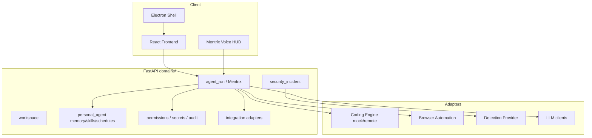
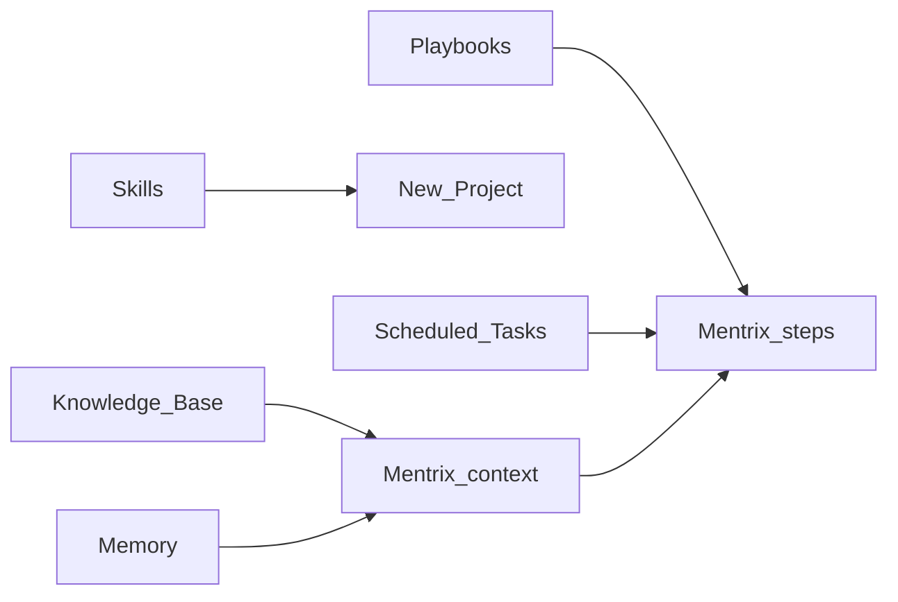
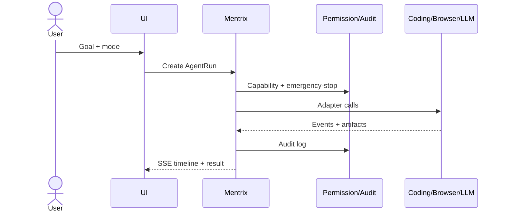
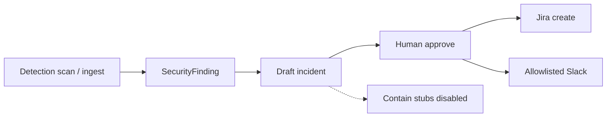

# ZECT — Complete Architecture & Workflows

North star: `docs/screenshots/Upgrade.md`. Branding: third-party engines only behind adapters + `THIRD_PARTY_NOTICES.md`.

## System context

## Development tool map (100% of ZECT surfaces)

| Capability | Route / API | Phase |
|---|---|---|
| Ask / Plan / Build / Review / Deploy | `/ask` … `/deploy`, Mentrix modes | 1–3 |
| Developer Workspace | `/workspace` | 3 |
| Coding Engine | `/api/coding-engine/*` | 2 |
| PR Review + bugfix | `/review`, PR viewer | 4 |
| Permissions / secrets / audit / emergency-stop | `/permissions`, `/secrets`, `/audit-trail` | 5 |
| Voice companion | `/mentrix`, `/mentrix-home` | 6 |
| Browser + file organize | Mentrix browser + `/api/file-organize` | 7 |
| Slack/Email drafts + Jira | OutboundDraft + integrations | 8 |
| Security incidents | `/security-incidents`, `/api/security/*` | 9 |
| Typed memory / skills / schedules / watches | `/memory`, `/skills-engine`, `/scheduled-tasks`, `/api/automation-watches` | 10 |
| Knowledge Base + Playbooks | `/knowledge-base`, `/playbooks` — inject + executable steps | 10 |
| Release / support / legal | `docs/RELEASE.md`, `scripts/support_bundle.py`, EULA/PRIVACY | 11 |
| Architecture (ZECT diagrams) | `/tool-comparison` | 11 |

## Labs productivity spine

Primary Labs (sidebar): **Skills Engine**, **Playbooks**, **Knowledge Base**, **Scheduled Tasks**, **Memory**, **Permissions**.

Advanced Labs (More Labs): Security Incidents, Mentrix Notes, Transfer & Onboard, Conversations, Architecture.

Not in sidebar (routes remain): Dream Engine, Data Layer, Data Flywheel, Session Insights, App Runner, File Explorer.

Team talk track: [`TEAM_PRESENTATION.md`](TEAM_PRESENTATION.md). Local ports/isolation: [`RUNBOOK_LOCAL.md`](RUNBOOK_LOCAL.md).

## Mentrix run workflow

## Security IR workflow

## Phase completion (Upgrade spine)

| # | Phase | Status |
|---|---|---|
| 0–5 | Audit → permissions | Done |
| 6–8 | Voice / browser / integrations Stage A | Done |
| 9 | Security monitoring spine | Done |
| 10 | Memory / skills / automation Stage B | Done (this PR) |
| 11 | Packaging Stage B (legal + CSP + comparison) | Done (this PR); signing deferred |
