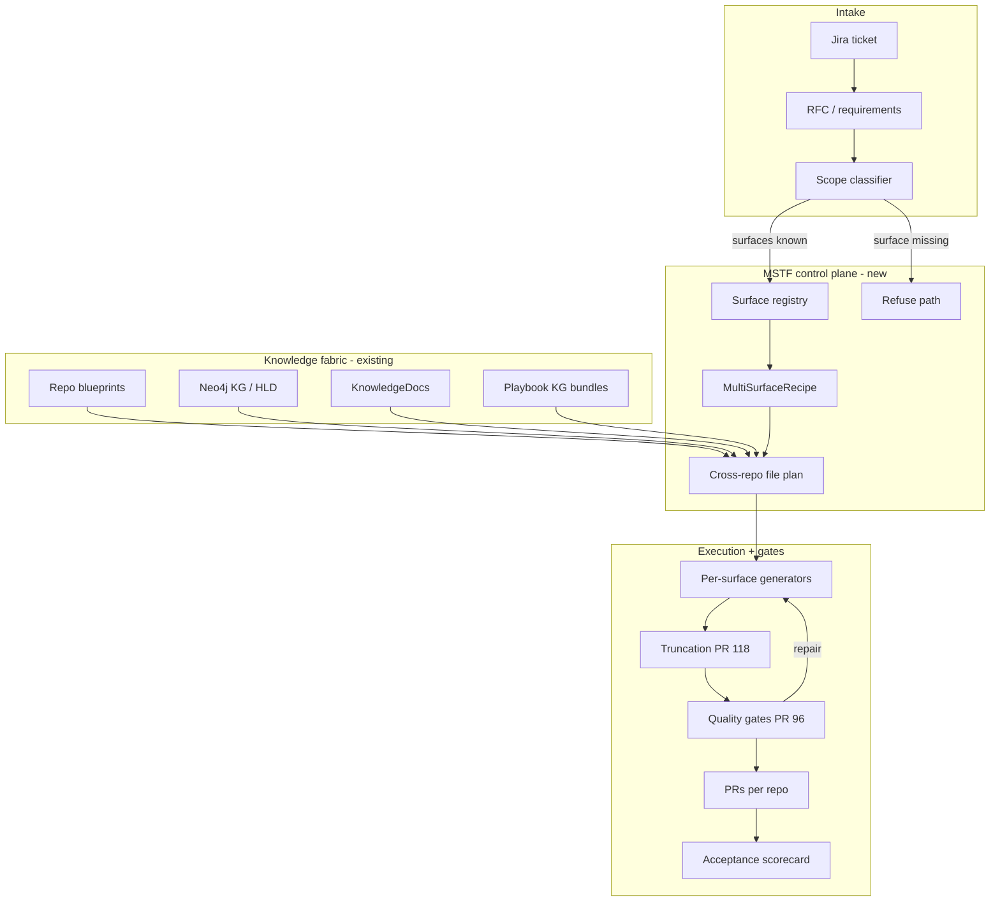

# Multi-Surface Transaction Fabric (MSTF)

**Demo & architecture brief for MinionBot / Code Red**  
**Audience:** Engineering leads, Code Red, MinionBot maintainers  
**Status:** Forward architecture — builds on existing MinionBot stack  
**Date:** July 2026

---

## Demo talk track (5–7 minutes)

Use this script when presenting from ZECT Desktop → **Docs Center → MSTF**.

| Slide / section | Say this |
|-----------------|----------|
| **1. Problem** | MinionBot already works for Authorized Signatory–style work when changes stay on **NGC / BPM PI** recipes. When tickets also need **CDS** and **Tango**, teams go manual. Old POC accuracy sat near **~50%**. |
| **2. What we already fixed** | PRs **#118** (common truncation) and **#96** (codegen quality gates) are **real code**, not docs. They harden completeness and grounding on the **current** path. |
| **3. What we will not do** | We will **not** add ZECT **Lattice** into MinionBot. MinionBot already has **Blueprint + Neo4j KG + Knowledge docs + Playbook bundles**. |
| **4. MSTF idea** | Treat NGC / BPM / CDS / Tango as first-class **surfaces**. Jira → classify surfaces → index + playbooks → multi-surface recipe → generate → hard gates → scorecard. |
| **5. AI-agnostic** | Models are pluggable. Truth lives in recipes, knowledge, playbooks, and gates. |
| **6. Repo selection** | Jira does **not** pick random repos. It drives **capability-scoped** work via surfaces that are registered and indexed. |
| **7. Where it ships** | **MinionBot** is the system of record. ZECT Mentrix may later *call* MinionBot — it is not the Code Red fix vehicle. |
| **8. Ask** | Merge #118/#96 → glossary of CDS/Tango repos → refresh/index → one pilot ticket → measure “100%” on a golden suite. |

**One-liner for leadership**

> MSTF makes Code Red multi-system: classify Jira into NGC/BPM/CDS/Tango surfaces, generate only from indexed blueprint + knowledge + playbooks, fail closed with quality gates, measure 100% on a scorecard — all inside MinionBot.

---

## 1. Problem statement

| Situation | Reality |
|-----------|---------|
| Authorized Signatory + NGC-like | MinionBot **works** (exemplar ≈ template; recipe path) |
| Same program + **CDS / Tango** | MinionBot **not ready** without enhancements → manual |
| Historical POC | ~**50%** usable accuracy |
| Open PRs #118 / #96 | Fix **quality/accuracy kernel**, not CDS/Tango domain coverage |

**MSTF** closes the domain gap **and** keeps the quality spine, without inventing a second graph product inside MinionBot.

---

## 2. Design principles

1. **No Lattice in MinionBot** — reuse Blueprint, Neo4j KG, KnowledgeDocs, `agent-index.json` Playbooks, TransactionRecipe.  
2. **Refuse > hallucinate** — missing surface → hard stop with checklist.  
3. **AI-agnostic control plane** — LLMs are interchangeable; control plane is deterministic.  
4. **Capability-scoped repo selection** — Jira selects work inside linked capabilities + surfaces.  
5. **“100%” = closed loop** — complete, grounded, contracted, **or blocked** — never half-wrong “done.”  
6. **Extend, don’t rewrite** — wrap orchestrator → planner → codegen → PR.

---

## 3. Glossary (use in demos)

| Term | Meaning |
|------|---------|
| **Surface** | Change domain: `bpm_pi`, `ngc`, `cds`, `tango` |
| **Capability** | Existing MinionBot team/project binding that owns repos + index |
| **MultiSurfaceRecipe** | Ordered surface slices + cross-surface contracts |
| **Knowledge fabric** | Blueprint + Neo4j + KnowledgeDocs + KG Playbooks |
| **Scope classifier** | Jira (+ runbook) → `surfaces_required[]` |
| **Scorecard** | Golden-suite metrics that define “100%” |

### NGC vs CDS vs Tango (operational)

| Surface | Typical work | Bot readiness |
|---------|--------------|---------------|
| **NGC** | Rules/config near an exemplar | Ready (proven) |
| **BPM PI** | Controllers / services / BPMN via recipe | Ready for template-like |
| **CDS** | Cross-system data / API / contracts | Gap → registry + index + recipe |
| **Tango** | Platform/service beyond NGC | Gap → same |

> Exact repo names for CDS/Tango come from domain owners (Lasya / Anubhav / Siddartha). They are not hardcoded in this brief.

---

## 4. Target architecture



### 4.1 Intake & classifier

**Output shape (example):**

```json
{
  "surfaces_required": ["bpm_pi", "ngc", "cds"],
  "exemplar_slug": "trustee-change",
  "target_slug": "authorized-signatory-change",
  "capability_ids": ["…"],
  "risk": "medium",
  "bot_ready": false,
  "missing_surfaces": ["cds"]
}
```

If `bot_ready == false` → **Refuse** (show missing index/playbook/repos). Do not fake codegen.

### 4.2 Surface registry (new config)

Per surface: capability IDs, repos, languages, required index assets, generators, gates, cross-surface contracts.

- NGC / BPM entries document the **working** path.  
- CDS / Tango entries are filled after the glossary workshop.

### 4.3 Knowledge fabric (reuse)

| Asset | Source | MSTF use |
|-------|--------|----------|
| Blueprint | blueprint-generator | Plan modules; grounding |
| Neo4j KG | orchestrator indexer | Graph context |
| KnowledgeDocs | repo walk (md/yaml/sql/…) | Domain rules as text |
| Playbook nodes | `agent-index.json` bundles | Procedural truth per surface |
| TransactionRecipe | common models | File plans; extend to multi-surface |

**Authoring rule:** put CDS/Tango playbooks and knowledge **inside those repos**, then index — do not rely on Confluence alone.

### 4.4 MultiSurfaceRecipe

```text
MultiSurfaceRecipe
  identifiers
  scope_manifest
  slices[]: surface_id + file_plan + contracts
  cross_surface_contracts[]
  exemplar_binding
```

Execute **slice-by-slice**, fail closed (same philosophy as recipe subtask units).

### 4.5 Generation

- **NGC / BPM:** existing greenfield bootstrap + recipe slicer.  
- **CDS / Tango:** surface skills + generic agent with **that surface’s** blueprint/KG/KB only.

### 4.6 Quality spine (code PRs — not documentation)

| PR | Repo | What it does |
|----|------|----------------|
| [#118](https://github.com/zinnia/minionbot-common/pull/118) | minionbot-common | `generate_with_status` / `finish_reason` truncation detection |
| [#96](https://github.com/zinnia/minionbot-code-generator/pull/96) | minionbot-code-generator | Truncation continuation, AC verifier, coverage tracer, invented-API xref, missing-LLD gate, manifest refs |

```text
generate_with_status (#118)
  → truncation continuation (#96)
  → syntax / sandbox
  → invented API cross-reference (#96)
  → acceptance_criteria_verifier (#96)
  → requirement_coverage_tracer (#96)
  → manifest / recipe contracts (#96)
  → missing critical LLD → block PR (#96)
  → lifecycle / pr_readiness
```

### 4.7 Jira → repo work (correct model)

```text
Jira
  → capability_ids
  → classifier → surfaces_required
  → surface registry → allowed repos
  → scope ∩ indexed repos
  → planner file plan
  → codegen per team → PR
```

**Correct:** capability- and surface-scoped.  
**Incorrect:** “LLM picks any GitHub repo in the org.”

### 4.8 AI-agnostic layers

| Layer | AI? | Source of truth |
|-------|-----|-----------------|
| Classifier / registry | Optional assist + rules | Surface registry + Jira metadata |
| Retrieval | Embeddings OK | Indexed blueprint / KG / KB |
| Plan / code / AC judge | Swappable LLM | Recipes + gates veto |
| Promote | Human + gates | Scorecard |

---

## 5. What “100%” means (scorecard)

| Dimension | Pass rule |
|-----------|-----------|
| Completeness | No truncated / missing critical files in promoted PR |
| Grounding | Zero blocking invented-API / contract failures |
| Satisfaction | AC + requirement coverage ≥ agreed threshold |
| Scope honesty | Missing surface → refuse (not greenwash) |
| Human rework | Rework file % under ceiling, then tighten |

**Golden suite seeds**

1. Authorized Signatory (NGC/BPM regression)  
2. Pure NGC rules ticket  
3. One historical CDS+Tango ticket (manual baseline → bot target)  
4. One “must refuse” ticket (surface not registered)

**100% = suite green**, then expand — not “LLM never errs.”

---

## 6. Component map

| Concern | Home |
|---------|------|
| Jira + RFC + PI repo hints | minionbot-orchestrator |
| Classifier + refuse | orchestrator + common models |
| Surface registry | common config / Mongo |
| Blueprint / knowledge / KG ingest | blueprint-generator + indexing queue |
| Plan | minionbot-planner |
| MultiSurfaceRecipe + codegen + gates | code-generator + common |
| Ask over KB | Mosaic (support, not executor) |
| Truncation | common #118 |
| Quality gates | codegen #96 |

---

## 7. Phased delivery

| Phase | Outcome | Exit criteria |
|-------|---------|---------------|
| **P0** Quality kernel | Merge #118 + #96; NGC goldens | Suite #1–2 pass |
| **P1** Honesty | Classifier + refuse | Suite #4 refuse works |
| **P2** Knowledge | Index CDS+Tango; ship KB/playbooks | Retrieval hits those docs |
| **P3** Multi-surface | Recipe v1 for one real ticket | One CDS+Tango E2E assisted |
| **P4** Gate parity | Extend #96 to new surfaces | Blocking gates on CDS/Tango |
| **P5** Adoption | Playbook + metrics for leadership | % Code Red via bot measured |

**P0 alone ≠ Anubhav’s gap closed.** P1–P4 close CDS/Tango.

---

## 8. ZECT vs MinionBot (say this clearly in demos)

| Question | Answer |
|----------|--------|
| Build MSTF in MinionBot? | **Yes** — system of record for Code Red codegen |
| Build MSTF in ZECT? | **No** for this gap |
| Does MinionBot have Lattice? | **No** — ZECT only |
| Does MinionBot have graph + blueprint? | **Yes** — Blueprint + Neo4j KG (+ knowledge + playbooks) |
| Later Mentrix integration? | Optional: Mentrix **calls** MinionBot APIs |

This document lives in the ZECT repo so you can open it from **Desktop → Docs Center** during demos. Implementation remains on MinionBot services.

---

## 9. Risks

| Risk | Mitigation |
|------|------------|
| CDS/Tango repos undefined | Glossary workshop before codegen |
| Stale indexes | Repo refresh + indexing queue |
| Over-claiming “100%” | Always say “scorecard on golden suite” |
| BPM playbook parity on non-BPM | Surface-specific gate packs |
| Model chasing | Freeze control plane; swap models under scorecard |

---

## 10. Immediate asks (meeting close)

1. Confirm merge / review for **#118** and **#96**.  
2. Lasya / Anubhav: one-page **repo list per surface** (NGC, CDS, Tango).  
3. Siddartha: **refresh + index** those repos.  
4. Pick **one** paused CDS+Tango Code Red ticket as P3 pilot.  
5. Agree scorecard wording for Rajan: leverage MinionBot **now** on NGC-like; CDS/Tango via MSTF phases.

---

## 11. Related links

- minionbot-common PR: https://github.com/zinnia/minionbot-common/pull/118  
- minionbot-code-generator PR: https://github.com/zinnia/minionbot-code-generator/pull/96  
- Local stacks (typical): MinionBot UI `http://localhost:3000` · code-generator `:8003` · orchestrator `:8100`

---

*Document owner: platform / MinionBot engineering. Use for internal demos; update surface registry tables as CDS/Tango repos are confirmed.*
