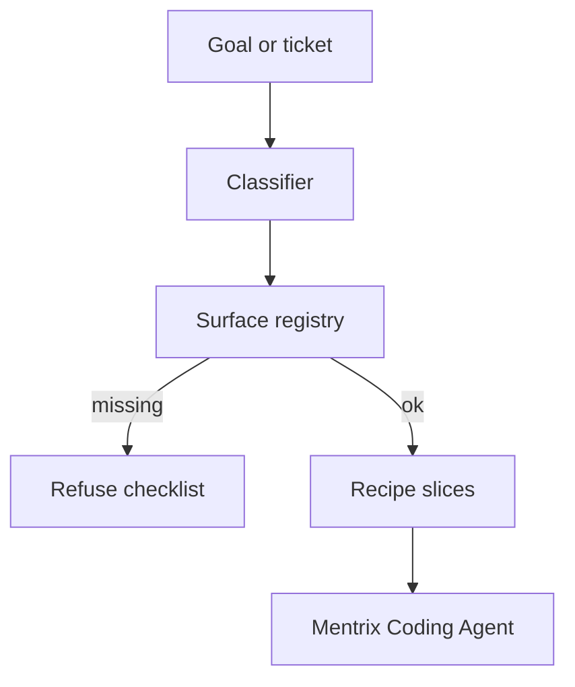

# Mentrix Multi-Surface Fabric

**Architecture brief for ZECT Mentrix**  
**Audience:** Engineering leads, Mentrix operators  
**Status:** Spine shipping in ZECT — surface registry, classify, refuse, Coding Agent handoff. Deeper per-surface gates/scorecard follow later.

---

## One-liner

> Mentrix Multi-Surface Fabric classifies work into registered surfaces (e.g. NGC / BPM / CDS / Tango), refuses missing surfaces, builds a multi-slice recipe, and hands each slice to Mentrix Coding Agent — grounded by Lattice, Blueprint, Knowledge, and Playbooks inside ZECT.

---

## Design principles

1. **ZECT is the system of record** for this fabric — Mentrix Delivery + Coding Agent execute slices.  
2. **Refuse > hallucinate** — missing surface → hard stop with checklist.  
3. **Capability-scoped repos** — surfaces point at registered workspaces / project keys.  
4. **Shared Mentrix context** — skills, memory, Lattice, Blueprint inject into Coding Agent.  
5. **Gates deepen later** — spine ships classify/refuse/handoff; golden scorecard is a follow-on ticket.

---

## Glossary

| Term | Meaning |
|------|---------|
| **Surface** | Change domain: `bpm_pi`, `ngc`, `cds`, `tango`, … |
| **Surface registry** | Mentrix table of active surfaces + keywords + workspace |
| **Classifier** | Goal/ticket text → `surfaces_required[]` |
| **Refuse** | Missing registered surface → no codegen |
| **MultiSurfaceRecipe** | Ordered slices → Mentrix Coding Agent sessions |

---

## Flow

### APIs (spine)

- `GET/POST /api/fabric/surfaces`
- `POST /api/fabric/classify`
- `POST /api/fabric/run` — 409 on refuse; else starts Coding Agent sessions per slice

### Companion

- `fabric_classify`, `fabric_run` (confirm on run)

---

## Operator path

1. Register/activate surfaces under **Mentrix Fabric** (`/fabric`).  
2. Classify a goal — review `surfaces_required` / `missing_surfaces`.  
3. Run — opens Developer Workspace sessions per slice.  
4. Optional: Mentrix Process (Camunda REST) for BPMN deploy/start/incidents.

See also [`docs/guides/ZECT_SECURITY_AND_CODING_OPERATOR.md`](guides/ZECT_SECURITY_AND_CODING_OPERATOR.md).
