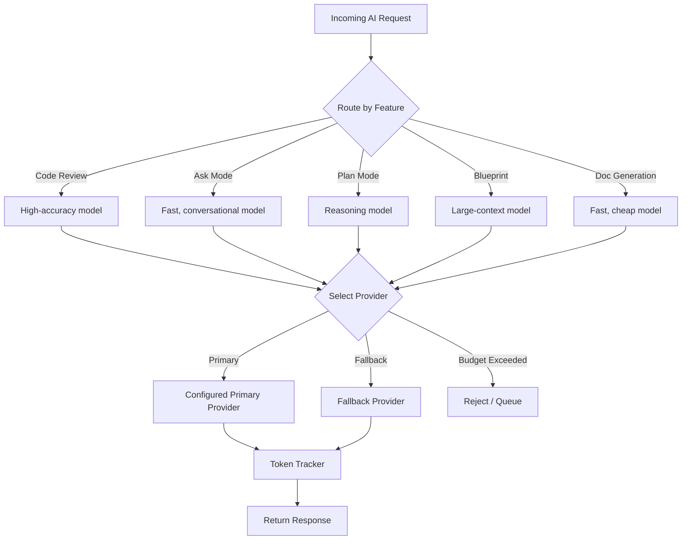

# ZECT — AI-Agnostic Architecture

## Principle

ZECT is designed to work with **any** LLM provider. The AI layer is abstracted behind a common interface so teams can switch providers, use multiple models simultaneously, implement fallback chains, and control costs — all without changing application code.

---

## Supported Providers

| Provider | Models | Use Case |
|----------|--------|----------|
| **OpenAI** | gpt-4o, gpt-4o-mini, o1, o3 | General-purpose, code review, planning |
| **Anthropic** | Claude 4 Sonnet, Claude 4 Opus | Long-context analysis, complex reasoning |
| **AWS Bedrock** | Claude, Titan, Llama | Enterprise deployment, data residency |
| **Azure OpenAI** | GPT-4o (Azure-hosted) | Enterprise compliance, Azure integration |
| **Google Gemini** | Gemini 2.5 Pro/Flash | Multimodal analysis, large context |
| **Local/Self-Hosted** | Ollama, vLLM, LMStudio | Air-gapped environments, cost control |

---

## Provider Interface Design

```python
# backend/app/providers/base.py (design)

from abc import ABC, abstractmethod
from dataclasses import dataclass
from typing import Optional

@dataclass
class LLMRequest:
    """Standardized request format for all providers."""
    system_prompt: str
    user_prompt: str
    model: str
    max_tokens: int = 4096
    temperature: float = 0.3
    response_format: Optional[str] = None  # "json" or None

@dataclass
class LLMResponse:
    """Standardized response format from all providers."""
    content: str
    model: str
    provider: str
    prompt_tokens: int
    completion_tokens: int
    total_tokens: int
    latency_ms: float
    estimated_cost_usd: float

class LLMProvider(ABC):
    """Abstract base for all AI providers."""

    @abstractmethod
    async def complete(self, request: LLMRequest) -> LLMResponse:
        """Send a completion request to the provider."""
        pass

    @abstractmethod
    def estimate_cost(self, prompt_tokens: int, completion_tokens: int) -> float:
        """Estimate cost in USD for given token counts."""
        pass

    @abstractmethod
    def supports_model(self, model: str) -> bool:
        """Check if this provider supports the given model."""
        pass
```

---

## Model Selection Strategy



### Feature-to-Model Mapping (Configurable)

| Feature | Recommended Model | Reasoning |
|---------|------------------|-----------|
| Code Review | gpt-4o / Claude 4 Sonnet | High accuracy needed for security/bug detection |
| Ask Mode | gpt-4o-mini / Claude Haiku | Fast response, lower cost for conversational |
| Plan Mode | o1 / Claude 4 Opus | Deep reasoning for architecture decisions |
| Blueprint Generation | gpt-4o / Gemini 2.5 Pro | Large context for full-repo analysis |
| Doc Generation | gpt-4o-mini / Claude Haiku | Bulk generation, cost-sensitive |
| Fix Prompt Generation | gpt-4o-mini | Structured output, template-based |

---

## Fallback Strategy

```yaml
# Example configuration (backend/.env or settings table)

# Primary provider
AI_PROVIDER=openai
AI_MODEL=gpt-4o-mini

# Fallback chain (tried in order if primary fails)
AI_FALLBACK_1=anthropic:claude-3-5-haiku-20241022
AI_FALLBACK_2=azure:gpt-4o-mini
AI_FALLBACK_3=local:llama-3.1-8b

# Fallback triggers
AI_FALLBACK_ON_ERROR=true        # Fallback on 5xx errors
AI_FALLBACK_ON_TIMEOUT=true      # Fallback if response > 30s
AI_FALLBACK_ON_RATE_LIMIT=true   # Fallback on 429 status
```

### Fallback Decision Flow

1. **Try primary provider** with configured model
2. **On failure** (timeout, rate limit, 5xx error):
   - Log the failure in `token_logs` with error details
   - Try next provider in fallback chain
3. **On all failures:**
   - Return graceful error to user
   - Queue request for retry (if non-interactive)
4. **On budget exceeded:**
   - Block request, notify user
   - Suggest cheaper model alternative

---

## Prompt Format Standards

All prompts follow a structured format regardless of provider:

```
┌─────────────────────────────────────┐
│ SYSTEM PROMPT                       │
│ - Role definition                   │
│ - Output format specification       │
│ - Constraints and rules             │
└─────────────────────────────────────┘
┌─────────────────────────────────────┐
│ USER PROMPT                         │
│ - Context (repo info, file content) │
│ - Specific request/question         │
│ - Examples (if needed)              │
└─────────────────────────────────────┘
```

### Prompt Template Registry

```python
PROMPTS = {
    "code_review": {
        "system": "You are a senior code reviewer...",
        "user_template": "Review this code:\n```{language}\n{code}\n```\nFocus on: {focus_areas}",
        "response_format": "json",
        "max_tokens": 4096,
    },
    "ask_mode": {
        "system": "You are a senior engineering assistant...",
        "user_template": "{question}\n\nContext:\n{context}",
        "response_format": None,
        "max_tokens": 2048,
    },
    # ... more templates
}
```

---

## Token and Cost Tracking

Every AI call is logged with:

| Field | Description |
|-------|-------------|
| `action` | Feature that triggered the call (review, ask, plan, etc.) |
| `model` | Model used (gpt-4o-mini, claude-3-5-sonnet, etc.) |
| `provider` | Provider used (openai, anthropic, bedrock, etc.) |
| `prompt_tokens` | Input token count |
| `completion_tokens` | Output token count |
| `estimated_cost_usd` | Calculated cost based on provider pricing |
| `latency_ms` | Response time |
| `status` | success / error / fallback |
| `session_id` | Link to user session |

### Cost Calculation

```python
PRICING = {
    "gpt-4o-mini": {"input": 0.15, "output": 0.60},      # per 1M tokens
    "gpt-4o": {"input": 2.50, "output": 10.00},
    "claude-3-5-sonnet": {"input": 3.00, "output": 15.00},
    "claude-3-5-haiku": {"input": 0.25, "output": 1.25},
    "gemini-2.5-flash": {"input": 0.15, "output": 0.60},
}
```

---

## Response Validation

All AI responses are validated before being shown to users:

1. **Format validation** — JSON responses must parse correctly
2. **Safety check** — No credentials, PII, or harmful content in output
3. **Completeness check** — Response has required fields
4. **Hallucination guard** — File paths/line numbers verified against actual code
5. **Length check** — Response within expected bounds

---

## Provider-Specific Considerations

| Provider | Consideration | Where Handled |
|----------|---------------|---------------|
| OpenAI | Rate limits per org | Retry with exponential backoff |
| Anthropic | Different prompt format (Human/Assistant) | Provider adapter |
| AWS Bedrock | IAM auth, region-specific | Provider config |
| Azure OpenAI | Deployment-based, not model-based | Provider config |
| Gemini | Different safety settings | Provider adapter |
| Local | No token limits, but slower | Timeout adjustment |

---

## Configuration

All AI configuration lives in `backend/.env` (never committed):

```env
# Primary provider
AI_PROVIDER=openai
OPENAI_API_KEY=sk-...

# Optional: Additional providers
ANTHROPIC_API_KEY=sk-ant-...
AWS_REGION=us-east-1
AZURE_OPENAI_ENDPOINT=https://xxx.openai.azure.com/
AZURE_OPENAI_KEY=...
GOOGLE_AI_KEY=...

# Model selection per feature (override defaults)
MODEL_CODE_REVIEW=gpt-4o
MODEL_ASK=gpt-4o-mini
MODEL_PLAN=gpt-4o
MODEL_BLUEPRINT=gpt-4o
MODEL_DOCS=gpt-4o-mini
```

---

## Security Rules

1. **API keys are NEVER exposed to the frontend** — all AI calls go through the backend
2. **API keys are NEVER logged** — redacted in all log output
3. **API keys are NEVER committed** — `.env` is in `.gitignore`
4. **Response content is sanitized** — strip any leaked credentials from AI output
5. **User data is not sent to providers unnecessarily** — minimal context principle
6. **Provider compliance** — teams can restrict to specific providers for data residency
