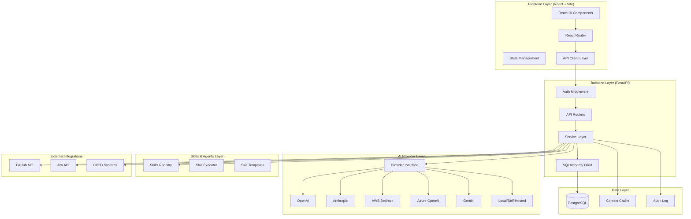
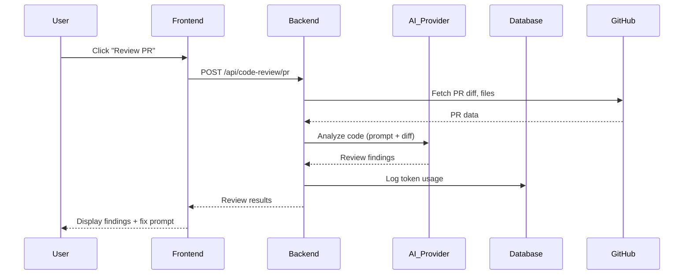

# ZECT — Tool Architecture

## Overview

ZECT (Engineering Delivery Control Tower) is a fullstack AI-governed engineering productivity platform. It provides repo analysis, blueprint generation, code review, token tracking, and agentic workflows for development teams.

---

## System Architecture



---

## Layer Breakdown

### 1. Frontend Layer

| Component | Technology | Purpose |
|-----------|-----------|---------|
| UI Framework | React 18 + TypeScript | Component-based UI |
| Build Tool | Vite 6 | Fast dev server and builds |
| Styling | Tailwind CSS | Utility-first responsive design |
| Routing | React Router v7 | SPA navigation |
| Charts | Recharts | Analytics visualizations |
| HTTP Client | Fetch API (lib/api.ts) | Backend communication |

**Pages (16 total):**
- Dashboard, Projects, ProjectDetail, CreateProject
- AskMode, PlanMode, BlueprintGenerator, CodeReview
- RepoAnalysis, DocGenerator, PRViewer, Orchestration
- Analytics, Settings, Docs, Login

### 2. Backend Layer

| Component | Technology | Purpose |
|-----------|-----------|---------|
| Framework | FastAPI | Async API server |
| ORM | SQLAlchemy 2.x | Database abstraction |
| Auth | Custom middleware | Session-based login |
| Validation | Pydantic | Request/response schemas |
| Server | Uvicorn | ASGI server |

**Routers:**
- `/api/projects` — CRUD for engineering projects
- `/api/github` — GitHub integration (PRs, commits, CI)
- `/api/settings` — Feature toggles and configuration
- `/api/code-review` — AI-powered PR/snippet review
- `/api/llm` — Ask/Plan/Blueprint AI features
- `/api/analytics` — Token usage and project metrics
- `/api/repo-analysis` — Repository structure analysis
- `/auth` — Login/logout/session

### 3. AI Provider Layer

Abstraction over multiple LLM providers. See `docs/architecture/AI_AGNOSTIC_ARCHITECTURE.md` for full details.

**Current:** OpenAI (gpt-4o-mini)
**Planned:** Anthropic, AWS Bedrock, Azure OpenAI, Gemini, local models

### 4. Skills & Agents Layer

Reusable, composable skill definitions that can be triggered by users or automated workflows. See `docs/skills/SKILLS_OVERVIEW.md`.

### 5. Data Layer

| Table | Purpose |
|-------|---------|
| `projects` | Engineering projects with stage tracking |
| `repos` | Connected GitHub repositories |
| `settings` | Feature toggles, configurations |
| `token_logs` | LLM API usage audit trail |

**Supports:** SQLite (dev) and PostgreSQL (production) via `DATABASE_URL` environment variable.

### 6. External Integrations

- **GitHub:** PyGithub — PRs, commits, CI status, file trees
- **Jira:** (Planned) — ticket linking, status sync
- **CI/CD:** GitHub Actions status monitoring

---

## Request Flow



---

## Directory Structure

```
ZECT/
├── .agents/                 # Agent/skill definitions
│   └── skills/
├── backend/
│   ├── app/
│   │   ├── main.py          # FastAPI app entry
│   │   ├── database.py      # DB connection + engine
│   │   ├── models.py        # SQLAlchemy ORM models
│   │   ├── schemas.py       # Pydantic schemas
│   │   ├── token_tracker.py # Token usage tracking
│   │   ├── github_service.py# GitHub API integration
│   │   ├── review_service.py# AI code review logic
│   │   └── routers/         # API route handlers
│   ├── .env                 # Environment variables (gitignored)
│   ├── .env.example         # Template for .env
│   └── pyproject.toml       # Python dependencies
├── frontend/
│   ├── src/
│   │   ├── App.tsx          # Root component + routes
│   │   ├── main.tsx         # Entry point
│   │   ├── components/      # Shared UI components
│   │   ├── pages/           # Route page components
│   │   ├── lib/             # Utilities + API client
│   │   └── types/           # TypeScript type definitions
│   ├── package.json         # Node dependencies
│   └── vite.config.ts       # Build configuration
├── docs/                    # Documentation (this folder)
│   ├── architecture/
│   ├── workflows/
│   ├── repo-analysis/
│   ├── skills/
│   └── governance/
└── README.md
```

---

## Design Principles

1. **AI-Agnostic** — No hard dependency on any single AI provider
2. **Skill-Driven** — Repeatable workflows encapsulated as Skills
3. **Human-in-the-Loop** — AI suggests, humans approve (especially merges)
4. **Token-Aware** — Every AI call is tracked, costed, and auditable
5. **Responsive** — UI works on desktop, tablet, and mobile
6. **Secure** — Secrets server-side only, RBAC, audit logging
