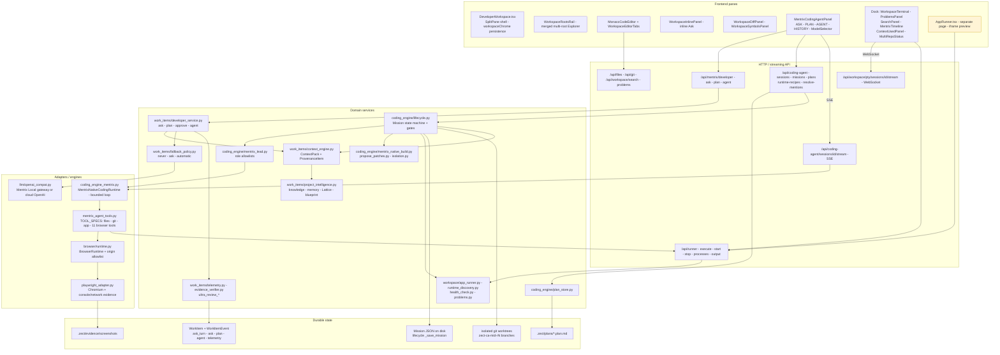
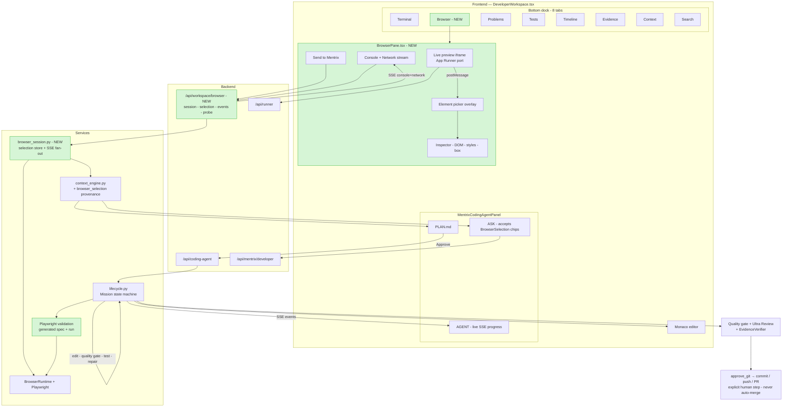
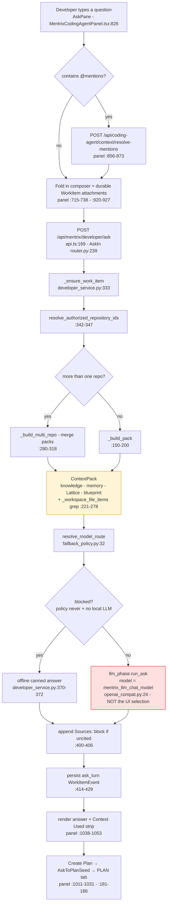
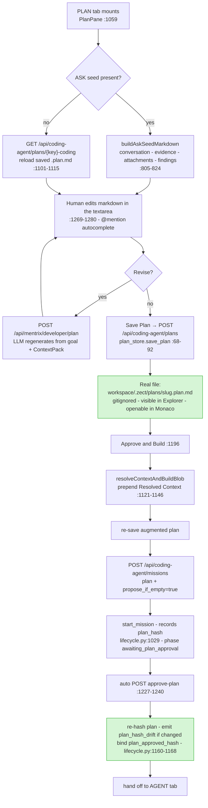
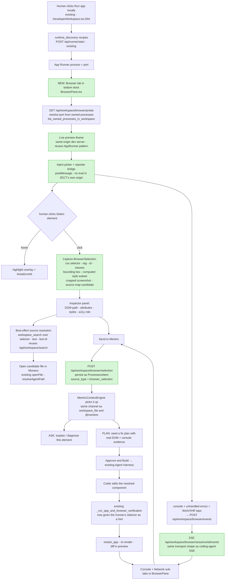
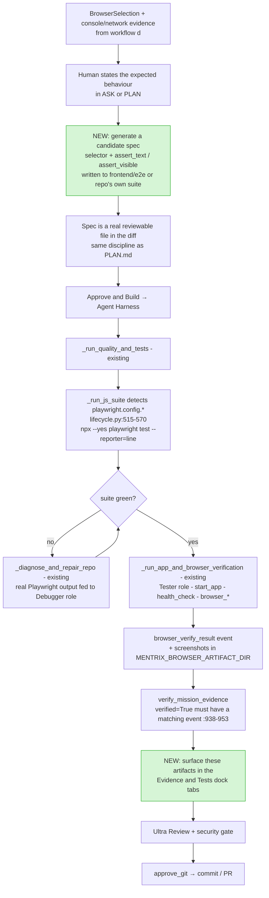

# ZECT Developer Workspace — Cursor Parity Gap Analysis

Status: **analysis + proposal for human review. No runtime code changed by this document.**
Base: `develop` @ `f5f2cb8`.
Scope: ZECT Developer Workspace's ASK → PLAN → AGENT workflow, and an integrated browser/DevTools tab.

This compares ZECT against Cursor's *public behaviour* (Ask = repo-aware Q&A with no edits; Plan/Agent = drafts a plan then executes it with file edits, terminal commands and test loops; browser panel = click an element in a live preview and the agent receives screenshot + DOM context). The target design uses **ZECT's own architecture** — Mentrix roles, the Mission lifecycle, `BrowserRuntime`, App Runner, the ContextPack/provenance model — not a copy of Cursor's UI.

---

## 1. Capability comparison

| # | Capability (Cursor behaviour) | ZECT status today | Evidence |
|---|---|---|---|
| 1 | **Repo-aware Q&A, zero edits** | **PARTIALLY WORKING** | `frontend/src/components/MentrixCodingAgentPanel.tsx:826` (`AskPane`), `:963` ("ASK is Q&A only — this path never edits files"), `frontend/src/lib/api.ts:169`, `backend/app/domains/work_items/router.py:275`, `backend/app/services/work_items/developer_service.py:320` |
| 1a | ↳ retrieval is grounded in real file content | **PARTIALLY WORKING** | `backend/app/services/work_items/developer_service.py:221-278` — `_workspace_file_items()` is a token grep returning single matching *lines* (`:261-277`), capped at 12 items. Filename→full-content grounding is **not yet in `develop`** (see §5) |
| 1b | ↳ conversation persists across reload/restart | **ALREADY WORKING** | `developer_service.py:414-429` (`ask_turn` events), `:441-460` (`ask_history`), `MentrixCodingAgentPanel.tsx:879-910` |
| 1c | ↳ image/screenshot questions | **ALREADY WORKING** | `router.py:283-287` (data-URL validation), `AskIn.images` `:250`, `MentrixCodingAgentPanel.tsx:928-935` |
| 1d | ↳ **user-chosen model actually used** | **MISSING** | See §2.3 — selector is cosmetic end-to-end |
| 2 | **Plan as reviewable markdown** | **ALREADY WORKING** | `MentrixCodingAgentPanel.tsx:1059-1320` (`PlanPane`), `backend/app/services/coding_engine/plan_store.py:64-92` |
| 2a | ↳ plan is a **real file** in the repo, visible in Explorer | **ALREADY WORKING** | `plan_store.py:48-52` → `<workspace>/.zect/plans/<slug>.plan.md`; gitignored by `plan_store.py:24-38`; opened in Monaco via `MentrixCodingAgentPanel.tsx:1251-1261` → `DeveloperWorkspace.tsx:1376` (`onOpenPath`) |
| 2b | ↳ human-editable, survives tab switch / reload | **ALREADY WORKING** | `MentrixCodingAgentPanel.tsx:1101-1115` (reload on mount), `:1269-1280` (editable textarea), `:1148-1171` (`Save Plan`) |
| 2c | ↳ ASK → PLAN continuity (requirements carried forward) | **ALREADY WORKING** | `MentrixCodingAgentPanel.tsx:796-824` (`AskToPlanSeed` + `buildAskSeedMarkdown`), `:181-186`, `:1085-1086` |
| 2d | ↳ approval is **bound** to the reviewed text | **ALREADY WORKING** | `backend/app/services/coding_engine/lifecycle.py:1160-1168` — SHA-256 re-hash + `plan_hash_drift` event + `plan_approved_hash` |
| 3 | **Agent executes the approved plan: edits files** | **ALREADY WORKING** | `lifecycle.py:1191-1195`, `:1198-1271` (`_run_native_implementer`), `backend/app/adapters/coding_engine_mentrix.py:178` (`MentrixNativeCodingRuntime`), tools at `backend/app/services/coding_engine/mentrix_agent_tools.py:100-145` |
| 3a | ↳ runs in isolation, not on the user's checkout | **ALREADY WORKING** | `lifecycle.py:1169-1186` (`isolate_worktree`, branch `zect-ca-<mid>-r<repo>`), `:396` |
| 3b | ↳ runs commands / terminal | **ALREADY WORKING** | `mentrix_agent_tools.py:131` (`run_command`), role-gated by `backend/app/services/coding_engine/mentrix_lead.py:73` |
| 3c | ↳ **deterministic** quality gates, not LLM-judged | **ALREADY WORKING** | `lifecycle.py:716-748` (`run_repo_quality_gates`: ruff, mypy, eslint, tsc, build), `:749-766` (`_run_quality_and_tests` — quality **before** tests), `:444-591` (pytest / npm / Playwright suites) |
| 3d | ↳ **real** test-fail → debug → repair → re-test loop | **ALREADY WORKING** | `lifecycle.py:1318-1386` (`_diagnose_and_repair_repo`) — feeds actual stdout/stderr back into the Debugger role, re-runs `_run_quality_and_tests`, bounded by `MENTRIX_CODING_AGENT_AUTO_REPAIR_MAX` (default 2), then `blocked` |
| 3e | ↳ bounded tool loop with per-role least privilege | **ALREADY WORKING** | `mentrix_lead.py:40-80` (four allowlists), enforced twice: offered-tools filtering **and** `coding_engine_mentrix.py:631` `_run_one_tool` defence-in-depth |
| 3f | ↳ visible progress while it runs | **PARTIALLY WORKING** | SSE exists for chat sessions (`backend/app/domains/workspace/coding_agent.py:81-136`) and PTY has a WebSocket (`backend/app/domains/workspace/pty_router.py:123-160`), **but** `MissionPane` shows only the snapshot returned by each POST (`MentrixCodingAgentPanel.tsx:316-334`, evidence list `:545-554`) — there is no live mission event subscription, so a multi-minute Approve & Build looks frozen |
| 3g | ↳ retry / resume / cancel | **ALREADY WORKING** | `lifecycle.py:1675-1760`, UI `MentrixCodingAgentPanel.tsx:592-647` |
| 3h | ↳ review + evidence gate before commit | **ALREADY WORKING** | `lifecycle.py:1567-1610` (`review_diff` + `scan_worktree_security` + `verify_mission_evidence`), `:905-958` |
| 3i | ↳ commit/push requires explicit human approval, never auto-merge | **ALREADY WORKING** | `lifecycle.py:1607-1609`, `:1613-1674` (`approve_git`) |
| 4 | **Integrated browser panel inside the IDE** | **MISSING** | Bottom dock is exactly `terminal · problems · tests · timeline · evidence · context · search` — `frontend/src/pages/DeveloperWorkspace.tsx:1428-1450`; the type union `WorkspaceBottomTab` has no browser member — `frontend/src/lib/workspaceChrome.ts:4-11` |
| 4a | ↳ run the app from the IDE | **ALREADY WORKING** | `DeveloperWorkspace.tsx:934-938` ("Run app locally" → terminal + `runAppTick`), `frontend/src/components/WorkspaceTerminal.tsx:193-200`, `:123`; recipes from `backend/app/services/workspace/runtime_discovery.py:46`; process mgmt `backend/app/domains/workspace/app_runner.py:24` (`/api/runner`), `:317-521` |
| 4b | ↳ **live rendered preview** of the running app | **PARTIALLY WORKING — wrong place** | A sandboxed iframe exists, but only on the standalone `/app-runner` page: `frontend/src/pages/AppRunner.tsx:786-797`, route `frontend/src/App.tsx:212`. Nothing renders a preview inside Developer Workspace |
| 4c | ↳ click a DOM element in the preview and inspect it | **MISSING** | No `element-inspector`, element-picker, `getComputedStyle`, or DOM-selection code anywhere in `frontend/src` (searched `iframe`, `webview`, `devtools`, `element-inspector`, `console-log`; only hits are `AppRunner.tsx:364` and `:790`) |
| 4d | ↳ see console + network for the previewed app | **MISSING in UI / PRESENT in engine** | Engine side is real and always-on: `backend/app/adapters/playwright_adapter.py:54-77` (`_attach_evidence_listeners` — console `error`/`warning`, `requestfailed`, and any response ≥400), `:117-128` (`_evidence`), exposed as `browser_console_errors` / `browser_network_failures` (`mentrix_agent_tools.py:438-460`). **No human-facing surface consumes any of it.** The bottom dock's `Problems` tab is static analysis only (`frontend/src/components/WorkspaceProblemsPanel.tsx`, `backend/app/services/workspace/problems.py`) |
| 4e | ↳ hand browser context to the agent for a fix | **MISSING for humans, WORKING agent-internally** | Agent-internal: `lifecycle.py:1389-1484` (`_run_app_and_browser_verification`) — Tester role gets `start_app`/`health_check`/`browser_*`, decides what to click, fixes source, `restart_app`, re-verifies; bounded by `MENTRIX_CODING_AGENT_BROWSER_VERIFY_MAX` (default 2); `verified` requires **both** the browser turn's own success **and** unit tests still green (`:1462-1466`). There is no path for a *human*-selected element to enter that loop |
| 4f | ↳ Playwright available as the browser engine | **ALREADY WORKING** | `backend/app/services/browser/runtime.py:59-97` (`PlaywrightProvider`), `:214-267` (`BrowserRuntime` + origin allowlist `:36-43`), `:100-181` (optional Playwright-MCP provider, no silent substitution), adapter `backend/app/adapters/playwright_adapter.py:130-360` |
| 4g | ↳ Playwright as a **project** validation suite | **ALREADY WORKING** | `lifecycle.py:515-570` — detects `playwright.config.{ts,js,mts}` and runs `npx --yes playwright test --reporter=line` as part of the mission test gate. ZECT's own suite: `frontend/playwright.config.ts`, `frontend/e2e/` (incl. `developer-ask-plan-approve.spec.ts`, `agent-workspace-phases.spec.ts`) |
| 4h | ↳ browser evidence is auditable | **PARTIALLY WORKING** | Mission events `browser_verify_attempt` / `browser_verify_result` (`lifecycle.py:1428-1434`, `:1467-1475`) and an evidence cross-check that refuses `verified=True` without a matching event (`:938-953`); screenshot artifacts go to `MENTRIX_BROWSER_ARTIFACT_DIR` (default `.zect/evidence/screenshots`, `browser/runtime.py:29`). Not surfaced in the workspace `Evidence` tab, which currently renders `DeveloperMultiRepoStatus` (`DeveloperWorkspace.tsx:1521-1533`) |
| 5 | Mission survives navigation / reload / restart | **ALREADY WORKING** | `MentrixCodingAgentPanel.tsx:275-298` (re-attach from durable id), id resolution `DeveloperWorkspace.tsx:335-360` (URL → localStorage → `WorkItem.coding_mission_id`), server-side persistence `lifecycle.py:119-144` |

---

## 2. Current-state architecture

### 2.1 Shape

`DeveloperWorkspace.tsx` is a four-region IDE shell composed of `SplitPane`s whose visibility and sizes persist in `localStorage` (`workspaceChrome.ts`, `WORKSPACE_SPLIT_KEYS`, `DeveloperWorkspace.tsx:1538-1584`):

- **Explorer** — merged multi-root tree over authorized local clones (`WorkspaceRootsRail`, `DeveloperWorkspace.tsx:1152-1192`), with per-file markers for *agent-written* (teal) vs *git-changed* (amber) (`:887-909`).
- **Editor** — Monaco + tabs + inline Ask + diff + symbols (`:1194-1356`). All reads/writes go through path-authorized backend endpoints; `saveFile()` refuses to write outside the active root (`:768-785`).
- **Agent** (right) — `MentrixCodingAgentPanel` with four tabs: `ASK | PLAN | AGENT | HISTORY` (`MentrixCodingAgentPanel.tsx:82`, `:174-226`).
- **Tools dock** (bottom) — seven tabs (`:1428-1450`). Terminal is a **real PTY** over WebSocket (`RealTerminal.tsx:41-98` → `pty_router.py:123-160`); the other six are request/response panels.

Two distinct live-output transports already exist and are the natural carriers for anything new:
- **WebSocket** `/api/workspace/pty/sessions/{id}/stream` — bidirectional, used by the terminal.
- **SSE** `/api/coding-agent/sessions/{id}/stream` — unidirectional agent events, `text/event-stream`, `ping` keepalive, terminates on `completed|failed|cancelled` (`coding_agent.py:81-136`), consumed by `codingAgentStream()` (`api.ts:1984-2010`).

### 2.2 The three workflows, end to end

**ASK.** `AskPane` resolves `@mentions` against real sources (`:856-873`), folds in durable WorkItem attachments (`:715-738`), then POSTs to `/api/mentrix/developer/ask`. `MentrixDeveloperService.ask()` builds a `ContextPack` from Project Intelligence (knowledge, memory, Lattice hits, blueprint) **plus** `_workspace_file_items()` local grep (`developer_service.py:184-199`), consults `resolve_model_route()` (`:365-369`), calls `llm_phase.run_ask`, appends a `Sources:` block from `workspace_file` provenance if the answer didn't cite any (`:400-406`), and persists a full `ask_turn` event for replay (`:414-429`).

**PLAN.** `PlanPane` seeds from ASK, saves to a real `.plan.md`, and on **Approve & Build** prepends resolved context, re-saves, `codingAgentCreateMission({plan, propose_if_empty: true})`, then immediately auto-calls `codingAgentApprovePlan` (`:1196-1246`).

**AGENT.** `start_mission` records `plan_hash` and parks at `awaiting_plan_approval` (`lifecycle.py:1029-1095`). `approve_plan` → `propose_from_plan` for deterministic JSON patches; when none are produced it flags `native_implement_pending` (`:1139-1159`) → re-hash and bind the plan (`:1160-1168`) → isolate a worktree per repo (`:1169-1186`) → `_run_native_implementer` (Explore read-only, then Coder) → `_run_edit_test_review`: apply patches, `_run_quality_and_tests`, `_diagnose_and_repair_repo` on failure, then `_run_app_and_browser_verification` on success, then sibling aggregation (PASS+FAIL ⇒ BLOCKED, `:1558-1565`), `review_diff` + security scan + `verify_mission_evidence`, ending at `awaiting_git_approval`. `approve_git` is a separate explicit human step.

### 2.3 Confirmed open gap — the model selector is not wired (ASK)

Traced end to end:

1. `ModelSelector` (`frontend/src/components/ModelSelector.tsx:105-132`) renders a `<select>` over a hardcoded `CLOUD_MODELS` list plus gateway-probed local models.
2. It is rendered in the panel header and its value is held in `chatModel` state, lifted to `DeveloperWorkspace`'s `agentModel` (`MentrixCodingAgentPanel.tsx:100-107`, `:162-171`; `DeveloperWorkspace.tsx:328`, `:1374-1375`).
3. `chatModel` is passed into `AskPane` as `model` (`:178`). **`AskPane`'s only use of it is a cosmetic vision-capability warning** (`:995-999`).
4. `AskPane.ask()` builds the `developerAsk({...})` body at `:929-936` — `question`, `project_id`, `work_item_id`, `repository_id`, `repository_ids`, `images`. **No `model`.**
5. `developerAsk`'s TypeScript body type (`frontend/src/lib/api.ts:169-178`) has **no `model` field**, so it isn't even expressible.
6. `AskIn` (`backend/app/domains/work_items/router.py:239-250`) has **no `model` field**, and `developer_ask` (`:289-299`) forwards no model.
7. The model actually used comes from `mentrix_llm_chat_model()` (`backend/app/adapters/llm/openai_compat.py:24-29`) — `ZECT_LLM_CHAT_MODEL` → `MENTRIX_COMPANION_MODEL` → `"gpt-4o-mini"` — used both as `local_model` for `resolve_model_route()` (`developer_service.py:365-369`) and as the client's model (`get_openai_compat_client()`, `openai_compat.py:36-56`).

**Consequence:** the dropdown changes nothing except a warning banner. Telemetry compounds the confusion — `requested_model` is reported as `mentrix_llm_chat_model()` (`developer_service.py:382`), i.e. the *env* model, never the user's selection, so the audit trail cannot even show the discrepancy. This is the precise mechanism behind "not sure what model I am using". Note `MentrixCodingAgentPanel.tsx:695-699` already concedes there is no model-capability registry in ZECT.

PLAN is explicit about ignoring it (`:1090`: `void model; // PLAN never sends images to a model itself`). Mission/native-build has a real `model` parameter (`mentrix_native_build.py:20`, honoured at `coding_engine_mentrix.py:201` — `explicit_model or mentrix_llm_chat_model()`), but no caller in the mission path passes one.

### 2.4 Current-state diagram

*Current state. The browser engine, Playwright, App Runner and the agent's `browser_*` tools all exist — but the only human-visible live preview lives on a separate page, and the workspace dock has no browser tab. The model selector has no wire to the backend.*

---

## 3. Target-state architecture

### 3.1 The workflow being targeted

`Workspace → Ask → Plan.md → Approve → Agent Harness → Edit Code → Run App → Browser Preview → Select Element → Inspect Console/Network → Mentrix Fix → Playwright Validation → Review Diff → Quality Gate → Commit/PR`

Most of that spine is already real. Three things make it seamless:

1. **A `Browser` tab in the existing bottom dock**, not a separate page. It reuses the App Runner process the `Run app locally` button already starts, so "run" and "preview" are one act.
2. **A DOM-selection bridge.** An element picker injected into the preview emits a `BrowserSelection` — selector, tag/classes/id, bounding box, computed-style subset, a cropped screenshot, the current console/network slice, and a best-effort source-file candidate. It is persisted as a first-class **provenance item** (`source_type: "browser_selection"`), so it flows through `MentrixContextEngine` into ASK, PLAN and Mission exactly like `workspace_file` and `@mention` items do today — no parallel context channel.
3. **A live mission event stream** so the Agent Harness's existing `explore_start`, `native_implement`, `tests`, `diagnose_attempt`, `browser_verify_result` events (already emitted by `lifecycle._emit`) reach the UI while the mission runs, instead of only in the POST response.

Design constraints carried over from what already exists: origin allowlisting for every browser action (`browser/runtime.py:36-43`, `MENTRIX_BROWSER_ALLOWED_ORIGINS`); no password autofill (`playwright_adapter.py:154`); role tool allowlists as the privilege boundary; evidence must be cross-checkable (`lifecycle.py:938-953`); nothing auto-commits.

### 3.2 Target diagram

*Target state. Green = new. Everything else already exists and is reused unchanged.*

---

## 4. The six workflow diagrams

### (a) ASK workflow — current, as it actually runs today

Two annotations: the red node is §2.3 (UI model selection never reaches here). The amber node is §5's still-uncommitted grounding gap — today this returns single grep-matched *lines*, not whole files.

### (b) PLAN workflow — current

### (c) Agent Harness workflow — current

```mermaid
flowchart TD
  AP["approve_plan - lifecycle.py:1103"]
  AP --> PROP{"deterministic JSON patches supplied?"}
  PROP -->|no + propose_if_empty| PFP["propose_from_plan<br/>propose_patches.py"]
  PFP --> N{"patches produced?"}
  N -->|zero| NIP["native_implement_pending = true<br/>:1153-1159"]
  N -->|some| BIND
  PROP -->|yes| BIND
  NIP --> BIND["re-hash + bind plan :1160-1168"]
  BIND --> ISO["isolate_worktree per repo<br/>branch zect-ca-mid-rN :1169-1186<br/>user checkout untouched"]
  ISO --> EXPL["Explore role - READ ONLY<br/>mentrix_lead.run_explore_phase<br/>allowlist has no write - patch - run_command"]
  EXPL --> CODER["Coder role - write_file - apply_patch - run_command<br/>_run_native_implementer :1198-1271"]
  CODER --> PATCH["_apply_patches - deterministic patch application :855"]
  PATCH --> QG["_run_quality_and_tests :749<br/>ruff - mypy - eslint - tsc - build FIRST<br/>then pytest - npm test - playwright"]
  QG --> OK{"all green?"}
  OK -->|no| DBG["Debugger role - _diagnose_and_repair_repo :1318<br/>real stdout+stderr fed back - re-run gates<br/>bounded by AUTO_REPAIR_MAX default 2"]
  DBG --> OK2{"green now?"}
  OK2 -->|no| BLOCK["phase = blocked<br/>tests_STATUS_after_N_repair_attempts"]
  OK2 -->|yes| BV
  OK -->|yes| BV["_run_app_and_browser_verification :1389"]
  BV --> DISC{"runtime_discovery finds a runnable app?"}
  DISC -->|no| DIFF
  DISC -->|yes| TESTER["Tester role - start_app - health_check - browser_*<br/>agent decides what to start and click<br/>fixes source - restart_app - re-verifies<br/>bounded by BROWSER_VERIFY_MAX default 2<br/>verified = browser ok AND tests still green :1462-1466"]
  TESTER --> DIFF["_collect_diff + sibling aggregation<br/>PASS + FAIL ⇒ BLOCKED :1558-1565"]
  DIFF --> REVIEW["review_diff + scan_worktree_security<br/>any Critical/High ⇒ blocked :1567-1582"]
  REVIEW --> EVID["verify_mission_evidence :905<br/>refuses verified=True with no matching event :938-953"]
  EVID --> AWAIT["phase = awaiting_git_approval :1607"]
  AWAIT --> HUMAN["human clicks Approve git"]
  HUMAN --> AG["approve_git :1613<br/>commit - push - never auto-merge"]
  AG --> PR["Prepare PR → Delivery run<br/>panel :648-684"]

  style BLOCK fill:#ffe0e0,stroke:#c00
  style QG fill:#d6f5d6,stroke:#2a2
  style DBG fill:#d6f5d6,stroke:#2a2
  style TESTER fill:#d6f5d6,stroke:#2a2
```

This is **real**, not a stub: deterministic gates run before any LLM judgement, the repair loop consumes actual failure output, roles are least-privilege and enforced twice, and every claim is evidence-checked. The one weakness is observability (3f) — none of these events stream to the UI live.

### (d) Browser / element-inspection workflow — **TARGET** (does not exist yet)

Design notes, grounded in ZECT's architecture rather than a generic wishlist:
- **Two engines, one pane.** The iframe is for *human* interaction (fast, real, no server round trip). `BrowserRuntime`/Playwright stays the *agent's* engine and the screenshot/assertion engine. The pane offers "Capture with Playwright" for artifacts that must be auditable evidence (`.zect/evidence/screenshots`), because iframe-side screenshots cannot be trusted as evidence.
- **Cross-origin honesty.** For a same-origin dev server the injected bridge works. For a cross-origin target the pane must *say so* and fall back to Playwright-driven `browser_snapshot`, following ZECT's existing no-silent-substitution discipline (`browser/runtime.py:100-106`).
- **Governance.** Every backend browser action routes through `BrowserRuntime.run()` so `MENTRIX_BROWSER_ALLOWED_ORIGINS` still applies (`:246-257`); the preview URL is validated against owned App Runner processes, not free-typed.

### (e) Playwright validation workflow — TARGET, on existing infrastructure

Almost all of this exists. The genuinely new parts are spec *generation* from a captured selection, and *surfacing* browser evidence in the dock instead of leaving it in mission JSON.

### (f) Complete ZECT Developer Workspace architecture — current

---

## 5. Already fixed today, and what is still open

### 5.1 ASK context grounding — fixed in the live dev copy, **NOT yet in `develop`**

Confirmed live earlier today: `_workspace_file_items()` was changed to detect a filename named in the question (e.g. *"what does calc.py do"*) and include that file's **full content**, not just token-matched lines. ASK then correctly found a real bug — `add()` returning `a - b` — in a test file. Before the change, ASK could only ask generic clarifying questions whenever the question's vocabulary didn't overlap the file's literal text.

**Important caveat for reviewers:** that change is **not present in `develop` or in this worktree.** `backend/app/services/work_items/developer_service.py:221-278` still contains only the token-grep implementation (regex over `[A-Za-z_][A-Za-z0-9_]{3,}` minus `_ASK_STOP`, top-5 tokens, one matching line per file, hard cap of 12 items). **The fix is committed separately** (see the durable-attachments/ASK-grounding PR in this same tranche) — this document only records the finding for context.

### 5.2 Offline/fallback policy — an environment setting, not a code bug

ASK was returning the offline canned answer unconditionally because `get_fallback_policy()` defaults to `never` (`backend/app/services/work_items/fallback_policy.py:16-18`), and with no local gateway configured `resolve_model_route()` returns `blocked` with `policy_never_blocks_cloud` (`:55-64`). Setting `ZECT_MODEL_FALLBACK_POLICY=automatic` for this dev environment restored ASK.

This is correct-by-design, **not** a defect. In a regulated insurance context, `never` — *do not send repository context to a cloud model unless a local model is available* — is exactly the conservative default a compliance-reviewed deployment should ship with. `automatic` is appropriate for a local dev box and should be set deliberately, per environment, with the cloud-egress implication documented. `POLICY_ASK` exists as the middle ground (explicit per-request human consent, `:66-83`) and is the better long-term production posture for a developer tool; note that today no UI surfaces the `user_allows_cloud` prompt, so `ask` behaves as `never` from the user's point of view. Worth flagging to whoever owns the control.

### 5.3 OPEN, unfixed: the model selector is not wired

See §2.3 for the full trace. Summary of the defect:

- `frontend/src/lib/api.ts:169-178` — `developerAsk()`'s body type has **no** `model` field.
- `frontend/src/components/MentrixCodingAgentPanel.tsx:929-936` — the request body sends no model.
- `frontend/src/components/MentrixCodingAgentPanel.tsx:995-999` — the *only* consumer of the `model` prop in ASK is a vision-capability warning string.
- `backend/app/domains/work_items/router.py:239-250` — `AskIn` has **no** `model` field.
- `backend/app/adapters/llm/openai_compat.py:24-29` — the model in use is always `ZECT_LLM_CHAT_MODEL` → `MENTRIX_COMPANION_MODEL` → `gpt-4o-mini`.
- `backend/app/services/work_items/developer_service.py:382` — telemetry reports `requested_model` as the **env** model, so the audit trail cannot even reveal the mismatch.

Recommended minimal fix (deliberately *not* applied here): add `model: str = ""` to `AskIn`; thread it through `MentrixDeveloperService.ask()` into `llm_phase.run_ask` and into `resolve_model_route(local_model=...)`; add `model?: string` to the `developerAsk` body type and send `chatModel`; report both `requested_model` (the user's choice) and `actual_model` (what ran) in telemetry so a substitution is *visible* rather than silent. Same treatment for `PlanIn`. `mentrix_native_build`/`coding_engine_mentrix.py:201` already accepts an explicit model, so the Mission path needs only a caller change. Until then, an honest interim mitigation is to disable the selector or label it "set by environment".

### 5.4 Confirmed working — do not re-audit

Verified end to end in a live manual session today, and re-confirmed by reading the code for this document:
- ASK → PLAN continuity (`MentrixCodingAgentPanel.tsx:796-824`, `:181-186`, `:1085-1086`).
- PLAN.md persistence as a real, Explorer-visible, editable file, hash-bound at Approve & Build (`plan_store.py:64-92`, `lifecycle.py:1160-1168`).
- Mission re-attachment across a full page reload (`MentrixCodingAgentPanel.tsx:275-298`, `DeveloperWorkspace.tsx:335-360`, `lifecycle.py:119-144`).
- The Agent Harness's deterministic gate → repair → browser-verify → review → evidence → explicit-git-approval chain (`lifecycle.py:716-766`, `:1318-1386`, `:1389-1484`, `:1487-1610`, `:1613+`).

---

## 6. Phased implementation plan — PROPOSAL ONLY

Not to be built until a human approves. Sized as focused PRs; each phase is independently shippable and independently revertable.

### Phase 0 — land the two known fixes first (small, unblocks everything)
- `backend/app/services/work_items/developer_service.py` — commit the `_workspace_file_items()` filename→full-content grounding (§5.1). Add a unit test: a question naming a file returns a `workspace_file` provenance item whose content is the whole file, with a size cap and a token-budget guard.
- `docs/developer/` or `config/` — document `ZECT_MODEL_FALLBACK_POLICY` per environment, and why production defaults to `never` (§5.2).
- Optionally in the same PR: wire the model selector (§5.3), or disable it with an honest label. Do **not** leave it silently cosmetic.

### Phase 1 — Browser tab shell (no inspection yet)
- `frontend/src/lib/workspaceChrome.ts` — add `"browser"` to `WorkspaceBottomTab` and `TABS`.
- `frontend/src/pages/DeveloperWorkspace.tsx` — add `["browser","Browser"]` to the dock tab array (`:1428-1450`) and render `<BrowserPane/>`; pass `workspaceRoot`, `activeRepoId`, and the existing `runAppTick` so **Run app locally** can open the Browser tab instead of only the Terminal.
- `frontend/src/components/BrowserPane.tsx` **(new)** — URL bar restricted to ports of owned App Runner processes, reload, viewport presets, and the sandboxed iframe (lift the pattern from `AppRunner.tsx:786-797`; keep `sandbox="allow-same-origin allow-scripts allow-forms"`, drop `allow-popups`).
- `backend/app/domains/workspace/browser_panel.py` **(new)**, prefix `/api/workspace/browser` — `GET /probe?workspace=` returns candidate preview URLs derived from `app_runner.list_owned_processes_in_workspace()` (`app_runner.py:254`) plus `runtime_discovery` ports. No free-typed URLs.
- `backend/app/api/register.py` — register the router (follow the `app_runner` pattern at `:38`/`:122`).
- `frontend/src/lib/api.ts` — `browserProbe()`.
- Tests: `frontend/src/components/BrowserPane.test.tsx`; `backend/tests/.../test_browser_panel_probe.py`; extend `frontend/e2e/developer-split-layout.spec.ts` for the eighth tab.

### Phase 2 — console + network stream
- `frontend/src/lib/browserBridge.ts` **(new)** — the injected reporter: patch `console.*`, `window.onerror`, `unhandledrejection`, `fetch`, `XMLHttpRequest`; `postMessage` to the parent. Documented as best-effort and same-origin-only.
- `backend/app/services/workspace/browser_session.py` **(new)** — in-memory session store with a bounded ring buffer per session and an SSE fan-out generator. Mirror the shape of `coding_agent.py:81-136` (sequence ids, `ping` keepalive, terminal event) so the frontend reuses the same consumption pattern as `codingAgentStream()`.
- `browser_panel.py` — `POST /sessions`, `POST /sessions/{id}/events`, `GET /sessions/{id}/events` (SSE), `DELETE /sessions/{id}`.
- `BrowserPane.tsx` — Console and Network sub-tabs; severity filter; click-through to `openFile` when a stack frame maps into an authorized root.
- Cross-origin fallback: when the bridge cannot inject, show a clear notice and offer `browser_console_errors` / `browser_network_failures` via `BrowserRuntime` instead of silently showing an empty console.

### Phase 3 — element picker + inspector
- `frontend/src/lib/elementPicker.ts` **(new)** — hover highlight, click capture, stable-selector generation preferring `data-testid` → `id` → scoped class path → `nth-of-type`; DOM breadcrumb; bounding box; a curated `getComputedStyle` subset (layout, typography, colour, spacing) rather than the whole cascade.
- `frontend/src/components/BrowserInspectorPanel.tsx` **(new)** — DOM path, attributes, styles, a11y role, and a **Send to Mentrix** button.
- `backend/app/services/workspace/browser_session.py` — `BrowserSelection` model and persistence.
- `browser_panel.py` — `POST /selection` (validates the workspace root, stores the selection, optionally captures an auditable Playwright screenshot via `BrowserRuntime`).
- Source resolution: reuse `backend/app/domains/workspace/workspace_search.py` to search for the selector / visible text / `data-testid` and return ranked candidate files; the pane offers them, it does not guess silently.

### Phase 4 — context bridge into ASK / PLAN / Mission (**the load-bearing phase**)
- `backend/app/services/work_items/context_engine.py` — add a `browser_selection` `ProvenanceItem` source type with the same `verification_state` / `selection_reason` / `freshness` discipline as `workspace_file`.
- `backend/app/services/work_items/developer_service.py` — accept `browser_selection_ids` on `ask()` and `plan()` and fold them into the pack next to `_workspace_file_items()`.
- `backend/app/domains/work_items/router.py` — add the field to `AskIn` and `PlanIn`.
- `frontend/src/components/MentrixCodingAgentPanel.tsx` — render selection chips in the ASK and PLAN composers (reuse `MentionContextStrip` / `ComposerAttachmentBar` patterns); include the ids in the request bodies.
- `backend/app/services/coding_engine/lifecycle.py` — accept an optional `browser_hints` on `start_mission` and pass the human's selector into `_run_app_and_browser_verification`'s goal text (`:1416-1427`) so the Tester role verifies *the element the human pointed at*.
- Also consider a `@browser` mention in `mention_resolver.py`, for symmetry with `@file` / `@problem` / `@terminal`.

### Phase 5 — live mission progress (closes gap 3f, independently valuable)
- `backend/app/domains/workspace/coding_agent.py` — add `GET /missions/{id}/stream` (SSE) over `lifecycle`'s existing `_emit` event list.
- `frontend/src/components/MentrixCodingAgentPanel.tsx` — subscribe in `MissionPane`; render `explore_start`, `native_implement`, `tests`, `diagnose_attempt`, `browser_verify_result` as they happen instead of only on POST completion.

### Phase 6 — Playwright validation from a selection
- `frontend/src/components/BrowserInspectorPanel.tsx` — "Generate Playwright check" from the captured selection + stated expectation.
- `backend/app/services/coding_engine/` **(new module)** — emit a candidate spec into the repo's own suite as a reviewable file in the diff; the existing `_run_js_suite` (`lifecycle.py:515-570`) then picks it up with no lifecycle change.
- `frontend/src/pages/DeveloperWorkspace.tsx` — surface `browser_verify_result` events and screenshot artifacts in the `Evidence` and `Tests` dock tabs (today `Evidence` renders only `DeveloperMultiRepoStatus`, `:1521-1533`).

### Compliance and security notes for review
- Every backend-initiated browser action must keep routing through `BrowserRuntime.run()` so `MENTRIX_BROWSER_ALLOWED_ORIGINS` still gates it (`browser/runtime.py:246-257`). A new endpoint that talks to Playwright directly would bypass workspace/network policy.
- Preserve the existing password-field refusal (`playwright_adapter.py:154`). The injected bridge must **redact** `input[type=password]` values and never transmit form contents.
- Captured console/network payloads can contain policyholder data in a dev environment pointed at real-ish fixtures. Cap sizes, redact common PII/PHI-shaped fields before persistence, and keep artifacts inside the gitignored `.zect/` tree (`plan_store.ensure_zect_ignored`). Do not let a browser selection become an unreviewed data-egress path to a cloud model — it must obey the same `ZECT_MODEL_FALLBACK_POLICY` gate as every other context source.
- The iframe stays sandboxed and same-origin-restricted; no `allow-top-navigation`.
- Nothing in this proposal alters the "no auto-merge / explicit `approve_git`" invariant.
