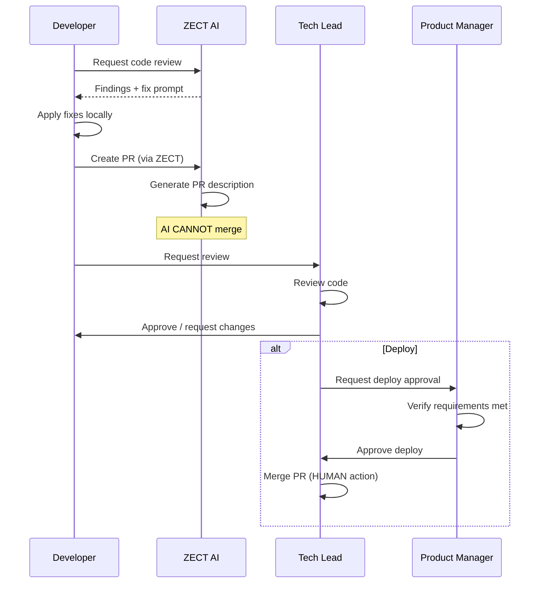

# ZECT — Security & Approvals

## Overview

This document defines the security model, approval workflows, and the #Helix operating model for ZECT.

---

## Security Model

### Authentication

| Layer | Method | Details |
|-------|--------|---------|
| Frontend → Backend | JWT Token | Stored in localStorage, sent in Authorization header |
| Backend → GitHub | Personal Access Token | Stored in .env, never exposed to client |
| Backend → AI Provider | API Key | Stored in .env, never in prompts or responses |
| Database | Connection string | Stored in .env with password |

### Secret Management

| Secret | Storage | Access |
|--------|---------|--------|
| `OPENAI_API_KEY` | .env (gitignored) | Backend only |
| `GITHUB_TOKEN` | .env (gitignored) | Backend only |
| `DATABASE_URL` | .env (gitignored) | Backend only |
| `ZECT_USERNAME` | .env (gitignored) | Backend only |
| `ZECT_PASSWORD` | .env (gitignored) | Backend only |

### Security Rules

1. **No secrets in code** — All secrets in .env files (gitignored)
2. **No secrets in prompts** — AI prompts never contain API keys or passwords
3. **No secrets in responses** — Backend strips sensitive data from API responses
4. **No secrets in logs** — Logging masks sensitive values
5. **No secrets in PRs** — Pre-commit hooks check for accidental secret commits
6. **CORS restricted** — Only frontend origin allowed
7. **Input validation** — All inputs validated via Pydantic schemas
8. **SQL injection prevention** — SQLAlchemy parameterized queries only

---

## Approval Workflow

### Who Approves What

| Action | Approver | Escalation |
|--------|----------|------------|
| PR merge (bug fix) | 1 peer reviewer | Tech Lead if disputes |
| PR merge (feature) | Tech Lead + 1 peer | VP Eng if complex |
| PR merge (security) | Security team | CISO if critical |
| Deploy to staging | Tech Lead | Auto if CI passes |
| Deploy to production | Tech Lead + PM | VP Eng for major releases |
| Database migration | DBA + Tech Lead | VP Eng |
| Access permission change | Admin | Security team |
| New AI provider added | Tech Lead + Security | VP Eng |
| Token budget increase | Team Lead | Finance if > $500/month |

### Approval Flow



---

## #Helix Operating Model

### What is #Helix?

#Helix is a high-performance operating model for AI-assisted engineering. It achieves **10x better tool performance** through:

1. **Repeatable Context** — Every AI interaction starts with structured context
2. **Reusable Skills** — Common workflows are Skills that can be re-run
3. **Scoped Plans** — Plans are specific, phased, and measurable
4. **Validation** — Every output is validated before use
5. **Human Approval** — Critical actions require human sign-off

### #Helix Principles

| Principle | Description | Example |
|-----------|-------------|---------|
| **Context First** | Always provide structured context before asking AI | Include repo structure, tech stack, constraints |
| **Skill Reuse** | Don't write one-off prompts; create Skills | Blueprint skill reused across all repos |
| **Scope Control** | Keep each AI interaction focused on one task | One review per PR, not bulk reviews |
| **Validate Output** | Check AI output before using it | Review generated code before committing |
| **Approve Actions** | Humans approve all destructive/irreversible actions | Merge, deploy, delete require approval |
| **Track Everything** | Log all AI usage for audit and optimization | Token logs, cost tracking, audit trail |

### #Helix Workflow

```
1. CONTEXT → Build structured context (repo, files, constraints)
2. SKILL → Select or create appropriate Skill
3. EXECUTE → Run the Skill with context
4. VALIDATE → Check output quality and correctness
5. APPROVE → Human reviews and approves
6. APPLY → Apply the result (commit, deploy, etc.)
7. LOG → Record usage, tokens, cost, outcome
```

### #Helix vs Ad-Hoc AI Usage

| Aspect | Ad-Hoc | #Helix |
|--------|--------|--------|
| Context | Random, often incomplete | Structured, repeatable |
| Prompts | One-off, inconsistent | Skills (reusable, versioned) |
| Quality | Variable | Consistently high |
| Cost | Unpredictable | Tracked and budgeted |
| Auditability | None | Full audit trail |
| Learning | Lost after session | Skills improve over time |
| Onboarding | Each person figures it out | Skills + docs provide structure |

---

## Vulnerability Management

### Severity Levels

| Level | Description | Response Time | Example |
|-------|-------------|---------------|---------|
| Critical | Active exploitation possible | 4 hours | SQL injection, RCE |
| High | Exploitable with effort | 24 hours | Auth bypass, XSS |
| Medium | Limited impact | 1 week | Info disclosure, CSRF |
| Low | Minimal risk | Next sprint | Missing headers, verbose errors |
| Info | Best practice suggestion | Backlog | Code style, documentation |

### Response Process

1. **Identify** — AI review or manual discovery
2. **Classify** — Assign severity level
3. **Notify** — Alert appropriate team based on severity
4. **Fix** — Develop and test patch
5. **Review** — Security team reviews fix
6. **Deploy** — Emergency deploy for Critical/High
7. **Post-mortem** — Document root cause and prevention

---

## Compliance Checklist

- [ ] All secrets in .env (never in code)
- [ ] CORS configured correctly
- [ ] Authentication on all API routes
- [ ] Input validation on all endpoints
- [ ] SQL injection prevention (parameterized queries)
- [ ] No PII in AI prompts
- [ ] Token usage logged and auditable
- [ ] PR merge requires human approval
- [ ] Deploy requires multi-person approval
- [ ] Audit logs retained 90+ days
