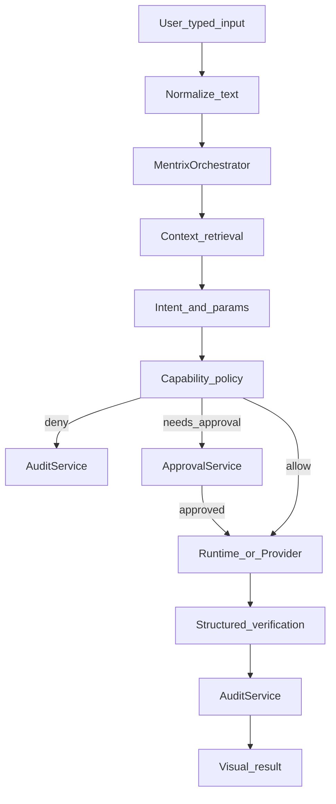
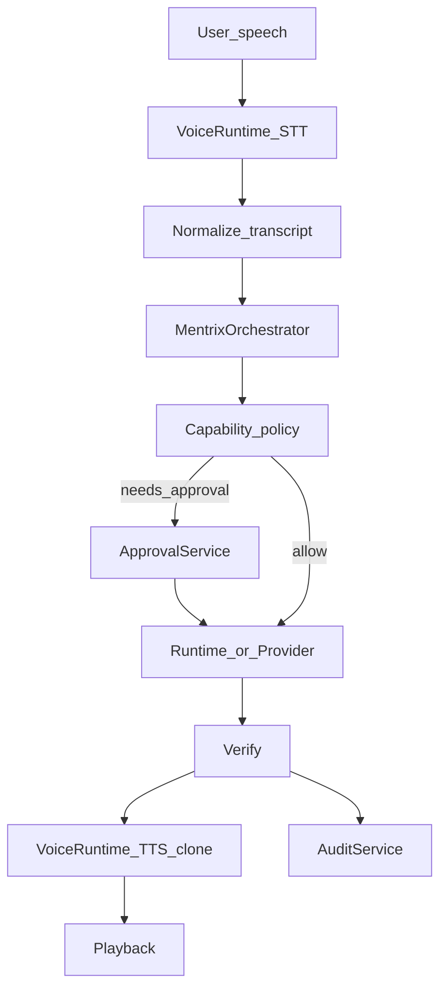
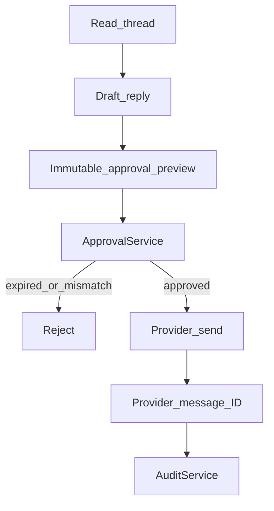
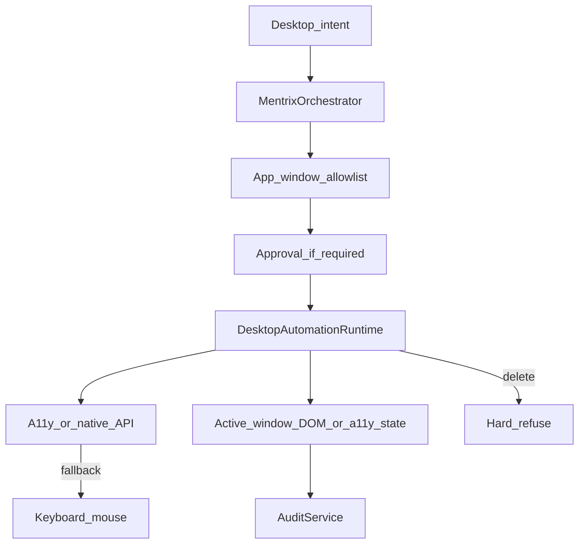
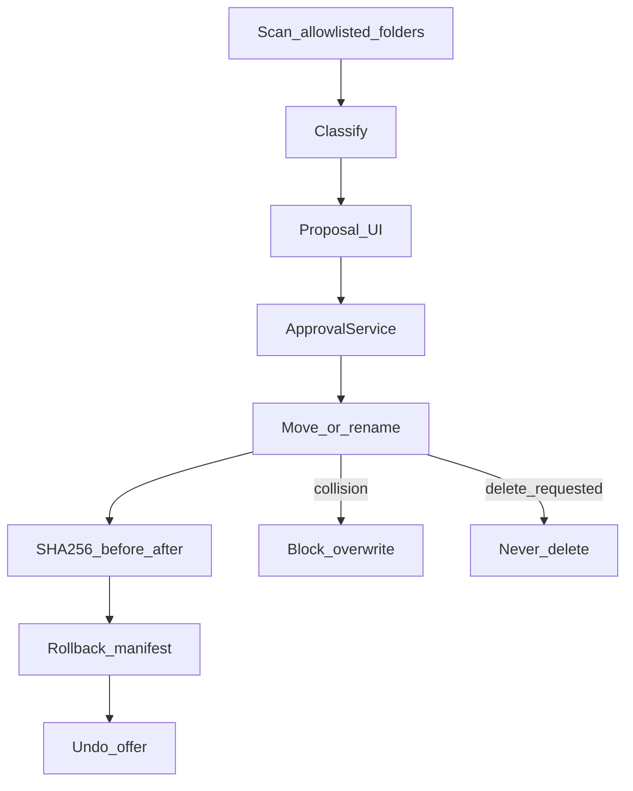
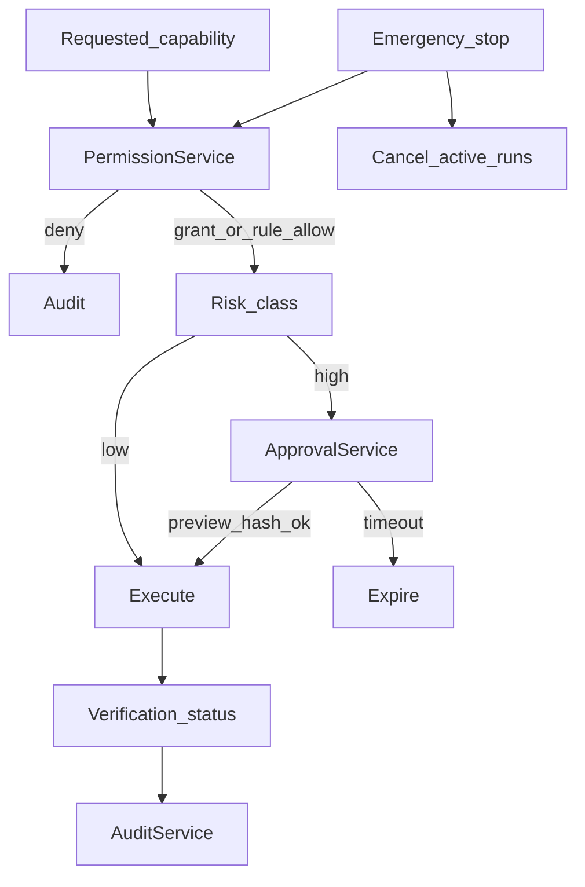

# Personal Agent — Target Architecture (PA-0)

Target interfaces from DesktopControl (normalize existing code behind these; do not big-bang rewrite).

```text
MentrixOrchestrator
VoiceRuntime
DesktopAutomationRuntime
BrowserAutomationRuntime
FileOrganizationRuntime
EmailProvider / SlackProvider / CalendarProvider
PermissionService / ApprovalService / AuditService
```

---

## 1. Typed command flow



---

## 2. Voice command flow



Spoken and typed commands **must** share MentrixOrchestrator + policy (PA-1, PA-7).

---

## 3. Email / Slack draft-and-send flow



No auto-send. Never delete/archive as spam without future explicit policy.

---

## 4. Desktop action flow



Trusted process: Electron main (or future dedicated agent host) — not renderer.

---

## 5. File-organization and Undo flow



---

## 6. Permission and approval flow



---

## Mapping from today → target

| Target | Current seed |
|--------|----------------|
| MentrixOrchestrator | `companion.py` + ForgeLoop (keep Delivery separate initially) |
| PermissionService | `domains/permissions` + `permission_broker.py` |
| ApprovalService | broker ALWAYS_CONFIRM + outbound_drafts + permissions approve |
| AuditService | `audit_trail.py` (+ fold Electron computerAuditLog) |
| DesktopAutomationRuntime | `electron/computer.js` |
| BrowserAutomationRuntime | `services/browser/runtime.py` |
| FileOrganizationRuntime | `file_organize.py` |
| VoiceRuntime | `realtime.py` + `voice_clone` + Voicebox |
| CalendarProvider | **new** (PA-2) |
