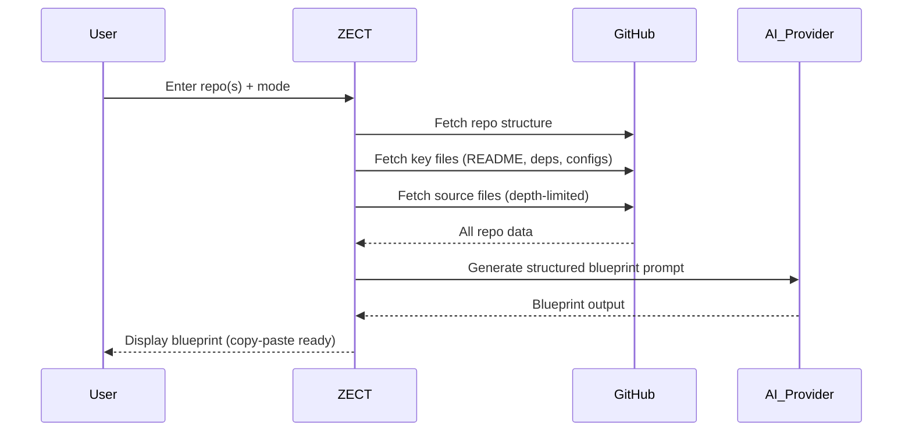

# ZECT — Blueprint Generation

## Overview

Blueprint Generation synthesizes a GitHub repository into a single, copy-paste-ready prompt for AI coding tools. The output enables any AI tool (Cursor, Claude Code, Codex, Windsurf, Devin, etc.) to recreate or extend the project from scratch.

---

## Modes

### Standard Mode

Analyzes one or more repos and generates a comprehensive prompt to recreate the **entire project** from scratch.

**Best for:**
- Full project blueprints
- Project recreation in a different framework
- Teaching AI tools your codebase patterns
- Creating starter templates

### Focused Mode

Scopes analysis to a **specific feature or layer** (e.g., auth, API, database).

**Best for:**
- Understanding a specific part of the codebase
- Replicating a feature in another project
- Extracting reusable patterns
- Targeted refactoring

---

## How It Works



---

## Blueprint Output Structure

```markdown
# Project Blueprint: [Repo Name]

## Overview
[Project description, purpose, key features]

## Tech Stack
- Frontend: [framework, build tool, styling]
- Backend: [framework, ORM, server]
- Database: [type, schema approach]
- Deployment: [infrastructure, CI/CD]

## Architecture
[High-level architecture description with component relationships]

## Directory Structure
[Complete file tree with annotations]

## Key Implementation Details

### [Component 1]
[Implementation details, patterns used]

### [Component 2]
[Implementation details, patterns used]

## Dependencies
[Full dependency list with versions]

## Configuration
[Environment variables, config files needed]

## Setup Instructions
[Step-by-step to get running from scratch]

## Prompt for AI Tool
[Final synthesized prompt ready to paste into any AI coding tool]
```

---

## AI-Agnostic Design

Generated blueprints work with **any** AI coding tool:

| Tool | How to Use Blueprint |
|------|---------------------|
| Cursor | Paste into Composer or chat |
| Claude Code | Paste as initial prompt |
| GitHub Copilot | Paste into chat panel |
| ChatGPT/GPT-4 | Paste as system/user prompt |
| Windsurf | Paste into Cascade |
| Devin | Paste as task description |
| Codex CLI | Pipe as input |

---

## Token Optimization

Blueprints are token-intensive. Optimization strategies:

| Strategy | Savings |
|----------|---------|
| Exclude test files from analysis | 20-30% |
| Summarize instead of including full files | 40-60% |
| Include only modified files (for updates) | 50-70% |
| Use file signatures instead of full content | 30-50% |
| Cache repo summary between generations | 80%+ on repeat |

---

## Limitations

- Maximum 5 repos per blueprint generation
- Very large repos (>500 files) are sampled, not fully included
- Binary files, images, and generated code are excluded
- Private repos require valid GitHub token
- Token budget limits total context size
