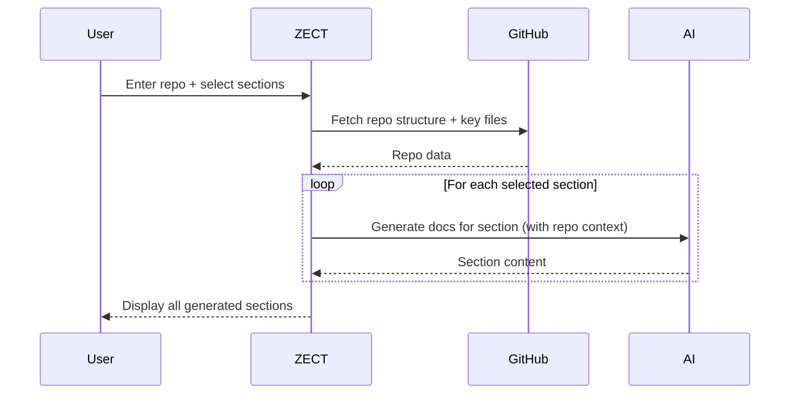

# ZECT — Granular Documentation Generation

## Overview

The Documentation Generator produces detailed, section-by-section documentation for any GitHub repository. Unlike a simple README, it generates granular documentation covering architecture, API reference, setup, testing, and deployment.

---

## Sections Available

| Section | What It Generates |
|---------|-------------------|
| **Overview** | Project purpose, key features, tech stack summary |
| **Architecture** | System design, component relationships, data flow |
| **API Reference** | All endpoints, request/response schemas, examples |
| **Setup Guide** | Step-by-step local development setup |
| **Testing** | Test strategy, how to run tests, coverage info |
| **Deployment** | Production deployment instructions, infra requirements |

---

## How It Works



---

## Input

| Field | Required | Example |
|-------|----------|---------|
| Owner | Yes | `KarthikKaruppasamy880` |
| Repository | Yes | `ZECT` |
| Sections | Yes (multi-select) | Overview, Architecture, API Reference, Setup Guide, Testing, Deployment |

---

## Output Quality

### Granularity Levels

| Level | Detail | Use Case |
|-------|--------|----------|
| **Summary** | 1-2 paragraphs per section | Quick overview for stakeholders |
| **Standard** | Full section with subsections | Developer onboarding |
| **Detailed** | Exhaustive with code examples | Reference documentation |

### Quality Checks

Generated documentation is validated for:
- File paths referenced actually exist in the repo
- Dependency versions match package.json/pyproject.toml
- API endpoints match actual router definitions
- Setup instructions are complete (no missing steps)

---

## Section Details

### Overview Section
```markdown
# [Repo Name]

## Purpose
[What the project does and why it exists]

## Key Features
- [Feature 1]
- [Feature 2]

## Tech Stack
| Layer | Technology |
|-------|-----------|
| Frontend | ... |
| Backend | ... |
| Database | ... |
```

### Architecture Section
```markdown
## System Architecture
[Mermaid diagram of component relationships]

## Data Flow
[How data moves through the system]

## Key Design Decisions
[Why certain choices were made]
```

### API Reference Section
```markdown
## Endpoints

### POST /api/projects
Create a new project.

**Request:**
{json schema}

**Response:**
{json schema}

**Example:**
{curl command}
```

### Setup Guide Section
```markdown
## Prerequisites
- Node.js 18+
- Python 3.10+
- PostgreSQL 14+

## Installation
1. Clone the repo
2. Install dependencies
3. Configure environment
4. Start development server

## Environment Variables
| Variable | Required | Description |
|----------|----------|-------------|
```

### Testing Section
```markdown
## Test Strategy
[Unit, integration, E2E breakdown]

## Running Tests
{commands}

## Coverage
[Current coverage metrics]
```

### Deployment Section
```markdown
## Infrastructure
[Server requirements, cloud services]

## Deployment Steps
[Step-by-step production deployment]

## Monitoring
[Health checks, dashboards, alerts]
```

---

## Use Cases

| Use Case | Sections to Generate |
|----------|---------------------|
| New team member onboarding | All sections |
| API consumer documentation | API Reference + Setup |
| Operations handoff | Deployment + Architecture |
| Project audit | Overview + Architecture |
| QA documentation | Testing + Setup |
