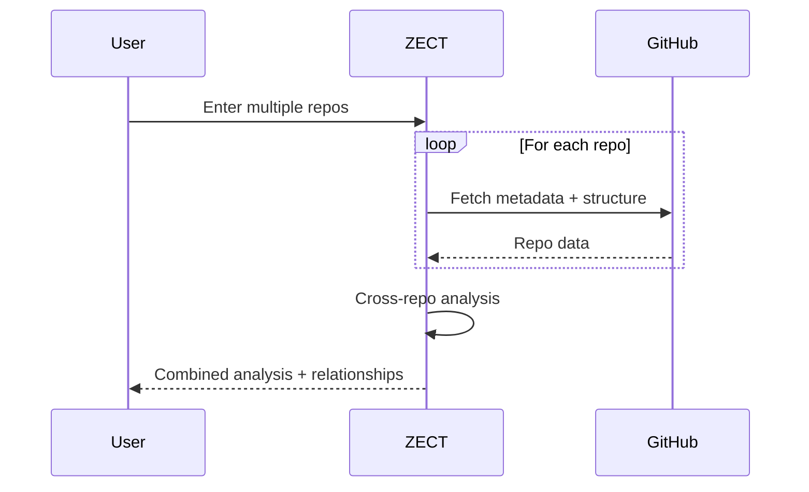

# ZECT — Multi-Repo Analysis

## Overview

Multi-repo analysis enables teams to analyze multiple repositories together — identifying shared patterns, dependencies between repos, and generating cross-repo architecture insights.

---

## How It Works



---

## Input

Users can add multiple repos (up to 5):

| Field | Required | Example |
|-------|----------|---------|
| Owner 1 | Yes | `KarthikKaruppasamy880` |
| Repo 1 | Yes | `ZECT` |
| Owner 2 | Yes | `KarthikKaruppasamy880` |
| Repo 2 | Yes | `ZEF` |
| ... | Optional | Up to 5 repos |

---

## Output

### Per-Repo Analysis
Same as Single Repo Analysis for each repository.

### Cross-Repo Insights

| Insight | Description |
|---------|-------------|
| **Shared dependencies** | Libraries used across multiple repos |
| **Tech stack comparison** | Side-by-side framework/language comparison |
| **Pattern consistency** | Whether repos follow same patterns |
| **Duplication detection** | Similar code/configs across repos |
| **Dependency chain** | If repos depend on each other |

### Relationship Map

```json
{
  "repos": ["ZECT", "ZEF"],
  "relationships": {
    "shared_deps": ["react", "typescript", "tailwindcss"],
    "shared_patterns": ["sidebar navigation", "dark theme", "card layout"],
    "dependency_direction": null,
    "shared_team": "Platform Engineering"
  },
  "recommendations": [
    "Extract shared UI components into a shared library",
    "Standardize API response format across both repos",
    "Consider monorepo if coupling continues to increase"
  ]
}
```

---

## Use Cases

| Use Case | Example |
|----------|---------|
| Monorepo evaluation | Should these repos be merged? |
| Shared library extraction | What can be extracted as a package? |
| Migration planning | Analyze old + new repos for migration |
| Team alignment | Are different teams following same patterns? |
| Blueprint from multiple sources | Combine best patterns from multiple repos |

---

## Orchestration Page

The Orchestration page in ZECT provides a dashboard view of all connected repos across projects:

- **Total repos** connected
- **Per-repo status** (stars, forks, issues, language)
- **Project linkage** (which project each repo belongs to)
- **Quick actions** (open on GitHub, analyze, review)
