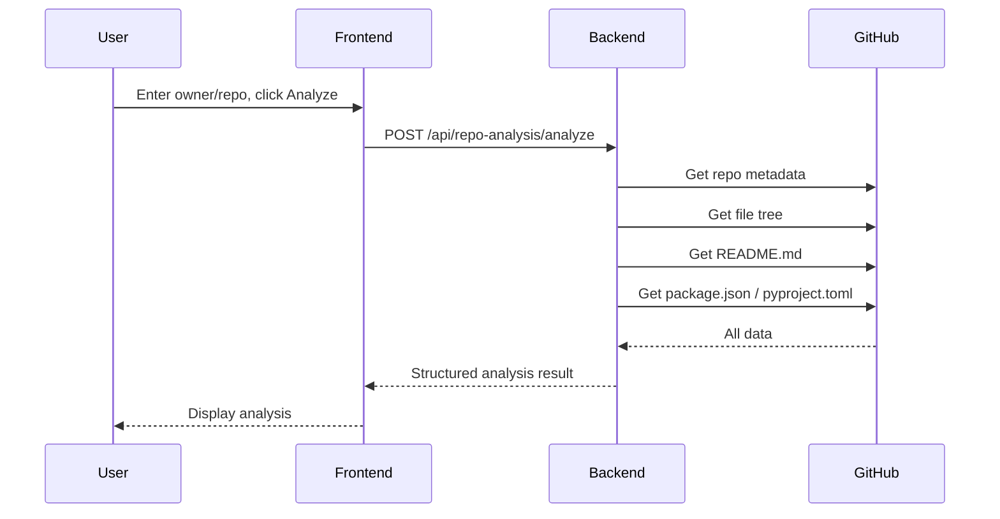

# ZECT — Single Repo Analysis

## Overview

Single repo analysis fetches and displays the complete structure of a GitHub repository — file tree, README, dependencies, language breakdown, and architecture patterns.

---

## How It Works



---

## Input

| Field | Required | Example |
|-------|----------|---------|
| Owner | Yes | `KarthikKaruppasamy880` |
| Repository | Yes | `ZECT` or full URL `https://github.com/owner/repo` |

The frontend accepts either:
- Separate owner + repo name fields
- Full GitHub URL (auto-parsed)

---

## Output

### Repository Metadata
- Name, description, language
- Stars, forks, open issues
- Created/updated dates
- Default branch
- License

### File Tree
- Complete directory structure (depth-limited)
- File count by extension
- Directory organization

### README Content
- Full README rendered content
- Setup instructions extracted
- Architecture notes

### Dependencies
- Package manager detected (npm, pip, cargo, go mod, etc.)
- Direct dependencies listed
- Dev dependencies listed
- Version constraints noted

### Language Breakdown
- Primary language
- Language percentages (from GitHub API)
- Framework detection based on dependencies

---

## Analysis Output Format

```json
{
  "repo": {
    "owner": "KarthikKaruppasamy880",
    "name": "ZECT",
    "description": "Zinnia Engineering Control Tower",
    "language": "TypeScript",
    "stars": 0,
    "forks": 0,
    "default_branch": "develop"
  },
  "structure": {
    "total_files": 45,
    "total_dirs": 12,
    "tree": ["backend/", "frontend/", "docs/", ...],
    "file_types": {
      ".tsx": 16,
      ".ts": 5,
      ".py": 12,
      ".md": 20
    }
  },
  "dependencies": {
    "frontend": {
      "manager": "npm",
      "runtime": ["react", "react-router-dom", "recharts"],
      "dev": ["vite", "typescript", "tailwindcss"]
    },
    "backend": {
      "manager": "poetry",
      "runtime": ["fastapi", "sqlalchemy", "openai", "PyGithub"],
      "dev": ["uvicorn"]
    }
  },
  "readme": "# ZECT\n...",
  "architecture_hints": {
    "frontend_framework": "React + Vite",
    "backend_framework": "FastAPI",
    "database": "SQLAlchemy (SQLite/PostgreSQL)",
    "styling": "Tailwind CSS"
  }
}
```

---

## Use Cases

| Use Case | Why |
|----------|-----|
| Understand new repo | Quick overview before diving in |
| Onboard new team member | See full project structure at a glance |
| Pre-review analysis | Understand context before code review |
| Blueprint preparation | Gather context for blueprint generation |
| Documentation generation | Feed into Doc Generator for auto-docs |

---

## Limitations

- Private repos require a valid GitHub token
- Very large repos (>10,000 files) may timeout
- Binary files are not analyzed
- Submodules are listed but not recursed into
