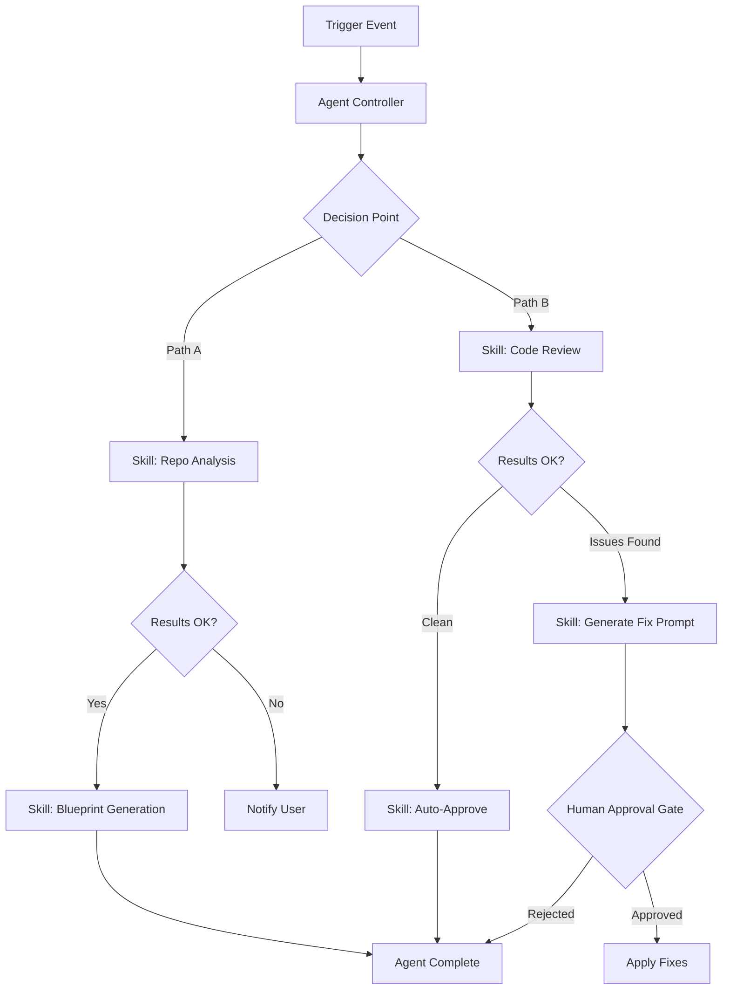
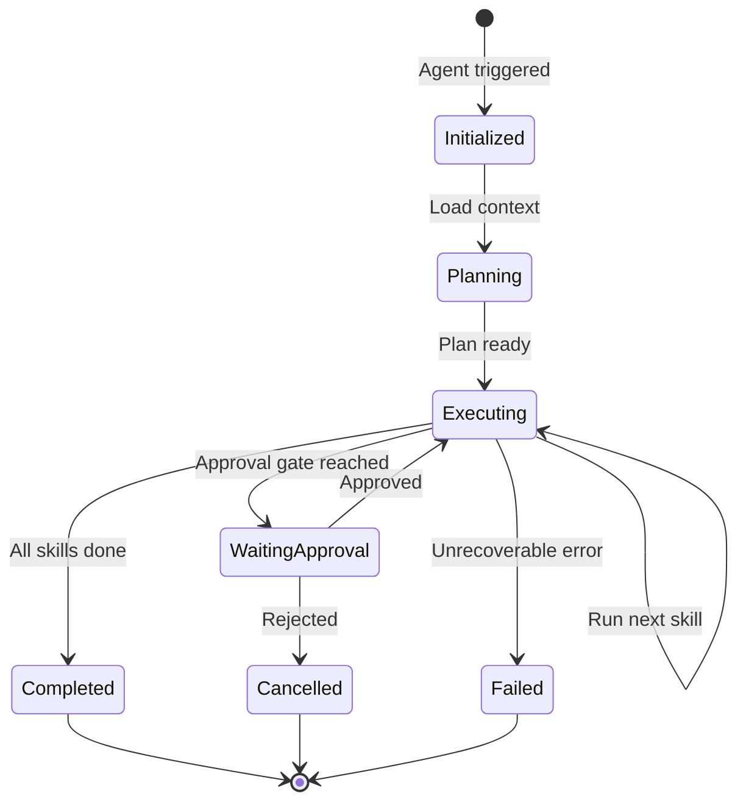

# ZECT — Agents Overview

## What are Agents?

Agents are **autonomous, multi-step workflows** that chain multiple Skills together to accomplish complex tasks. Unlike Skills (single task), Agents make decisions, maintain state across steps, and can branch based on results.

---

## Agent vs Skill

| Aspect | Skill | Agent |
|--------|-------|-------|
| **Scope** | Single focused task | Multi-step orchestration |
| **Decision making** | None — follows instructions | Makes routing decisions |
| **State** | Stateless | Maintains context across steps |
| **Composition** | Standalone | Chains multiple skills |
| **Human involvement** | May require input per step | Only at approval gates |
| **Duration** | Seconds to minutes | Minutes to hours |
| **Complexity** | Low-medium | Medium-high |

---

## Agent Architecture

---

## Built-in Agents

### 1. Full Repo Onboarding Agent

**Purpose:** Analyze a new repository and generate complete documentation.

**Steps:**
1. Run Single Repo Analysis
2. Generate Architecture documentation
3. Generate API Reference
4. Generate Setup Guide
5. Create Blueprint prompt
6. Output comprehensive onboarding package

**Trigger:** Manual (user selects repo)

---

### 2. PR Review & Fix Agent

**Purpose:** Review a PR, identify issues, generate fix prompts, and track resolution.

**Steps:**
1. Fetch PR details
2. Run Code Review skill
3. If issues found → Generate Fix Prompt
4. Track token usage
5. If fix applied → Re-review
6. Report final status

**Trigger:** Manual or automated (on PR creation)

---

### 3. Migration Planning Agent

**Purpose:** Analyze legacy repo and plan migration to modern stack.

**Steps:**
1. Analyze source repo (current state)
2. Identify deprecated dependencies
3. Identify architecture anti-patterns
4. Generate migration plan (phased)
5. Generate blueprint for target architecture
6. Estimate effort and risk

**Trigger:** Manual

---

### 4. Token Optimization Agent

**Purpose:** Monitor token usage and suggest optimizations.

**Steps:**
1. Fetch token usage logs (last 7 days)
2. Identify high-cost patterns
3. Suggest caching opportunities
4. Suggest model downgrades where appropriate
5. Generate optimization report

**Trigger:** Scheduled (weekly)

---

## Agent State Machine

---

## Approval Gates

Agents MUST pause for human approval at these points:

| Gate | When | Who Approves |
|------|------|--------------|
| **PR Merge** | Before merging any PR | Tech Lead |
| **Deployment** | Before deploying to production | Tech Lead + PM |
| **Data Deletion** | Before deleting any data | Admin |
| **External API** | Before calling external services | Developer |
| **Cost Threshold** | When estimated cost > $5 | Team Lead |

---

## Creating a New Agent

1. Define the agent in `.agents/` directory
2. List the skills it chains together
3. Define decision points and branching logic
4. Define approval gates
5. Define error handling and fallbacks
6. Register in the Agent Registry
7. Test with sample data

---

## Safety Rules

1. **No auto-merge** — Agents can create PRs but NEVER merge them
2. **No data deletion** — Agents cannot delete user data without approval
3. **Token budget** — Agents have a per-execution token budget
4. **Timeout** — Agents have a maximum execution time (default: 30 min)
5. **Audit trail** — Every agent action is logged
6. **Kill switch** — Users can cancel any running agent immediately
