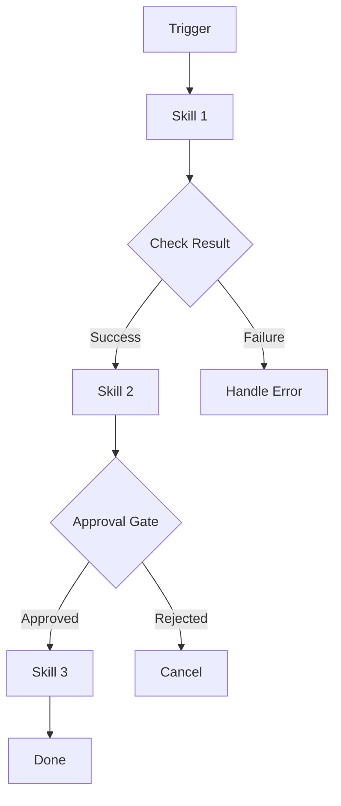
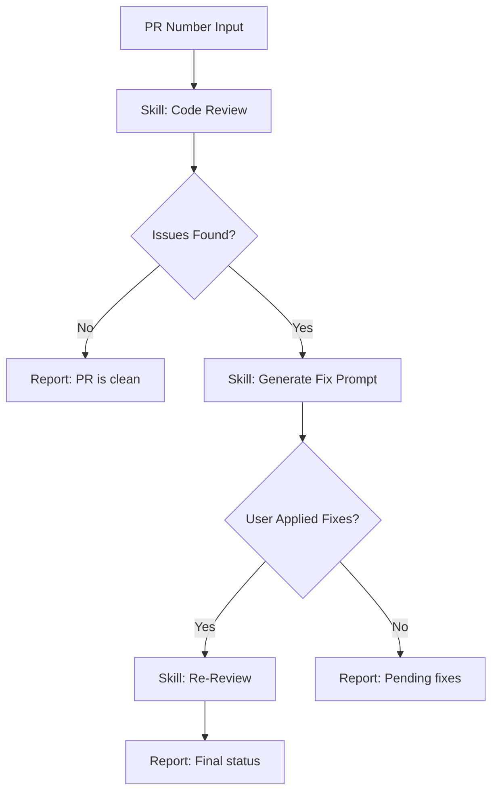

# ZECT — Agent Template

## Template

Use this template when creating a new Agent for ZECT.

---

```markdown
# Agent: [Agent Name]

## Metadata
- **ID:** [unique-agent-id]
- **Version:** [1.0.0]
- **Category:** [onboarding | review | migration | optimization | monitoring]
- **Trigger:** [manual | automated | scheduled]
- **Status:** [draft | active | deprecated]
- **Max Duration:** [30 minutes]
- **Token Budget:** [50,000 tokens]

## Purpose

[One paragraph describing what this agent accomplishes end-to-end.]

## When to Use

- [Scenario 1]
- [Scenario 2]
- [Scenario 3]

## Skills Chained

| Order | Skill ID | Purpose | Required |
|-------|----------|---------|----------|
| 1 | [skill-id] | [What it does in this context] | Yes |
| 2 | [skill-id] | [What it does in this context] | Yes |
| 3 | [skill-id] | [What it does in this context] | Conditional |

## Workflow



## Decision Points

| Point | Condition | Path A | Path B |
|-------|-----------|--------|--------|
| [Decision 1] | [Condition to evaluate] | [What happens if true] | [What happens if false] |

## Approval Gates

| Gate | Trigger | Approver | Timeout |
|------|---------|----------|---------|
| [Gate 1] | [When it triggers] | [Who approves] | [How long to wait] |

## Inputs

| Name | Type | Required | Description |
|------|------|----------|-------------|
| [input_name] | [type] | [Yes/No] | [Description] |

## Outputs

| Name | Type | Description |
|------|------|-------------|
| [output_name] | [type] | [What the agent produces] |

## State

| State Key | Type | Purpose |
|-----------|------|---------|
| [state_key] | [type] | [What it tracks across steps] |

## Error Handling

| Error | At Step | Recovery |
|-------|---------|----------|
| [Error type] | [Which skill] | [How to recover] |

## Constraints

- [Safety constraint 1]
- [Safety constraint 2]
- [Budget constraint]

## Example Execution

### Input
```json
{
  "input_name": "example"
}
```

### Execution Log
```
[00:00] Agent started
[00:01] Running Skill 1: Repo Analysis
[00:15] Skill 1 complete. Result: 45 files, 3 issues found
[00:15] Decision: Issues found → running Skill 2
[00:16] Running Skill 2: Generate Fix Prompt
[00:30] Skill 2 complete. Fix prompt generated
[00:30] Approval Gate: Waiting for human approval
[02:45] Approved by user@zinnia.com
[02:45] Running Skill 3: Apply Fixes
[03:00] Agent complete. Total tokens: 12,450
```

### Output
```json
{
  "output_name": "result"
}
```

## Changelog

| Version | Date | Changes |
|---------|------|---------|
| 1.0.0 | YYYY-MM-DD | Initial release |
```

---

## Example: PR Review & Fix Agent

```markdown
# Agent: PR Review & Fix

## Metadata
- **ID:** pr-review-fix
- **Version:** 1.0.0
- **Category:** review
- **Trigger:** manual
- **Status:** active
- **Max Duration:** 15 minutes
- **Token Budget:** 30,000 tokens

## Purpose

Review a pull request using AI, identify issues, generate a fix prompt, and optionally re-review after fixes are applied.

## Skills Chained

| Order | Skill ID | Purpose | Required |
|-------|----------|---------|----------|
| 1 | code-review-pr | Analyze PR for issues | Yes |
| 2 | generate-fix-prompt | Create fix prompt from findings | Conditional (if issues found) |
| 3 | code-review-pr | Re-review after fixes | Conditional (if fixes applied) |

## Workflow



## Approval Gates

| Gate | Trigger | Approver | Timeout |
|------|---------|----------|---------|
| Apply Fixes | Before modifying code | Developer | 24 hours |

## Constraints

- Must NOT auto-merge the PR
- Must NOT push code without approval
- Token budget: 30,000 per execution
- Max 3 re-review cycles
```
