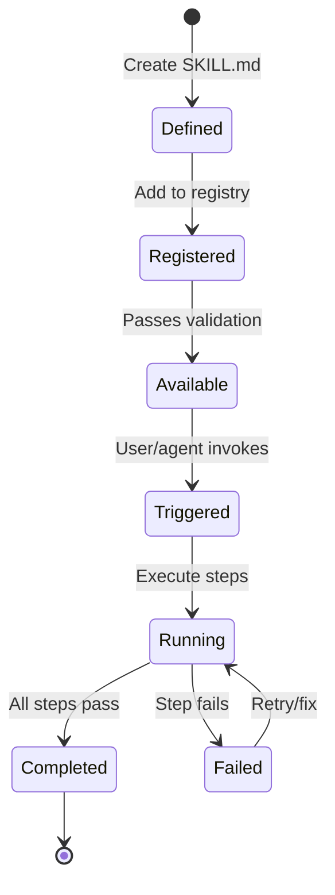

# ZECT — Skills Overview

## What are Skills?

Skills are **reusable, registered, triggerable workflows** that encapsulate specific engineering tasks. A Skill defines what to do, what inputs it needs, what outputs it produces, and what constraints it operates under.

Skills are the building blocks of ZECT's automation — they turn common engineering patterns into repeatable, AI-assisted workflows.

---

## Skill Types

| Type | Description | Example |
|------|-------------|---------|
| **Markdown-only** | Documentation-driven skill (instructions for humans/AI) | Testing checklist, review guidelines |
| **Code-backed** | Python script that executes actions | Repo analysis, token calculation |
| **Hybrid** | Markdown instructions + supporting code | Blueprint generation (docs + API calls) |

---

## Skill Lifecycle



---

## How Skills are Created

1. **Define** — Write a `SKILL.md` file describing the skill
2. **Register** — Add to the Skills Registry with metadata
3. **Validate** — Ensure inputs/outputs are well-defined
4. **Test** — Run the skill manually to verify it works
5. **Publish** — Make available to all team members

---

## How Skills are Triggered

| Trigger | Description |
|---------|-------------|
| **Manual** | User clicks a button or runs a command |
| **Automated** | Triggered by an event (PR created, stage changed) |
| **Scheduled** | Runs on a schedule (daily repo scan, weekly report) |
| **Chained** | Output of one skill triggers another |

---

## Skill Categories

| Category | Skills |
|----------|--------|
| **Repo Analysis** | Single repo scan, multi-repo scan, dependency audit |
| **Blueprint** | Standard blueprint, focused blueprint, migration blueprint |
| **Documentation** | API docs, architecture docs, setup guide, test docs |
| **Code Review** | PR review, security scan, performance review |
| **Testing** | Test generation, coverage analysis, E2E testing |
| **Refactoring** | Dead code detection, pattern extraction, DRY analysis |
| **Migration** | Framework migration, database migration, API migration |
| **Token/Cost** | Token analysis, cost optimization, usage reporting |
| **PR Management** | PR creation, description generation, review assignment |

---

## Skill vs Agent

| Aspect | Skill | Agent |
|--------|-------|-------|
| Scope | Single task | Multi-step workflow |
| Autonomy | Follows instructions | Makes decisions |
| Composition | Standalone | Chains multiple skills |
| State | Stateless (single run) | Maintains state across steps |
| Human involvement | May require input | Minimal (except approvals) |

---

## File Structure

Skills live in `.agents/skills/` at the repo root:

```
.agents/
└── skills/
    ├── repo-analysis/
    │   └── SKILL.md
    ├── blueprint-generation/
    │   └── SKILL.md
    ├── code-review/
    │   └── SKILL.md
    ├── doc-generation/
    │   └── SKILL.md
    ├── testing/
    │   └── SKILL.md
    └── pr-management/
        └── SKILL.md
```

---

## Design Principles

1. **Single Responsibility** — Each skill does one thing well
2. **Composable** — Skills can be chained together
3. **AI-Agnostic** — Skills work with any AI provider
4. **Human-Approved** — Destructive actions require human approval
5. **Auditable** — Every skill execution is logged
6. **Versioned** — Skills have versions, changes are tracked
