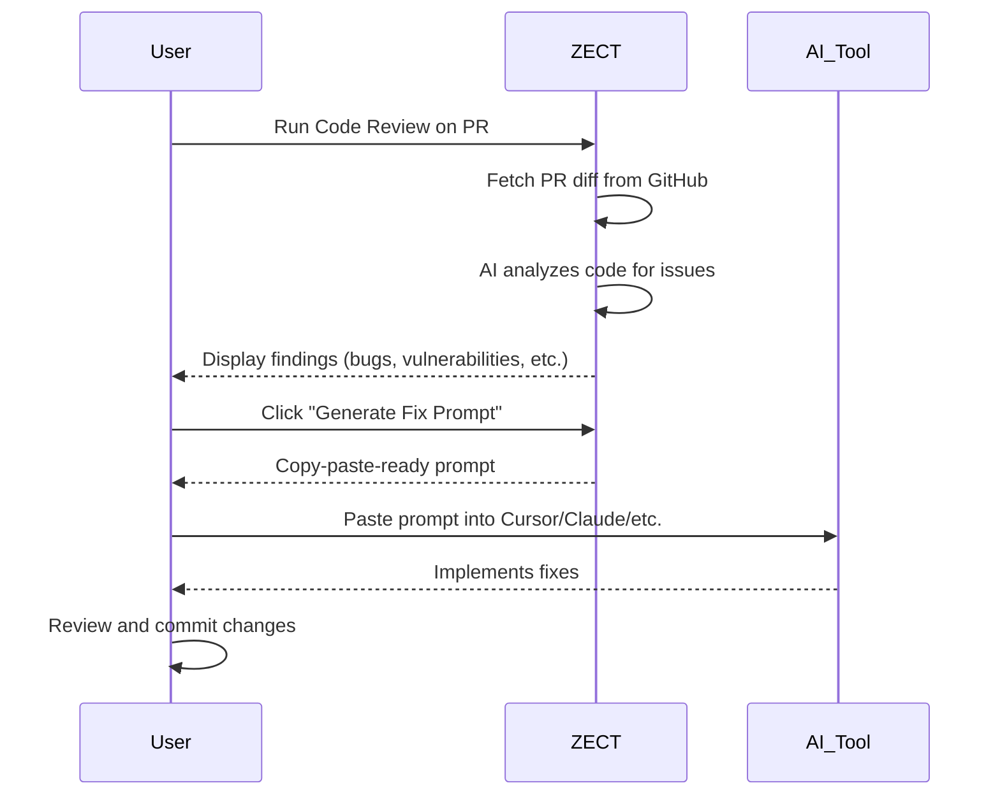
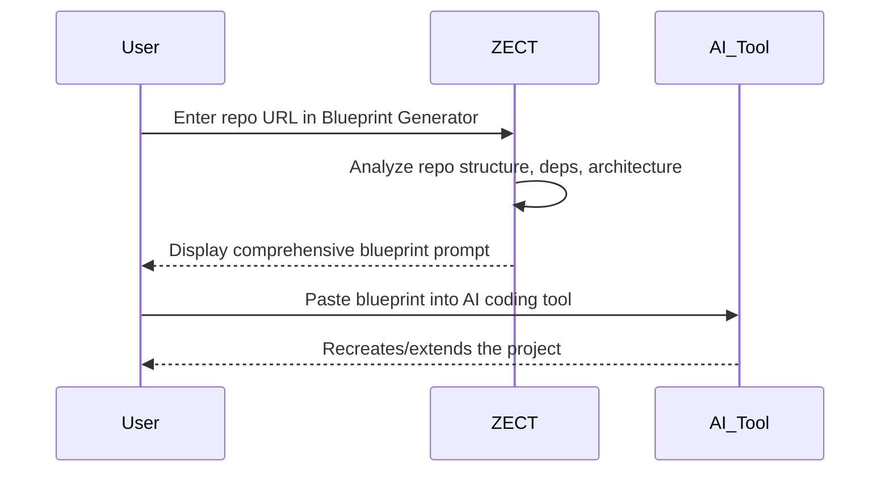

# ZECT — Add / Commit / Prompt Workflow

## Overview

This document defines how ZECT generates prompts from repository analysis and code review findings. The output is a copy-paste-ready prompt that can be sent to any AI coding tool (Cursor, Claude Code, Codex, Windsurf, Devin, etc.) to implement fixes or build features.

---

## Workflow Modes

### 1. Add Mode

**Purpose:** Add new files, features, or configurations to a project.

**When to Use:**
- Adding a new API endpoint
- Creating a new React component
- Adding database migrations
- Setting up new configuration

**Input Required:**
- What to add (feature description)
- Where to add it (target repo/directory)
- Constraints (tech stack, patterns to follow)

**Output:**
- Structured prompt with file paths, code examples, and implementation instructions
- Context from existing codebase to maintain consistency

**Example:**
```
Add a new /api/notifications endpoint that:
- Supports email, SMS, push channels
- Validates input with Pydantic
- Logs token usage via token_tracker
- Follows the same router pattern as code_review.py
```

---

### 2. Commit Mode

**Purpose:** Prepare changes for commit with proper messages, PR descriptions, and context.

**When to Use:**
- After implementing a feature
- After fixing a bug found in code review
- After refactoring
- Before creating a PR

**Input Required:**
- Changed files (auto-detected from git diff)
- Ticket/issue reference (optional)
- Summary of what was done

**Output:**
- Conventional commit message
- PR description with change summary
- Review checklist

**Commit Message Format:**
```
<type>(<scope>): <description>

<body>

<footer>
```

**Types:** feat, fix, refactor, docs, test, chore, perf, ci

**Example Output:**
```
feat(code-review): add AI-powered PR review engine

- Implement review_service.py with OpenAI integration
- Add /api/code-review/pr endpoint
- Create CodeReview.tsx frontend page
- Track token usage for review calls

Closes #42
```

---

### 3. Prompt Mode

**Purpose:** Generate a complete, AI-tool-ready prompt from ZECT analysis results.

**When to Use:**
- After Code Review finds issues → generate fix prompt
- After Repo Analysis → generate blueprint prompt
- After Plan Mode → generate implementation prompt
- After Doc Generator → generate documentation prompt

**Input Sources:**

| Source | Generates |
|--------|-----------|
| Code Review findings | Fix prompt with issues, files, and suggested fixes |
| Repo Analysis output | Full-repo blueprint prompt for recreating project |
| Plan Mode output | Implementation prompt for each phase |
| Doc Generator output | Documentation writing prompt |

**Output Format:**
```markdown
## Context
[Repository info, tech stack, relevant files]

## Task
[What needs to be done — specific and actionable]

## Files to Modify
[List of files with line numbers if applicable]

## Requirements
[Specific constraints, patterns to follow, tests needed]

## Examples
[Code examples from the existing codebase for consistency]
```

---

## Review → Fix Prompt Flow



---

## Blueprint → Build Prompt Flow



---

## Prompt Quality Rules

1. **Be specific** — include file paths, function names, line numbers
2. **Provide context** — include relevant code snippets from the codebase
3. **State constraints** — tech stack, patterns, testing requirements
4. **Include examples** — show existing patterns to maintain consistency
5. **Keep it focused** — one task per prompt, not multiple unrelated changes
6. **AI-agnostic** — prompts work with any AI tool, not just one vendor
