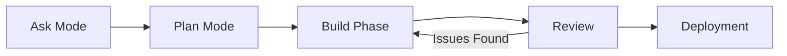

# ZECT — Ask / Plan / Develop Workflow

## Overview

ZECT implements a structured workflow with distinct modes for AI-assisted engineering. Each mode has a clear purpose, allowed actions, and expected outputs. This ensures AI tools are used efficiently and safely.

---

## Workflow Stages



---

## Ask Mode

### Purpose
Conversational AI assistant for engineering questions — architecture decisions, debugging help, code review guidance, and best practices.

### When to Use
- Exploring a problem before committing to a solution
- Getting architecture recommendations
- Understanding existing code behavior
- Debugging assistance
- Learning best practices for a specific tech stack

### Input Required
- A natural language question
- (Optional) Repository context for smarter answers

### Output Expected
- Conversational answer with code examples
- Architecture recommendations
- Links to relevant patterns or documentation

### Allowed Actions
- Ask questions about any engineering topic
- Add repo context to improve answer quality
- Follow up with clarifying questions
- Copy/paste answers for reference

### Not Allowed
- Making code changes directly from Ask Mode
- Committing or pushing code
- Creating PRs
- Modifying project configuration

### Example Prompts
```
"How should I structure a microservices migration for our legacy monolith?"
"What's the best way to handle auth in a React + FastAPI app?"
"Review my API design for a claims processing system"
"How do I set up CI/CD for a monorepo?"
```

### Validation Checklist
- [ ] Question is clear and specific
- [ ] Repo context added if relevant
- [ ] Answer addresses the actual question
- [ ] Recommendations are actionable

---

## Plan Mode

### Purpose
Generate a detailed, phased engineering plan from a project or feature description. Produces structured plans with phases, milestones, and technical requirements.

### When to Use
- Starting a new project or feature
- Breaking down a large initiative into phases
- Creating technical specifications
- Estimating effort and complexity
- Preparing for sprint planning

### Input Required
- Project/feature description (detailed is better)
- (Optional) Tech stack preferences
- (Optional) Team size and constraints
- (Optional) Timeline requirements

### Output Expected
- Phased engineering plan (3-6 phases typically)
- Technical requirements per phase
- Risk identification
- Milestone definitions
- Estimated effort per phase

### Allowed Actions
- Generate engineering plans
- Iterate on plan with additional constraints
- Export plan as markdown
- Use plan to create project in ZECT

### Not Allowed
- Executing code from Plan Mode
- Auto-creating branches or PRs
- Deploying anything
- Making changes without human review

### Example Prompt
```
"Plan a real-time notification service for Zinnia's insurance platform.
Requirements:
- Support email, SMS, push notifications
- Event-driven architecture
- Must integrate with existing policy admin system
- Team of 3 engineers, 8-week timeline
- Use AWS infrastructure"
```

### Validation Checklist
- [ ] Description is specific enough to generate actionable plan
- [ ] Generated plan has clear phases with deliverables
- [ ] Technical stack recommendations are appropriate
- [ ] Risks and dependencies are identified
- [ ] Timeline is realistic for team size

---

## Build Phase

### Purpose
Active implementation — writing code, running tests, maintaining CI/CD pipelines, and tracking technical debt.

### When to Use
- Plan is approved and ready for implementation
- Active development sprints
- Bug fixes and feature work
- Refactoring and optimization

### Key Activities
- Feature implementation in sprints
- Test-driven development (TDD)
- Code reviews and pair programming
- CI/CD pipeline maintenance
- Technical debt tracking and resolution

### Deliverables
- Working feature code with unit tests
- CI pipeline green on all commits
- Integration tests passing
- Code documentation and inline comments
- Performance benchmarks baseline

### Stage Gates (must pass to proceed)
- All unit tests passing (>80% coverage)
- CI pipeline green
- No critical security vulnerabilities
- Code follows established patterns

---

## Review Stage

### Purpose
Quality assurance — security audit, performance testing, accessibility checks, and user acceptance testing.

### Key Activities
- Security vulnerability scanning
- Performance and load testing
- Accessibility testing (WCAG 2.1)
- Code quality analysis
- User acceptance testing (UAT)

### Deliverables
- Security audit report with findings
- Performance test results
- Accessibility compliance report
- Code quality metrics and trends
- Bug fix verification results

### Stage Gates
- No critical or high severity bugs
- Security audit passed
- Performance within SLA targets
- Accessibility standards met

---

## Deployment Stage

### Purpose
Production release — safely roll out changes with monitoring, observability, and rollback capability.

### Key Activities
- Blue/green or canary deployment
- Health check verification
- Monitoring dashboard review
- Stakeholder communication
- Post-deployment retrospective

### Deliverables
- Production deployment runbook
- Monitoring dashboards and alerts
- Rollback procedure documentation
- Post-deployment verification checklist
- Release notes for stakeholders

### Stage Gates
- Staging environment verified
- Rollback procedure tested
- Monitoring and alerting configured
- Stakeholders notified of release

---

## Stage Transitions

| From | To | Trigger | Approval Required |
|------|-----|---------|-------------------|
| Ask | Plan | User clicks "Generate Plan" | No |
| Plan | Build | Plan approved by tech lead | Yes |
| Build | Review | All stage gates pass | No (automated) |
| Review | Deploy | Review gates pass | Yes (Tech Lead + PM) |
| Review | Build | Critical issues found | No |
| Deploy | (Done) | Post-deploy verification passes | Yes |
