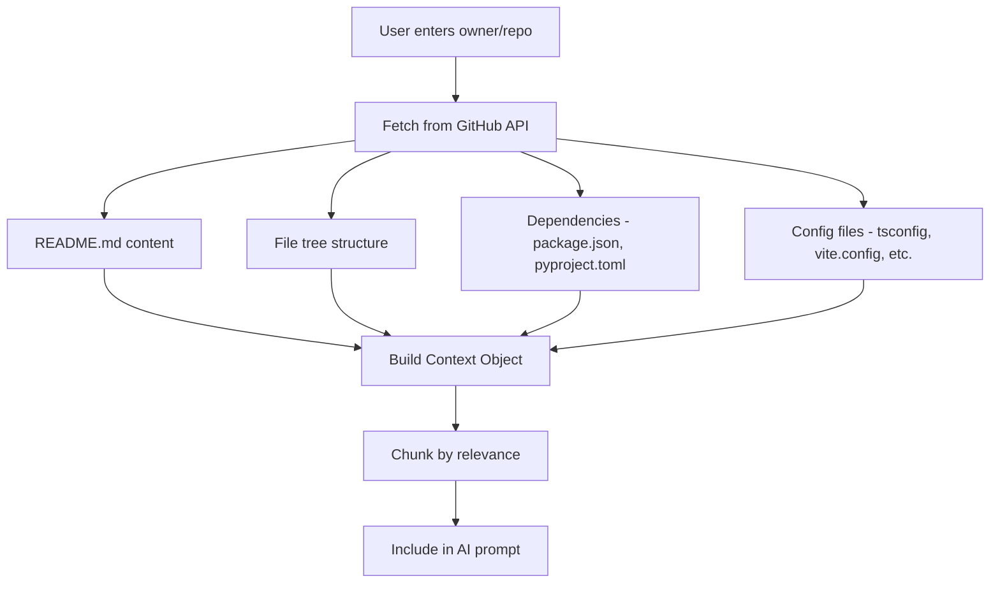

# ZECT — Context Management

## Overview

Context management defines how ZECT builds, maintains, and optimizes the information provided to AI models. Good context management reduces token waste, improves response quality, and enables multi-repo workflows.

---

## How Repo Context is Built



### Context Layers

| Layer | Content | Token Cost | Always Included |
|-------|---------|-----------|-----------------|
| **L1: Metadata** | Repo name, language, description | ~50 tokens | Yes |
| **L2: Structure** | File tree (top 2 levels) | ~200-500 tokens | Yes |
| **L3: Dependencies** | package.json / pyproject.toml | ~300-1000 tokens | Yes |
| **L4: README** | First 500 lines of README | ~500-2000 tokens | If available |
| **L5: Relevant files** | Files matching query topic | ~1000-5000 tokens | On demand |
| **L6: Full content** | Complete file contents | ~5000+ tokens | Rarely |

---

## How Context is Chunked

### Strategy: Progressive Detail

1. **Start with minimal context** (L1-L3) for simple questions
2. **Add README** (L4) for architecture or setup questions
3. **Add relevant files** (L5) for code-specific questions
4. **Add full content** (L6) only for blueprint/analysis tasks

### Chunking Rules

- **Max context per request**: 8,000 tokens (configurable)
- **Prioritize recent files**: Modified recently → higher relevance
- **Prioritize matching files**: File names matching query keywords
- **Truncate intelligently**: Keep imports + function signatures, skip implementations

---

## How Relevant Files are Selected

| Signal | Weight | Example |
|--------|--------|---------|
| File name matches query keywords | High | "auth" query → `auth.py`, `AuthService.ts` |
| Recently modified | Medium | Git log last 7 days |
| Import relationships | Medium | Files imported by relevant files |
| File size (smaller preferred) | Low | Prefer focused files over large ones |
| Directory depth (shallower preferred) | Low | Prefer `/src/auth.ts` over `/src/utils/helpers/auth/index.ts` |

### File Selection Algorithm

```
1. Parse query for keywords (nouns, technical terms)
2. Score each file in repo tree by:
   - Name match (40% weight)
   - Directory match (20% weight)
   - Recency (20% weight)
   - Size inverse (10% weight)
   - Depth inverse (10% weight)
3. Select top N files until token budget reached
4. Fetch content for selected files
5. Truncate to fit remaining token budget
```

---

## How Outdated Context is Refreshed

| Trigger | Action |
|---------|--------|
| Session > 1 hour old | Prompt user: "Refresh context?" |
| New commits pushed to repo | Auto-flag context as stale |
| User manually requests | Re-fetch all context layers |
| File not found in analysis | Remove from context, fetch updated tree |

### Staleness Detection

```
Context is stale when:
- repo.lastPushedAt > context.fetchedAt
- session.duration > 60 minutes
- user explicitly requests refresh
```

---

## How Multi-Repo Context is Handled

### Use Cases

- Blueprint Generator (analyze multiple repos together)
- Cross-repo architecture analysis
- Monorepo vs multi-repo comparison
- Dependency chain analysis

### Strategy

```
For N repos:
1. Fetch L1-L3 context for ALL repos (~1000 tokens each)
2. Identify relationships (shared deps, import references)
3. For the primary repo: fetch L4-L5 context
4. For secondary repos: fetch only relevant L4 context
5. Compose unified context with repo labels

Total budget: Split evenly or weighted by relevance
- Primary repo: 60% of token budget
- Secondary repos: 40% split equally
```

### Multi-Repo Context Format

```
## Repository: KarthikKaruppasamy880/ZECT (Primary)
Tech: React + TypeScript, FastAPI + Python
Structure: [file tree]
Key files: [relevant content]

## Repository: KarthikKaruppasamy880/ZEF (Secondary)
Tech: React + TypeScript
Structure: [file tree]
Relationship: Shares UI component patterns with ZECT
```

---

## Context Caching

### What is Cached

| Data | Cache Duration | Invalidation |
|------|---------------|--------------|
| File tree | 1 hour | New push to repo |
| README | 1 hour | File modified |
| Dependencies | 6 hours | Lock file changed |
| Repo metadata | 24 hours | Rarely changes |
| Full file content | 30 minutes | File modified |

### Cache Keys

```
cache_key = f"{owner}/{repo}/{branch}/{file_path}@{last_commit_sha}"
```

---

## Token Budget Allocation

| Feature | Context Budget | Model Budget | Total |
|---------|---------------|--------------|-------|
| Ask Mode | 4,000 tokens | 2,000 tokens | 6,000 |
| Plan Mode | 6,000 tokens | 4,000 tokens | 10,000 |
| Code Review | 8,000 tokens | 4,000 tokens | 12,000 |
| Blueprint | 20,000 tokens | 8,000 tokens | 28,000 |
| Doc Generator | 10,000 tokens | 6,000 tokens | 16,000 |

---

## Best Practices

1. **Minimal context principle** — include only what's needed for the task
2. **Cache aggressively** — repo structure rarely changes between requests
3. **Progressive loading** — start small, add more if AI response is insufficient
4. **Label clearly** — always prefix context with file paths and repo names
5. **Refresh on demand** — don't auto-refresh unless explicitly stale
