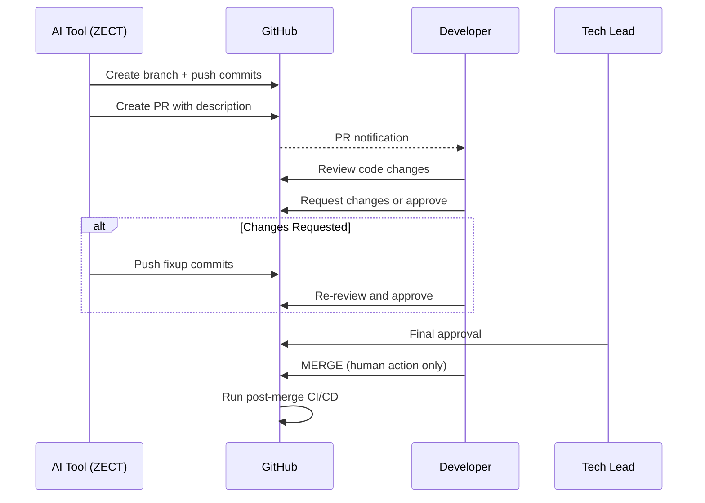

# ZECT — PR Creation & Human-Only Merge Approval

## Core Rule

> **AI tools may create PRs, prepare commit messages, and suggest changes. Merge MUST happen only by manual human instruction/approval. AI must NEVER auto-merge PRs.**

---

## PR Creation Rules

### What AI Tools CAN Do

| Action | Allowed | Notes |
|--------|---------|-------|
| Create branches | Yes | Feature branches only, never main/develop |
| Write code | Yes | Following established patterns |
| Run tests | Yes | Verify changes pass CI |
| Create PRs | Yes | With proper description and context |
| Generate PR descriptions | Yes | Summary of changes, testing notes |
| Suggest reviewers | Yes | Based on file ownership |
| Add labels | Yes | Based on change type |
| Respond to review comments | Yes | Explain or fix issues |
| Push fixup commits | Yes | Address review feedback |

### What AI Tools CANNOT Do

| Action | Allowed | Why |
|--------|---------|-----|
| Merge PRs | **NEVER** | Requires human judgment and approval |
| Approve PRs | **NEVER** | Only humans can approve |
| Force push to main/develop | **NEVER** | Protected branches |
| Delete branches | **NEVER** | Only repo admins |
| Bypass CI checks | **NEVER** | All checks must pass |
| Dismiss reviews | **NEVER** | Only PR author or admin |

---

## PR Workflow



---

## PR Description Template

```markdown
## Summary
[Brief description of what this PR does]

## Changes
- [List of specific changes made]

## Testing
- [ ] Unit tests pass
- [ ] Integration tests pass
- [ ] Manual testing completed

## Screenshots (if UI changes)
[Screenshots here]

## Review Checklist
- [ ] Code follows project conventions
- [ ] No security vulnerabilities introduced
- [ ] No sensitive data exposed
- [ ] Performance impact assessed
- [ ] Documentation updated if needed
```

---

## Reviewer Requirements

| Change Type | Minimum Reviewers | Who |
|-------------|-------------------|-----|
| Bug fix | 1 | Any team member |
| Feature | 2 | 1 peer + 1 tech lead |
| Security | 2 | 1 tech lead + 1 security |
| Architecture | 3 | Tech lead + architect + PM |
| Hotfix | 1 | Tech lead (expedited) |

---

## Merge Restrictions

1. **Branch protection** — main and develop are protected
2. **Required reviews** — minimum 1 approval before merge
3. **CI must pass** — all checks green
4. **No force merge** — squash or merge commit only
5. **Human clicks merge** — never automated

---

## Rollback Considerations

| Scenario | Action | Who Decides |
|----------|--------|-------------|
| Bug found post-merge | Revert PR or hotfix | Tech lead |
| Performance regression | Revert + investigate | On-call engineer |
| Security vulnerability | Immediate revert | Security team |
| Failed deployment | Auto-rollback via CI/CD | Automated, human notified |

---

## Audit Logging

Every PR action is logged:

| Event | Logged Data |
|-------|-------------|
| PR created | Who created, branch, description |
| Review requested | Reviewers assigned |
| Review submitted | Reviewer, decision (approve/request changes) |
| Commits pushed | Author, message, files changed |
| PR merged | Who merged, merge method, timestamp |
| PR closed | Who closed, reason |

---

## Configuration

In ZECT Settings:

- **Deployment Approval Mode**: Controls who must approve before deployment
  - Anyone
  - Tech Lead
  - Tech Lead + PM (default)
  - VP Engineering

- **Minimum Review Severity**: Blocks merge if unresolved findings above threshold
  - Critical, High, Medium (default), Low, Info
