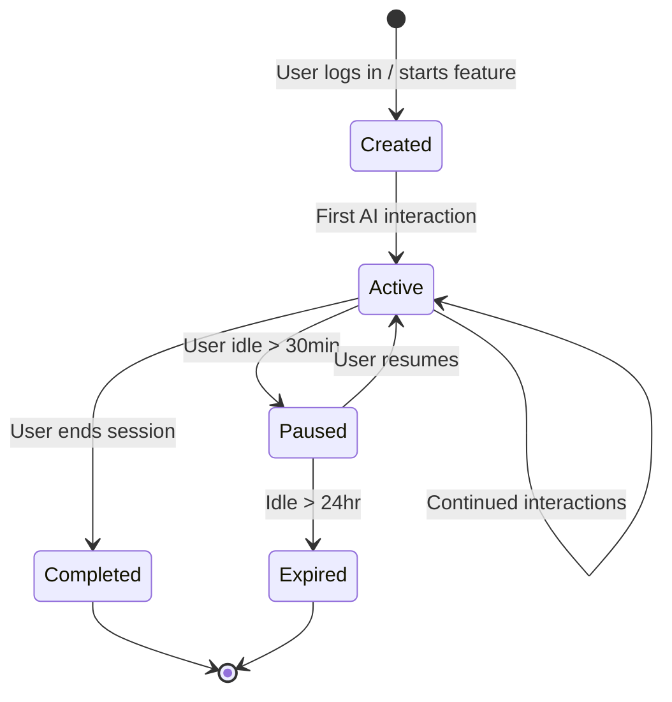

# ZECT — Session Management

## Overview

Sessions in ZECT track user interactions with AI features across time. A session maintains context, records token usage, and enables resumption of work.

---

## Session Lifecycle



---

## How a Session Starts

| Trigger | Session Type | Context |
|---------|-------------|---------|
| Login | Auth session | User identity, permissions |
| Open Ask Mode | Ask session | Selected repo context |
| Open Plan Mode | Plan session | Project description |
| Run Code Review | Review session | PR data, diff content |
| Run Blueprint | Blueprint session | Repo structure |
| Run Repo Analysis | Analysis session | Repo URL(s) |

---

## Session Data Model

```typescript
interface Session {
  id: string;              // Unique session ID
  userId: string;          // Authenticated user
  type: SessionType;       // ask, plan, review, blueprint, analysis
  status: SessionStatus;   // active, paused, completed, expired
  startedAt: DateTime;     // When session began
  lastActiveAt: DateTime;  // Last user interaction
  endedAt?: DateTime;      // When session ended
  
  // Context
  projectId?: number;      // Linked project
  repoContext?: RepoContext[];  // Repos loaded as context
  
  // Usage
  totalTokens: number;     // Total tokens consumed
  totalCost: number;       // Total estimated cost (USD)
  interactions: number;    // Number of AI calls made
  
  // State
  conversationHistory: Message[];  // For Ask Mode
  planOutput?: string;     // For Plan Mode
  reviewFindings?: Finding[];  // For Code Review
}
```

---

## State Management

### What is Stored

| Data | Storage | Persistence |
|------|---------|-------------|
| Auth token | localStorage | Until logout/expiry |
| Current project | Component state | Per navigation |
| Conversation history | Component state | Per session |
| Token usage | Database (token_logs) | Permanent |
| Feature toggles | Database (settings) | Permanent |

### How State is Maintained

1. **Frontend**: React component state (`useState`) for UI state
2. **Backend**: Database records for persistent data
3. **Auth**: JWT token in localStorage, validated per request
4. **Context**: Built on-demand from GitHub API calls

---

## Repo Context Linking

Sessions can be linked to one or more repositories for context-aware AI responses:

```
1. User clicks "Add repo context" in Ask Mode
2. Enter owner/repo (e.g., KarthikKaruppasamy880/ZECT)
3. ZECT fetches: README, file tree, package.json/pyproject.toml
4. Context is included in AI prompts for that session
5. Context persists until session ends or user removes it
```

---

## When to Create a New Session

| Scenario | Action |
|----------|--------|
| User switches to different feature (Ask → Plan) | New session |
| User changes project context | New session |
| Previous session expired (>24hr idle) | New session |
| User explicitly starts fresh | New session |
| User continues same conversation | Same session |
| User adds more repos to context | Same session |

---

## How to Resume a Session

Currently, sessions are ephemeral (in-memory). Future implementation:

1. **Session list** — show recent sessions with type, timestamp, context
2. **Resume** — reload conversation history and repo context
3. **Token budget** — show remaining budget for resumed session
4. **Context refresh** — option to refresh repo context (code may have changed)

---

## Token Budget per Session

| Session Type | Default Token Budget | Configurable |
|-------------|---------------------|--------------|
| Ask Mode | 50,000 tokens | Yes (Settings) |
| Plan Mode | 100,000 tokens | Yes |
| Code Review | 200,000 tokens | Yes |
| Blueprint | 500,000 tokens | Yes |
| Repo Analysis | 100,000 tokens | Yes |

When budget is exceeded:
- User is warned at 80% consumption
- Session pauses at 100% (requires budget increase or new session)
