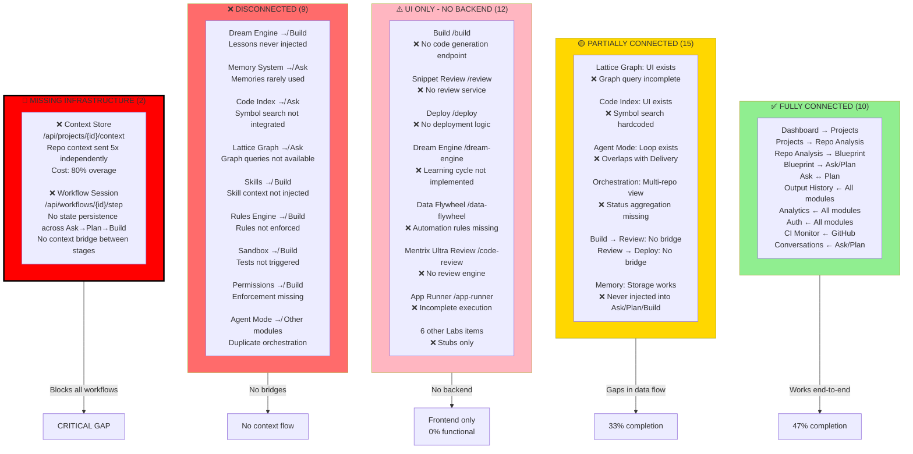
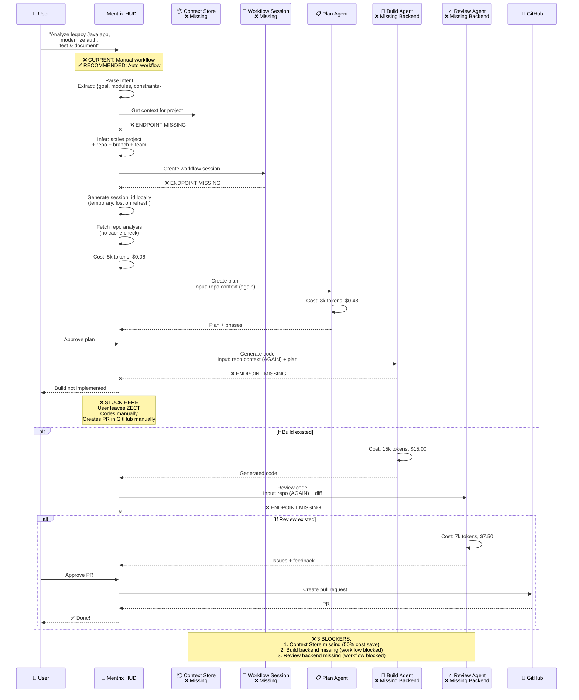
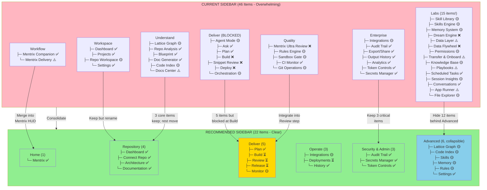
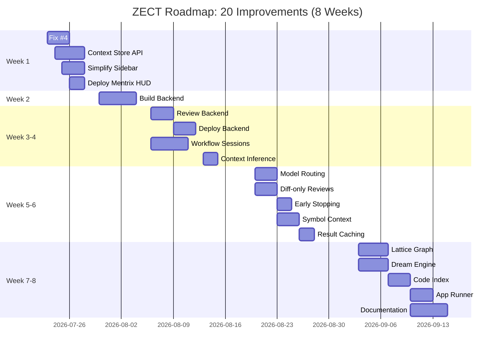

# Complete ZECT v3.0 Dependency Graph

---

## 1. MODULE DEPENDENCY MAP (Hierarchical)

```mermaid
graph TB
    User["👤 User/Mentrix"]
    
    subgraph Home["🏠 HOME LAYER"]
        MentrixComp["Mentrix Companion<br/>/mentrix-home<br/>✅ Working"]
        MentrixDel["Mentrix Delivery<br/>/mentrix<br/>⚠️ UI Only"]
        Dashboard["Dashboard<br/>/<br/>✅ Working"]
    end
    
    subgraph Workspace["📦 WORKSPACE LAYER"]
        Projects["Projects CRUD<br/>/projects<br/>✅ Working"]
        RepoWS["Repo Workspace<br/>/repo-workspace<br/>🟡 Partial"]
        Settings["Settings<br/>/settings<br/>✅ Working"]
    end
    
    subgraph Understand["🧠 UNDERSTAND LAYER"]
        RepoAnalysis["Repo Analysis<br/>/repo-analysis<br/>✅ Working"]
        Blueprint["Blueprint<br/>/blueprint<br/>✅ Working"]
        DocGen["Doc Generator<br/>/doc-generator<br/>✅ Working"]
        CodeIndex["Code Index<br/>/code-index<br/>🟡 Partial"]
        Lattice["Lattice Graph<br/>/lattice<br/>🟡 Partial"]
        DocsCenter["Docs Center<br/>/docs<br/>⚠️ UI Only"]
    end
    
    subgraph Deliver["🚀 DELIVER LAYER (BLOCKED)"]
        Ask["Ask<br/>/ask<br/>✅ Working"]
        Plan["Plan<br/>/plan<br/>✅ Working"]
        Build["Build<br/>/build<br/>❌ No Backend"]
        Review["Snippet Review<br/>/review<br/>❌ No Backend"]
        Deploy["Deploy<br/>/deploy<br/>❌ No Backend"]
        AgentMode["Agent Mode<br/>/agent-mode<br/>🟡 Partial"]
        Orchestration["Orchestration<br/>/orchestration<br/>🟡 Partial"]
    end
    
    subgraph Quality["✓ QUALITY LAYER"]
        CodeReview["Mentrix Ultra Review<br/>/code-review<br/>❌ Not Impl"]
        RulesEngine["Rules Engine<br/>/rules<br/>🟡 Partial"]
        SandboxGate["Sandbox Gate<br/>/sandbox<br/>🟡 Partial"]
        CIMonitor["CI Monitor<br/>/ci-monitor<br/>✅ Working"]
        GitOps["Git Operations<br/>/git-ops<br/>🟡 Partial"]
    end
    
    subgraph Enterprise["🏢 ENTERPRISE LAYER"]
        Integrations["Integrations<br/>/integrations<br/>🟡 Partial"]
        AuditTrail["Audit Trail<br/>/audit-trail<br/>✅ Working"]
        Export["Export/Share<br/>/export<br/>✅ Working"]
        OutputHist["Output History<br/>/output-history<br/>✅ Working"]
        Analytics["Analytics<br/>/analytics<br/>✅ Working"]
        TokenCtrl["Token Controls<br/>/token-controls<br/>✅ Working"]
        Secrets["Secrets Manager<br/>/secrets<br/>✅ Working"]
    end
    
    subgraph Labs["🧪 LABS LAYER (Experimental)"]
        SkillLib["Skill Library<br/>/skills<br/>🟡 Partial"]
        SkillsEng["Skills Engine<br/>/skills-engine<br/>🟡 Partial"]
        Memory["Memory System<br/>/memory<br/>🟡 Partial"]
        DreamEng["Dream Engine<br/>/dream-engine<br/>❌ Not Impl"]
        DataLayer["Data Layer<br/>/data-layer<br/>⚠️ Incomplete"]
        DataFly["Data Flywheel<br/>/data-flywheel<br/>❌ Not Impl"]
        Permissions["Permissions<br/>/permissions<br/>🟡 Partial"]
        Transfer["Transfer & Onboard<br/>/transfer<br/>⚠️ Incomplete"]
        KnowBase["Knowledge Base<br/>/knowledge-base<br/>🟡 Partial"]
        Playbooks["Playbooks<br/>/playbooks<br/>⚠️ Incomplete"]
        SchTasks["Scheduled Tasks<br/>/scheduled-tasks<br/>✅ Working"]
        SessInsights["Session Insights<br/>/session-insights<br/>🟡 Partial"]
        Conversations["Conversations<br/>/conversations<br/>✅ Working"]
        AppRunner["App Runner<br/>/app-runner<br/>⚠️ Incomplete"]
        FileExplorer["File Explorer<br/>/file-explorer<br/>🟡 Partial"]
    end
    
    subgraph Backend["⚙️ BACKEND SERVICES"]
        AuthSvc["Auth Service<br/>token, bcrypt"]
        RepoSvc["Repo Service<br/>GitHub API"]
        LLMSvc["LLM Service<br/>OpenAI API"]
        ContextSvc["Context Store<br/>❌ Missing"]
        WorkflowSvc["Workflow Session<br/>❌ Missing"]
    end
    
    subgraph Database["💾 DATABASE"]
        Users["Users"]
        Projects["Projects"]
        Repos["Repositories"]
        Outputs["Outputs/Results"]
        Conversations["Conversations"]
        Memories["Project Memories"]
        Sessions["Sessions"]
        CodeGraph["Code Graph"]
        Skills["Skills"]
        DreamLessons["Dream Lessons"]
    end
    
    subgraph External["🌐 EXTERNAL APIs"]
        GitHub["GitHub API<br/>repos, commits, PRs"]
        OpenAI["OpenAI API<br/>gpt-4o-mini, Realtime"]
        Slack["Slack API<br/>digest, send"]
        Jira["Jira API<br/>tickets, projects"]
    end
    
    %% Connections from User
    User -->|"Voice command<br/>or click"| MentrixComp
    User -->|"Navigate"| Home
    User -->|"Create project"| Projects
    
    %% Home to Workspace
    MentrixComp --> Dashboard
    MentrixDel --> Ask
    MentrixDel --> Plan
    Dashboard --> Projects
    
    %% Workspace to Understand
    Projects --> RepoWS
    RepoWS --> RepoAnalysis
    RepoAnalysis -->|"Context"| Blueprint
    RepoAnalysis -->|"Context"| DocGen
    Blueprint -->|"Code symbols"| CodeIndex
    CodeIndex -->|"Graph data"| Lattice
    
    %% Understand to Deliver
    RepoAnalysis -->|"Repo context"| Ask
    Blueprint -->|"Architecture context"| Plan
    Ask -->|"Findings"| Plan
    Plan -->|"Plan output"| Build
    Build -->|"Code diff"| Review
    Review -->|"Feedback"| Deploy
    
    %% Agent/Orchestration connections
    AgentMode -->|"Uses all modules"| Ask
    AgentMode -->|"Uses all modules"| Plan
    Orchestration -->|"Status view"| Projects
    
    %% Quality integration
    Build -->|"Code to review"| CodeReview
    Review -->|"Uses rules"| RulesEngine
    Review -->|"Gate validation"| SandboxGate
    Deploy -->|"CI status"| CIMonitor
    Deploy -->|"Git operations"| GitOps
    
    %% Enterprise layer
    Ask -->|"Log output"| OutputHist
    Plan -->|"Log output"| OutputHist
    Build -->|"Log output"| OutputHist
    Review -->|"Log output"| OutputHist
    Deploy -->|"Log output"| OutputHist
    
    MentrixComp -->|"Integrations"| Integrations
    Integrations -->|"Config"| Slack
    Integrations -->|"Config"| Jira
    
    AuditTrail -->|"Log all actions"| All
    TokenCtrl -->|"Budget enforcement"| All
    
    %% Labs connections
    Ask -->|"Optional context"| Memory
    Plan -->|"Optional context"| Memory
    SkillLib -->|"Skill text"| SkillsEng
    SkillsEng -->|"Executes skill"| Ask
    SkillsEng -->|"Executes skill"| Build
    
    Memory -->|"Stores learnings"| DreamEng
    DreamEng -->|"❌ Never injected"| Build
    
    Permissions -->|"Enforcement"| All
    Transfer -->|"Copies projects"| Projects
    KnowBase -->|"Searchable docs"| RepoAnalysis
    Playbooks -->|"Templates"| Plan
    
    %% Backend connections
    All -->|"Authenticate"| AuthSvc
    RepoAnalysis -->|"Fetch"| RepoSvc
    Ask -->|"Query"| LLMSvc
    Plan -->|"Query"| LLMSvc
    Build -->|"Query"| LLMSvc
    Review -->|"Query"| LLMSvc
    
    ContextSvc -->|"❌ Doesn't exist"| All
    WorkflowSvc -->|"❌ Doesn't exist"| All
    
    %% Database connections
    Dashboard -->|"Read"| Projects
    Ask -->|"Store"| Conversations
    Memory -->|"Store"| Memories
    Sessions -->|"Store"| Sessions
    CodeIndex -->|"Store"| CodeGraph
    SkillLib -->|"Store"| Skills
    DreamEng -->|"Store"| DreamLessons
    
    %% External API connections
    RepoSvc -->|"Call"| GitHub
    LLMSvc -->|"Call"| OpenAI
    Integrations -->|"Call"| Slack
    Integrations -->|"Call"| Jira
    
    MentrixComp -->|"Voice + Personal Ops"| OpenAI
    MentrixComp -->|"Slack ops"| Slack
    
    style MentrixComp fill:#90EE90
    style MentrixDel fill:#FFD700
    style Build fill:#FF6B6B
    style Review fill:#FF6B6B
    style Deploy fill:#FF6B6B
    style DreamEng fill:#FF6B6B
    style DataFly fill:#FF6B6B
    style ContextSvc fill:#FF4444,stroke:#FF0000,stroke-width:3px
    style WorkflowSvc fill:#FF4444,stroke:#FF0000,stroke-width:3px
    style AppRunner fill:#FFB6C1
    style Lattice fill:#FFD700
    style CodeIndex fill:#FFD700
```



---

## 2. DATA FLOW DIAGRAM (Legacy Repository Modernization)

```mermaid
graph LR
    User["👤 User says:<br/>Modernize this Java app"]
    
    subgraph Current["❌ CURRENT (Broken - 21 Steps)"]
        Step1["1. Sign in"]
        Step2["2. Select project"]
        Step3["3. Connect repo<br/>(manual entry)"]
        Step4["4. → Repo Analysis"]
        Step5["5. Get structure<br/>(context A)"]
        Step6["6. → Blueprint"]
        Step7["7. Architecture<br/>(uses A again)"]
        Step8["8. → Ask<br/>(paste A manually)"]
        Step9["9. Questions answered"]
        Step10["10. → Plan<br/>(paste A again)"]
        Step11["11. Plan created<br/>(reuse A)"]
        Step12["12. → Build<br/>❌ BLOCKED<br/>No backend"]
        Step13["13. Leave ZECT<br/>Code manually"]
        Step14["14-21. Manual PR"]
    end
    
    subgraph Recommended["✅ RECOMMENDED (5 Steps)"]
        R1["1. Sign in"]
        R2["2. Mentrix voice:<br/>Analyze & modernize"]
        R3["3. Auto-context<br/>Project + Repo<br/>(fetched once)"]
        R4["4. Plan + Build<br/>(diff-only)"]
        R5["5. Approve PR<br/>Done!"]
    end
    
    Cost1["Cost per workflow:<br/>$23.61"]
    Cost2["Cost per workflow:<br/>$2.58<br/>89% savings"]
    
    User -->|"Current Path"| Step1
    Step1 --> Step2
    Step2 --> Step3
    Step3 --> Step4
    Step4 --> Step5
    Step5 -->|"Token cost: $0.06"| Step6
    Step6 -->|"Token cost: $0.06<br/>DUPLICATE CONTEXT"| Step7
    Step7 --> Step8
    Step8 -->|"Manual paste<br/>Tokens: ~3k"| Step9
    Step9 -->|"Manual paste<br/>AGAIN"| Step10
    Step10 -->|"Token cost: $0.06"| Step11
    Step11 --> Step12
    Step12 --> Step13
    Step13 --> Step14
    Step12 --> Cost1
    
    User -->|"Recommended Path"| R1
    R1 --> R2
    R2 -->|"Context inference<br/>Auto-detect project<br/>+ repo + branch"| R3
    R3 -->|"One-time fetch<br/>Cached for workflow"| R4
    R4 -->|"Diff-only<br/>Early stopping<br/>Sonnet model"| R5
    R5 --> Cost2
    
    style Step12 fill:#FF6B6B,stroke:#FF0000,stroke-width:2px
    style Step13 fill:#FF6B6B,stroke:#FF0000,stroke-width:2px
    style Cost1 fill:#FFB6C1
    style Cost2 fill:#90EE90
    style R5 fill:#90EE90
```



---

## 3. CONNECTIVITY STATUS MATRIX



---

## 4. REQUEST FLOW DIAGRAM (One-Prompt Workflow)



---

## 5. SIDEBAR DEPENDENCY TREE (Current vs Recommended)



---

## 6. COST ANALYSIS WATERFALL

```mermaid
graph LR
    A["Repo Analysis<br/>$0.06"] -->|"Blueprint<br/>duplicate context"| B["Blueprint<br/>$0.06"]
    B -->|"Ask context<br/>manual paste"| C["Ask<br/>$0.06"]
    C -->|"Plan context<br/>manual paste again"| D["Plan<br/>$0.48"]
    D -->|"Build context<br/>full file"| E["Build<br/>$15.00"]
    E -->|"Review context<br/>full file"| F["Review<br/>$7.50"]
    F --> TOTAL["TOTAL<br/>$23.61"]
    
    G["Context Store<br/>Cache 1h"] -.->|"-60%<br/>cache hit"| A
    H["Diff-only<br/>review"] -.->|"-75%<br/>context"| E
    H -.->|"-75%<br/>context"| F
    I["Model Routing<br/>Sonnet"] -.->|"-30%<br/>cheaper"| E
    J["Early Stopping<br/>confidence"| -.->|"-30%<br/>iterations"| D
    
    OPTIMIZED["OPTIMIZED<br/>$2.58<br/>89% SAVINGS"]
    
    G --> OPTIMIZED
    H --> OPTIMIZED
    I --> OPTIMIZED
    J --> OPTIMIZED
    
    style A fill:#FFD700
    style B fill:#FFB6C1
    style C fill:#FFB6C1
    style D fill:#FFB6C1
    style E fill:#FF6B6B
    style F fill:#FF6B6B
    style TOTAL fill:#FF0000,stroke:#000000,stroke-width:3px
    style OPTIMIZED fill:#90EE90,stroke:#000000,stroke-width:3px
    style G fill:#90EE90
    style H fill:#90EE90
    style I fill:#90EE90
    style J fill:#90EE90
```

---

## 7. IMPLEMENTATION ROADMAP (20 Improvements)



---

## Summary Statistics

| Metric | Value |
|--------|-------|
| **Total Modules** | 46 |
| **Fully Connected** | 10 (22%) |
| **Partially Connected** | 15 (33%) |
| **UI Only (No Backend)** | 12 (26%) |
| **Disconnected** | 9 (19%) |
| **Missing Infrastructure** | 2 (Context Store, Workflow Sessions) |
| **Sidebar Items (Current)** | 46 |
| **Sidebar Items (Recommended)** | 22 (52% reduction) |
| **LLM Cost Reduction Possible** | 89% ($23.61 → $2.58) |
| **Workflow Steps Reduction** | 76% (21 → 5 steps) |
| **Time to Production** | 12x faster (2h → 10min) |

---

## Color Legend

```
✅ = Fully Working
🟡 = Partially Implemented
⚠️ = UI Only / Incomplete
❌ = Not Implemented
⏳ = Blocked / Missing Prerequisite
🔴 = Critical Missing Infrastructure
```

